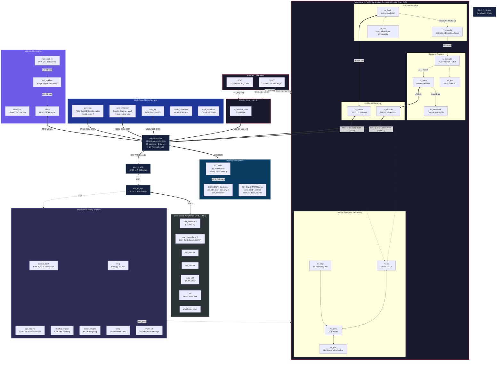

# 🔥 TITAN-X System-on-Chip (SoC) — RTL Verification Handoff

**Project Penguin — Iteration 3 | SMVDU RISC-V ASIC Tapeout (SCL 180nm)**

Welcome to the **RTL Verification Handoff Package**. This repository was automatically generated from the final, timing-closed 180nm SCL `Project_penguin3` codebase. It is specifically designed for the **RTL Verification Team** to perform functional bottom-up validation of the design using native Verilog testbenches, Icarus Verilog (`iverilog`), and `gtkwave`.

TITAN-X is a high-performance, heterogeneous multi-core RISC-V System-on-Chip designed for compute-intensive and security-critical applications. It features a quad-core RV64GC application processor cluster, a dedicated RV64IMAC monitor core, hardware security enclave, video/imaging pipelines, and a rich peripheral set — all interconnected via a 15-Master / 9-Slave AXI4 crossbar fabric.

| Parameter | Value |
|---|---|
| **ISA** | RISC-V RV64GC (IMACFDZicsr\_Zifencei) |
| **Application Cores** | 4× RV64GC (Hart 0–3) |
| **Monitor Core** | 1× RV64IMAC (Hart 4) |
| **L1 I-Cache** | 16 KB, 4-Way Set Associative (per core) |
| **L1 D-Cache** | 16 KB, 4-Way Set Associative (per core) |
| **L2 Cache** | 512 KB Unified, Snoop Filter (MESI) |
| **MMU** | Sv39/Sv48 with Hardware PTW |
| **Physical Memory Protection** | 16 PMP Regions |
| **Interconnect** | AXI4 Crossbar (64-bit, 15M × 9S) → AHB → APB |
| **Target Process** | SCL 180nm (OSU018 Std Cell Library) |
| **Operating Frequency** | 138.8 MHz (Timing Closure Achieved) |

---

## 📦 What is included?
This repository is split into 10 fundamental functional groups, mimicking the 11-Gate sign-off strategy used during architectural development:

1. `common/`: Core synchronization primitives (FIFOs, CDC, Reset Syncs)
2. `frontend/`: CPU Fetch and Decode
3. `backend/`: CPU Execution, FPU, MMU, CSRs
4. `interconnect/`: AXI4 Crossbar, APB bridges, MPU
5. `memory/`: DDR Controller, L2 Cache, SRAM arrays
6. `security/`: Secure Boot, Cryptographic Co-processors
7. `peripherals/`: SPI, UART, I2C, CAN, Ethernet, PCIe
8. `storage/`: eMMC, QSPI, USB
9. `video/`: MIPI CSI-2 RX, ISP Pipeline, HDMI Controller
10. `top/`: The `titan_x_top` SoC wrapper

## 📂 Module Level Structure & Master Wrappers
Inside each group, there is a dedicated directory for every RTL module containing:
- **`[module_name].v`**: The raw, optimized RTL design file.
- **`tb_[module_name].v`**: A functional SystemVerilog testbench featuring automated randomized stimulus injection, clock generation, and `$dumpvars()` for GTKWave.
- **`cmds.f`**: An auto-generated command file containing the relative paths to all required dependencies to make compilation seamless.
- **`README.md`**: A custom, auto-generated verification guide for that specific module detailing all I/O signals, a Mermaid structural map of its sub-modules, and the injected stimulus profile.

### 👑 Master Wrappers
This repository doesn't just stop at the bottom-level leaf nodes. It contains testbenches and documentation for every "Master Wrapper" all the way up to the absolute top of the SoC. 
Verification should flow bottom-up:
- **The Absolute Top**: `top/titan_x_top/` 
- **The CPU Core Master**: `backend/rv_core_top/`
- **The Memory Subsystem Master**: `memory/l2_cache_top/`
- **Peripheral & Interconnect Masters**: `peripherals/pcie_top/`, `memory/ddr_ctrl_top/`

---

## 🚀 Verification Team Instructions (Updated Workflow)

You are expected to navigate into each module's directory and run the automated functional testbenches, followed by writing directed UVM/SV assertions as needed.

**Workflow for a module (e.g., `sram_32x64_180nm`)**:
1. `cd memory/sram_32x64_180nm`
2. **Compile**: `iverilog -g2012 -o sim.vvp -I ../../includes -c cmds.f tb_sram_32x64_180nm.v`
   *(The `-c cmds.f` flag automatically pulls in all required dependencies, and `-g2012` enables SystemVerilog features).*
3. **Run**: `vvp sim.vvp`
4. **Inspect**: `gtkwave tb_sram_32x64_180nm.vcd`
5. **Modify**: Open the `tb_*.v` file and replace the automated `$random` stimulus with directed tests.

---

## 🏗️ SoC Architecture — High-Level Block Diagram



---

## 🧠 CPU Core Microarchitecture — Detailed Pinout (`rv_core_top`)

This diagram zooms into a single RV64GC core instance, showing every I/O pin at the module boundary, all internal submodule instantiations, and the data/control signal routing between them.

```mermaid
flowchart TD
    classDef inp fill:#e6ffe6,stroke:#00cc00,stroke-width:1px,color:#004d00;
    classDef outp fill:#ffe6e6,stroke:#cc0000,stroke-width:1px,color:#800000;
    classDef wire fill:none,stroke:#ffa500,stroke-width:1px,color:#d2691e,stroke-dasharray: 2 2;
    classDef mod fill:#f0f8ff,stroke:#4682b4,stroke-width:2px,color:#00008b;
    classDef cache fill:#fff0f5,stroke:#db7093,stroke-width:2px,color:#8b008b;
    classDef prot fill:#f5fffa,stroke:#3cb371,stroke-width:2px,color:#006400;

    subgraph CORE ["`rv_core_top` — Module Boundary"]
        direction TB

        subgraph SYS ["System"]
            P_clk("⬇ clk"):::inp
            P_rst("⬇ rst_n"):::inp
        end

        subgraph IRQ ["Interrupts"]
            P_irq_ext("⬇ irq_m_ext"):::inp
            P_irq_timer("⬇ irq_m_timer"):::inp
            P_irq_soft("⬇ irq_m_soft"):::inp
        end

        subgraph DBG ["Debug (JTAG)"]
            P_halt("⬇ halt_req"):::inp
            P_resume("⬇ resume_req"):::inp
            P_halted("⬆ hart_halted"):::outp
            P_running("⬆ hart_running"):::outp
        end

        subgraph SNOOP ["L2 Snoop Port"]
            P_sv("⬇ snoop_valid"):::inp
            P_sa("⬇ snoop_addr[39:0]"):::inp
            P_st("⬇ snoop_type[1:0]"):::inp
            P_sack("⬆ snoop_ack"):::outp
            P_sdv("⬆ snoop_data_valid"):::outp
            P_sd("⬆ snoop_data[511:0]"):::outp
        end

        subgraph IAXI ["AXI4 Master — I-Cache (Read-Only)"]
            direction LR
            P_iar("⬆ imem_arvalid, araddr[39:0],\narlen[7:0], arsize[2:0], arburst[1:0]"):::outp
            P_ird("⬇ imem_arready, rvalid,\nrdata[63:0], rlast, rresp[1:0]"):::inp
            P_irr("⬆ imem_rready"):::outp
        end

        subgraph DAXI ["AXI4 Master — D-Cache (Full R/W)"]
            direction LR
            P_daw("⬆ dmem_awvalid, awaddr[39:0],\nawlen[7:0], awsize[2:0], awburst[1:0]"):::outp
            P_dw("⬆ dmem_wvalid, wdata[63:0],\nwstrb[7:0], wlast"):::outp
            P_db("⬇ dmem_bvalid, bresp[1:0]\n⬆ dmem_bready"):::outp
            P_dar("⬆ dmem_arvalid, araddr[39:0],\narlen[7:0], arsize[2:0], arburst[1:0], arlock"):::outp
            P_dr("⬇ dmem_rvalid, rdata[63:0],\nrlast, rresp[1:0]\n⬆ dmem_rready"):::outp
        end

        subgraph PIPE ["5-Stage Integer Pipeline"]
            direction TB
            u_fetch["rv_fetch"]:::mod
            u_decode["rv_decode"]:::mod
            u_execute["rv_execute\n(ALU, Branch, CSR)"]:::mod
            u_mem["rv_mem"]:::mod
            u_wb["rv_writeback"]:::mod
        end

        subgraph ACC ["Accelerators"]
            u_bpu["rv_bpu\n(BTB + BHT)"]:::mod
            u_fpu["rv_fpu\n(IEEE-754)"]:::mod
        end

        subgraph CACHES ["L1 Caches"]
            u_ic["rv_icache"]:::cache
            u_dc["rv_dcache"]:::cache
        end

        subgraph VMPROT ["Virtual Memory & Protection"]
            u_mmu["rv_mmu"]:::prot
            u_tlb["rv_tlb"]:::prot
            u_ptw["rv_ptw"]:::prot
            u_pmp["rv_pmp"]:::prot
        end

        subgraph CTRL ["Control & Telemetry"]
            u_debug["rv_debug"]:::mod
            u_monitor["rv_monitor_core"]:::mod
        end

        %% === Pipeline Data Path ===
        u_fetch ==>|"Inst[31:0]\nPC[63:0]"| u_decode
        u_decode ==>|"RS1/RS2/RS3\nImmediate\nControl"| u_execute
        u_execute ==>|"ALU Res[63:0]\nLS Addr[63:0]"| u_mem
        u_mem ==>|"Load Data[63:0]\nRd Index[4:0]"| u_wb
        u_execute <==>|"FP Operands\nFP Flags"| u_fpu

        %% === Pipeline Control ===
        flush("flush_de_raw\n(BUFX4 buffered)"):::wire
        u_execute -.->|"branch_taken\nexception"| flush
        flush -.->|"flush"| u_fetch & u_decode
        u_mem -.->|"stall_req\n(D$ miss)"| u_execute & u_decode & u_fetch

        %% === Branch Prediction ===
        u_fetch <.->|"BTB/BHT\nR/W"| u_bpu
        u_execute -.->|"Resolve\nMispredict"| u_bpu
        u_execute -.->|"Target PC\nException PC"| u_fetch

        %% === Cache Access ===
        u_fetch <==>|"I-Fetch / Inst"| u_ic
        u_mem <==>|"L/S Req / Data"| u_dc

        %% === Address Translation ===
        priv("priv_mode[1:0]\nsatp[63:0]"):::wire
        u_execute -.->|"CSR Write"| priv
        priv -.-> u_mmu & u_tlb
        u_ic -.->|"VA (I)"| u_tlb
        u_dc -.->|"VA (D)"| u_tlb
        u_tlb <==>|"TLB Miss"| u_mmu
        u_mmu <==>|"PTE Req"| u_ptw
        u_ptw <==>|"L1D Bypass"| u_dc

        %% === PMP ===
        pmpcfg("pmpcfg[63:0]\npmpaddr[0:7]"):::wire
        u_execute -.->|"PMP CSR"| pmpcfg
        pmpcfg -.-> u_pmp
        u_mmu -.->|"PA Check"| u_pmp
        u_pmp -.->|"Fault"| u_mmu

        %% === External I/O Mapping ===
        u_ic ==>|"AR / R"| IAXI
        u_dc ==>|"AW / W / B / AR / R"| DAXI
        SNOOP ==> u_dc
        IRQ -.-> u_execute
        DBG <==> u_debug
        u_debug -.->|"Halt / Step"| u_execute
        u_monitor -.->|"Counters"| u_execute
    end
```

---

## 📌 SoC Top-Level I/O Pin Table (`titan_x_top`)

These are the physical pins exposed at the chip boundary.

### Clock & Reset

| Pin | Direction | Width | Description |
|---|---|---|---|
| `clk` | Input | 1 | System clock (138.8 MHz) |
| `rst_n` | Input | 1 | Active-low system reset |

### DDR4 Memory Interface

| Pin | Direction | Width | Description |
|---|---|---|---|
| `ddr_addr` | Output | 16 | DDR row/column address |
| `ddr_ba` | Output | 3 | Bank address |
| `ddr_bg` | Output | 2 | Bank group |
| `ddr_ck_p / ddr_ck_n` | Output | 1+1 | Differential DDR clock |
| `ddr_cke` | Output | 1 | Clock enable |
| `ddr_cs_n` | Output | 1 | Chip select (active low) |
| `ddr_ras_n / cas_n / we_n` | Output | 3 | Command pins |
| `ddr_reset_n` | Output | 1 | DDR reset |
| `ddr_odt` | Output | 1 | On-die termination |
| `ddr_act_n` | Output | 1 | Activate command |
| `ddr_dq` | Bidir | 64 | Data bus |
| `ddr_dqs_p / ddr_dqs_n` | Bidir | 8+8 | Differential data strobe |

### High-Speed Peripheral Clocks

| Pin | Direction | Width | Description |
|---|---|---|---|
| `pipe_clk` | Input | 1 | PCIe PIPE interface clock |
| `eth_tx_clk` | Input | 1 | Ethernet transmit clock |
| `eth_rx_clk` | Input | 1 | Ethernet receive clock |
| `ulpi_clk` | Input | 1 | USB ULPI PHY clock |

### Video / Imaging Interface

| Pin | Direction | Width | Description |
|---|---|---|---|
| `mipi_rxbyteclkhs` | Input | 1 | MIPI CSI-2 byte clock |
| `hdmi_clk_pixel` | Input | 1 | HDMI pixel clock |
| `hdmi_clk_tmds` | Input | 1 | HDMI TMDS serializer clock |
| `hdmi_tmds_clk_p/n` | Output | 1+1 | Differential TMDS clock output |
| `hdmi_tmds_data_p/n` | Output | 3+3 | Differential TMDS data lanes |

### Low-Speed Peripherals

| Pin | Direction | Width | Description |
|---|---|---|---|
| `rtc_clk` | Input | 1 | 32.768 kHz RTC crystal clock |
| `uart_tx[4:0]` | Output | 5 | UART transmit (5 channels) |
| `uart_rx[4:0]` | Input | 5 | UART receive (5 channels) |
| `can_tx[1:0]` | Output | 2 | CAN bus transmit (2 channels) |
| `can_rx[1:0]` | Input | 2 | CAN bus receive (2 channels) |

---

## 🗺️ AXI Crossbar Port Map

### Masters (15 Ports)

| Port | Module | Description |
|---|---|---|
| M[0–3] | `rv_core_top` × 4 | I-Cache refill (AR/R only) |
| M[4–7] | `rv_core_top` × 4 | D-Cache + PTW (Full AXI) |
| M[8] | `rv_monitor_core` | Monitor I-Fetch |
| M[9] | `rv_monitor_core` | Monitor D-Access |
| M[10] | `gem_ethernet` | Gigabit Ethernet DMA |
| M[11] | `pcie_top` | PCIe DMA |
| M[12] | `usb_otg` | USB OTG DMA |
| M[13–14] | — | Reserved (tied off) |

### Slaves (9 Ports)

| Port | Module | Description |
|---|---|---|
| S[0] | `ddr_ctrl_top` | DDR Memory Controller |
| S[1] | `axi4_to_ahb` | AHB → APB Peripheral Bridge |
| S[2–8] | — | Reserved (tied off, future expansion) |

---

## 🗂️ APB Address Map

| Base Address | Peripheral | PLIC IRQ |
|---|---|---|
| `0x1000_0000` | UART 0 | 20 |
| `0x1000_1000` | UART 1 | 21 |
| `0x1000_2000` | UART 2 | 22 |
| `0x1000_3000` | UART 3 | 23 |
| `0x1000_4000` | UART 4 | 24 |
| `0x1001_0000` | RTC | timer_irq[4:0] |
| `0x1002_0000` | Gigabit Ethernet (APB Cfg) | 27 |
| `0x1003_0000` | USB OTG (APB Cfg) | 28 |
| `0x1004_0000` | MIPI CSI-2 RX | — |
| `0x1005_0000` | ISP Pipeline | — |
| `0x1006_0000` | HDMI Controller | — |
| `0x2000_0000` | DRBG | 10 |
| `0x2001_0000` | AES Engine | 11 |
| `0x2002_0000` | eNVM Controller | — |
| `0x2003_0000` | Secure Boot ROM | — |
| `0x3000_0000` | CAN 0 | 25 |
| `0x3000_1000` | CAN 1 | 26 |

---

## 📁 Repository Structure

```text
rtl_verification_handoff/
├── README.md                    # This file
├── build_functional.py          # Auto-generates testbenches and cmds.f
├── common/                      # Shared RTL utilities & sync primitives
├── frontend/                    # CPU frontend pipeline
├── backend/                     # CPU backend pipeline
├── interconnect/                # Bus fabric (AXI4/AHB/APB)
├── memory/                      # Memory subsystem (L2, DDR, SRAM)
├── peripherals/                 # I/O peripherals (UART, CAN, I2C, SPI)
├── security/                    # Hardware security enclave
├── storage/                     # Storage interfaces (eMMC, USB, QSPI)
├── video/                       # Video & multimedia (HDMI, CSI2, ISP)
└── top/                         # SoC top-level integration
```

---

## ✅ Synthesis & Timing Closure Status

| Metric | Result |
|---|---|
| **Synthesis Tool** | Yosys + ABC (timing-driven, `-D 7200`) |
| **Target Library** | `osu018_stdcells.lib` (OSU 180nm, proxy for SCL 180nm) |
| **STA Tool** | OpenSTA 2.3.1 |
| **Clock Period** | 7.2 ns (138.8 MHz) |
| **Setup WNS / TNS** | 0.00 ns / 0.00 ns ✅ MET |
| **Hold WNS / TNS** | 0.00 ns / 0.00 ns ✅ MET |
| **Critical Path** | Execute → ALU Carry Chain → D-Cache → Writeback |
| **Key Optimization** | Explicit `BUFX4` instantiation on `flush` fanout tree (300+ FF → 4 balanced subtrees) |

---

*SMVDU TITAN-X SoC — Designed for SCL 180nm ASIC Tapeout*

