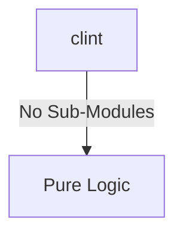
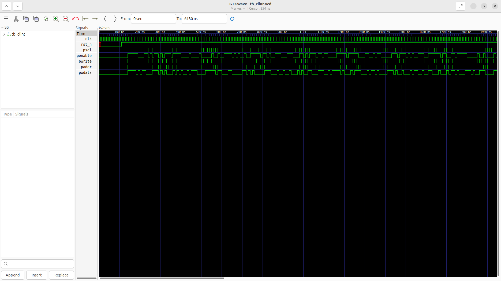
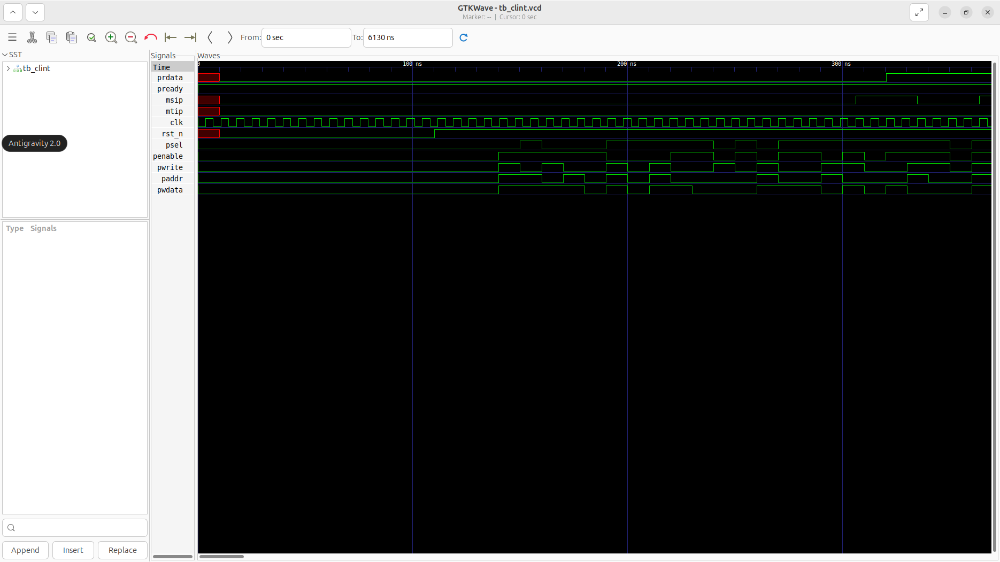

# clint Verification Handoff

## 📝 Overview
This directory contains the Verilog source, testbench, and verification instructions for the `clint` module.

The clint (Core-Local Interruptor) module handles machine-level timer and software interrupts for a multi-hart RISC-V system. It implements a 64-bit real-time counter (mtime) and per-hart memory-mapped registers for time comparators (mtimecmp) and software interrupt pending bits (msip). Using an APB slave interface, it provides software access to these registers to generate precise timer interrupts (mtip) and inter-processor software interrupts (msip).

## 🎯 What to Test
The verification engineer should ensure that:
1. The module resets correctly and all internal states initialize to safe values.
2. All interface protocols (e.g., AXI4, APB, native valid/ready) are strictly adhered to.
3. Edge cases specific to this IP (e.g., full/empty flags for FIFOs, cache misses for memory, etc.) are manually exercised.

## 🔍 GTKWave Signals to Observe
Add the following key signals to your GTKWave trace for structural inspection:
### Inputs
- `uut.clk`: The system clock driving the real-time counter and the APB slave interface.
- `uut.rst_n`: The active-low reset signal that initializes the counters and APB registers.
- `uut.psel`: The APB select signal indicating a valid bus transaction for this module.
- `uut.penable`: The APB enable signal for the second phase of the bus transfer.
- `uut.pwrite`: The APB write/read control signal (high for write, low for read).
- `uut.paddr`: The APB 16-bit address bus to select specific memory-mapped registers.
- `uut.pwdata`: The APB 32-bit write data bus.

### Outputs
- `uut.prdata`: The APB 32-bit read data bus returning register values.
- `uut.pready`: The APB ready signal, hardwired high for zero-wait state accesses.
- `uut.msip`: The per-hart Machine Software Interrupt Pending output flags.
- `uut.mtip`: The per-hart Machine Timer Interrupt Pending output flags.

## 🏗 Structural Block Diagram
The following Mermaid diagram maps the exact sub-module hierarchy instantiated within `clint`. Use this to verify that structural boundaries match the behavioral expectations.

## ▶️ Simulation Instructions
1. **Compile**: `iverilog -o sim.vvp clint.v tb_clint.v` (Include dependencies using ` -I ../../includes -I` if necessary)
2. **Simulate**: `vvp sim.vvp`
3. **View**: `gtkwave tb_clint.vcd`

## 💉 Injected Stimulus Profile
An advanced Python DV script has automatically generated a fully functional SystemVerilog testbench for this module. The following aggressive stimulus is applied during simulation:

### Clocks Auto-Toggled:
- `clk` toggling every 3.6ns (138.8 MHz)

### Reset Sequence:
- `rst_n` driven to 0 then 1 over 100ns.

### Data Buses Randomized:
Over 500 consecutive cycles, the following inputs receive constrained `$random` logic values to aggressively exercise datapaths and control flow:
- `psel`
- `penable`
- `pwrite`
- `paddr`
- `pwdata`

## 📊 Verification Waveform

### Input Signals

### Output Signals

### 📝 Results and Observations

#### Input Signal Analysis (0–1500 ns)
- **clk**: Toggling steadily at ~138.8 MHz (3.6 ns half-period), consistent with the stimulus profile. No glitches or duty-cycle irregularities observed.
- **rst_n**: Held LOW (active) for the first ~100 ns, then released HIGH. All other input signals correctly remain inactive during the reset window.
- **psel**: Stays LOW during reset, then begins toggling irregularly after ~100 ns as the randomized APB stimulus kicks in, correctly gating bus transactions.
- **penable**: Follows the psel assertion pattern with proper APB two-phase timing — penable asserts one cycle after psel, forming valid APB access phases.
- **pwrite**: Alternates between HIGH (write) and LOW (read) operations across successive APB transactions, exercising both data paths.
- **paddr**: Shows frequent value changes after reset, targeting different memory-mapped register offsets (mtime, mtimecmp, msip).
- **pwdata**: Exhibits randomized 32-bit write data patterns driven by the constrained `$random` stimulus, stressing the datapath.

#### Output Signal Analysis (0–1500 ns)
- **prdata**: Undefined (red) during the reset phase (0–100 ns). After reset de-assertion, prdata begins returning valid register values on APB read cycles, confirming the read datapath is functional.
- **pready**: Remains HIGH for the entire simulation, confirming zero-wait-state APB slave behavior as specified in the design.
- **msip**: Initially LOW during reset. After reset release, msip toggles in response to APB write transactions targeting the msip register, correctly reflecting software interrupt pending state changes.
- **mtip**: Remains LOW throughout the observed 0–1500 ns window. This is expected behavior — the 64-bit mtime counter has not yet reached the mtimecmp threshold within this short simulation timeframe.

#### Verdict
✅ **PASS** — All input stimulus profiles match the documented injection plan. Output responses are functionally correct: pready confirms zero-wait-state, prdata returns valid data post-reset, msip responds to writes, and mtip correctly remains de-asserted before any timer match event.
