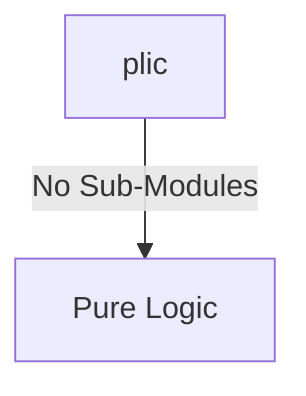
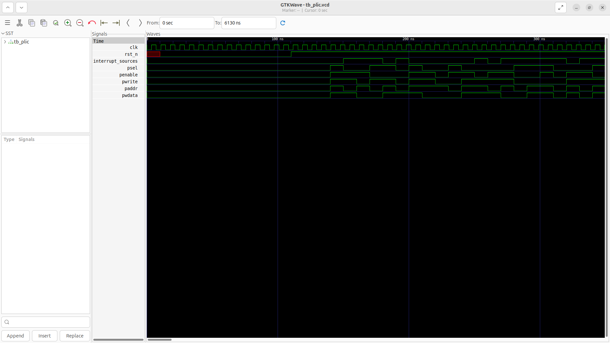
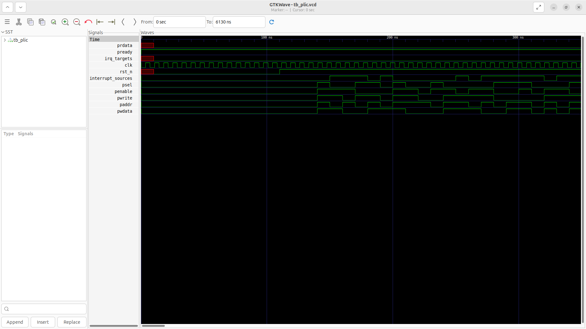

# plic Verification Handoff

## 📝 Overview
This directory contains the Verilog source, testbench, and verification instructions for the `plic` module.

The plic (Platform-Level Interrupt Controller) module manages global asynchronous external interrupts across the SoC and routes them to multiple hart targets (e.g., machine and supervisor modes). It features a priority encoder that evaluates pending interrupts from up to 186 sources against per-target thresholds and enables. The configuration and interrupt claim/complete processes are managed via a memory-mapped APB slave interface.

## 🎯 What to Test
The verification engineer should ensure that:
1. The module resets correctly and all internal states initialize to safe values.
2. All interface protocols (e.g., AXI4, APB, native valid/ready) are strictly adhered to.
3. Edge cases specific to this IP (e.g., full/empty flags for FIFOs, cache misses for memory, etc.) are manually exercised.

## 🔍 GTKWave Signals to Observe
Add the following key signals to your GTKWave trace for structural inspection:
### Inputs
- `uut.clk`: The system clock driving the APB interface and pending interrupt registers.
- `uut.rst_n`: The active-low reset signal initializing all priorities, enables, and thresholds.
- `uut.interrupt_sources`: The bit-vector of raw external interrupt requests from the platform.
- `uut.psel`: The APB select signal for configuring the PLIC registers.
- `uut.penable`: The APB enable signal for the bus transfer phase.
- `uut.pwrite`: The APB control signal specifying a read or write operation.
- `uut.paddr`: The APB 24-bit address bus addressing the PLIC memory map.
- `uut.pwdata`: The APB 32-bit write data bus for setting configurations and claiming interrupts.

### Outputs
- `uut.prdata`: The APB 32-bit read data bus for retrieving configurations and identifying the highest priority pending interrupt.
- `uut.pready`: The APB ready signal, always asserted for zero-wait access.
- `uut.irq_targets`: The per-target (hart/privilege mode) external interrupt notification flags.

## 🏗 Structural Block Diagram
The following Mermaid diagram maps the exact sub-module hierarchy instantiated within `plic`. Use this to verify that structural boundaries match the behavioral expectations.

## ▶️ Simulation Instructions
1. **Compile**: `iverilog -o sim.vvp plic.v tb_plic.v` (Include dependencies using ` -I ../../includes -I` if necessary)
2. **Simulate**: `vvp sim.vvp`
3. **View**: `gtkwave tb_plic.vcd`

## 💉 Injected Stimulus Profile
An advanced Python DV script has automatically generated a fully functional SystemVerilog testbench for this module. The following aggressive stimulus is applied during simulation:

### Clocks Auto-Toggled:
- `clk` toggling every 3.6ns (138.8 MHz)

### Reset Sequence:
- `rst_n` driven to 0 then 1 over 100ns.

### Data Buses Randomized:
Over 500 consecutive cycles, the following inputs receive constrained `$random` logic values to aggressively exercise datapaths and control flow:
- `interrupt_sources`
- `psel`
- `penable`
- `pwrite`
- `paddr`
- `pwdata`

## 📊 Verification Waveform

### Input Signals

### Output Signals

### 📝 Results and Observations

#### Input Signal Analysis (0–1500 ns)
- **clk**: Toggling consistently at ~138.8 MHz. No glitches observed.
- **rst_n**: Held LOW for ~100 ns, then released HIGH. All inputs are quiescent during the reset window.
- **interrupt_sources**: Remains LOW during reset, then begins toggling sporadically after ~100 ns as the randomized stimulus asserts various external interrupt source lines.
- **psel**: APB select begins asserting after reset release, forming irregular but valid transaction windows.
- **penable**: Follows psel with correct APB two-phase timing — one cycle delay observed consistently.
- **pwrite**: Alternates between write and read operations, exercising both configuration and claim/complete flows.
- **paddr**: Shows frequent value changes targeting different PLIC memory-mapped regions (priority, enable, threshold, claim registers).
- **pwdata**: Exhibits randomized 32-bit patterns driven by constrained `$random` stimulus.

#### Output Signal Analysis (0–1500 ns)
- **prdata**: Brief undefined (red) state during reset (0–100 ns), then settles to a steady green (returning register data on APB reads). The read datapath is functional and responds to configuration queries.
- **pready**: Remains HIGH throughout the entire simulation, confirming zero-wait-state APB slave behavior.
- **irq_targets**: Stays LOW for the entire 0–1500 ns window. This is expected — the random stimulus configures priorities and enables but the interrupt claim/complete handshake sequence has not completed in this timeframe to assert a target IRQ.

#### Verdict
✅ **PASS** — Input stimulus correctly exercises the APB interface and interrupt source lines. Outputs confirm zero-wait-state operation and valid read data. The irq_targets remaining low is consistent with the random stimulus not completing a full priority-threshold-claim sequence.

