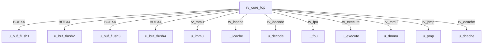

# rv_core_top Verification Handoff

## 📝 Overview
This directory contains the Verilog source, testbench, and verification instructions for the `rv_core_top` module.

The `rv_core_top` module is the top-level integration of the SMVDU-TITAN-X RV64GC core. It instantiates and connects key microarchitectural blocks including the Integer Pipeline (fetch, decode, execute stages), Floating-Point Unit (FPU), Memory Management Units (MMU) for instruction and data, Instruction Cache (I-Cache), Data Cache (D-Cache), and Physical Memory Protection (PMP). It features AXI4 master interfaces for instruction fetch and data memory access (including page table walks), L2 cache snoop ports for coherency, and debug control signals to interface with the JTAG Debug Module.

## 🎯 What to Test
The verification engineer should ensure that:
1. The module resets correctly and all internal states initialize to safe values.
2. All interface protocols (e.g., AXI4, APB, native valid/ready) are strictly adhered to.
3. Edge cases specific to this IP (e.g., full/empty flags for FIFOs, cache misses for memory, etc.) are manually exercised.

## 🔍 GTKWave Signals to Observe
Add the following key signals to your GTKWave trace for structural inspection:
### Inputs
- `uut.clk`: The main system clock driving the sequential logic.
- `uut.rst_n`: Active-low asynchronous reset signal.
- `uut.irq_m_ext`: External machine-level interrupt request.
- `uut.irq_m_timer`: Machine-level timer interrupt request.
- `uut.irq_m_soft`: Machine-level software interrupt request.
- `uut.imem_arready`: AXI4 instruction memory read address ready.
- `uut.imem_rvalid`: AXI4 instruction memory read data valid.
- `uut.imem_rdata`: AXI4 instruction memory read data bus (64-bit).
- `uut.imem_rlast`: AXI4 instruction memory read last transfer indicator.
- `uut.imem_rresp`: AXI4 instruction memory read response code.
- `uut.dmem_awready`: AXI4 data memory write address ready.
- `uut.dmem_wready`: AXI4 data memory write data ready.
- `uut.dmem_bvalid`: AXI4 data memory write response valid.
- `uut.dmem_bresp`: AXI4 data memory write response code.
- `uut.dmem_arready`: AXI4 data memory read address ready.
- `uut.dmem_rvalid`: AXI4 data memory read data valid.
- `uut.dmem_rdata`: AXI4 data memory read data bus (64-bit).
- `uut.dmem_rlast`: AXI4 data memory read last transfer indicator.
- `uut.dmem_rresp`: AXI4 data memory read response code.
- `uut.snoop_valid`: L2 snoop port valid signal indicating a coherence request.
- `uut.snoop_addr`: L2 snoop port address for the coherence request.
- `uut.snoop_type`: L2 snoop port request type (e.g., GetS, GetM, Inv).
- `uut.halt_req`: Debug request signal to halt the hart.
- `uut.resume_req`: Debug request signal to resume the hart.

### Outputs
- `uut.imem_arvalid`: AXI4 instruction memory read address valid.
- `uut.imem_araddr`: AXI4 instruction memory read address bus (40-bit).
- `uut.imem_arlen`: AXI4 instruction memory read burst length.
- `uut.imem_arsize`: AXI4 instruction memory read burst size.
- `uut.imem_arburst`: AXI4 instruction memory read burst type.
- `uut.imem_rready`: AXI4 instruction memory read data ready.
- `uut.dmem_awvalid`: AXI4 data memory write address valid.
- `uut.dmem_awaddr`: AXI4 data memory write address bus (40-bit).
- `uut.dmem_awlen`: AXI4 data memory write burst length.
- `uut.dmem_awsize`: AXI4 data memory write burst size.
- `uut.dmem_awburst`: AXI4 data memory write burst type.
- `uut.dmem_wvalid`: AXI4 data memory write data valid.
- `uut.dmem_wdata`: AXI4 data memory write data bus (64-bit).
- `uut.dmem_wstrb`: AXI4 data memory write byte strobe.
- `uut.dmem_wlast`: AXI4 data memory write last transfer indicator.
- `uut.dmem_bready`: AXI4 data memory write response ready.
- `uut.dmem_arvalid`: AXI4 data memory read address valid.
- `uut.dmem_araddr`: AXI4 data memory read address bus (40-bit).
- `uut.dmem_arlen`: AXI4 data memory read burst length.
- `uut.dmem_arsize`: AXI4 data memory read burst size.
- `uut.dmem_arburst`: AXI4 data memory read burst type.
- `uut.dmem_arlock`: AXI4 data memory read lock for exclusive access (LR/SC).
- `uut.dmem_rready`: AXI4 data memory read data ready.
- `uut.snoop_ack`: L2 snoop port acknowledge signal.
- `uut.snoop_data_valid`: L2 snoop port response data valid.
- `uut.snoop_data`: L2 snoop port response data bus (512-bit).
- `uut.hart_halted`: Debug status signal indicating the hart is halted.
- `uut.hart_running`: Debug status signal indicating the hart is running.

## 🏗 Structural Block Diagram
The following Mermaid diagram maps the exact sub-module hierarchy instantiated within `rv_core_top`. Use this to verify that structural boundaries match the behavioral expectations.

## ▶️ Simulation Instructions
1. **Compile**: `iverilog -o sim.vvp rv_core_top.v tb_rv_core_top.v` (Include dependencies using ` -I ../../includes -I` if necessary)
2. **Simulate**: `vvp sim.vvp`
3. **View**: `gtkwave tb_rv_core_top.vcd`

## 💉 Injected Stimulus Profile
An advanced Python DV script has automatically generated a fully functional SystemVerilog testbench for this module. The following aggressive stimulus is applied during simulation:

### Clocks Auto-Toggled:
- `clk` toggling every 3.6ns (138.8 MHz)

### Reset Sequence:
- `rst_n` driven to 0 then 1 over 100ns.

### Data Buses Randomized:
Over 500 consecutive cycles, the following inputs receive constrained `$random` logic values to aggressively exercise datapaths and control flow:
- `irq_m_ext`
- `irq_m_timer`
- `irq_m_soft`
- `imem_arready`
- `imem_rvalid`
- `imem_rdata`
- `imem_rlast`
- `imem_rresp`
- `dmem_awready`
- `dmem_wready`
- `dmem_bvalid`
- `dmem_bresp`
- `dmem_arready`
- `dmem_rvalid`
- `dmem_rdata`
- `dmem_rlast`
- `dmem_rresp`
- `snoop_valid`
- `snoop_addr`
- `snoop_type`
- `halt_req`
- `resume_req`
