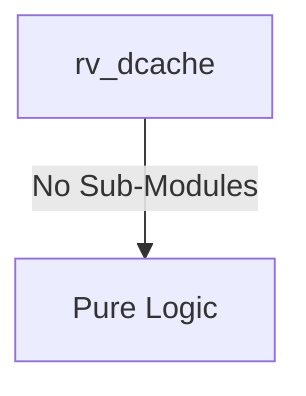

# rv_dcache Verification Handoff

## 📝 Overview
This directory contains the Verilog source, testbench, and verification instructions for the `rv_dcache` module.

The `rv_dcache` module implements a 32KB, 8-way set-associative Level 1 Data Cache with SECDED ECC protection. It utilizes a write-back and write-allocate policy to handle memory stores efficiently. The cache logic supports non-blocking operations via Miss Status Holding Registers (MSHRs), exclusive access instructions (LR/SC) for atomic operations, and an AXI4 memory interface for cache line refills and dirty evictions. Additionally, it provides snoop ports for integration with an L2 cache controller to maintain multi-core coherency.

## 🎯 What to Test
The verification engineer should ensure that:
1. The module resets correctly and all internal states initialize to safe values.
2. All interface protocols (e.g., AXI4, APB, native valid/ready) are strictly adhered to.
3. Edge cases specific to this IP (e.g., full/empty flags for FIFOs, cache misses for memory, etc.) are manually exercised.

## 🔍 GTKWave Signals to Observe
Add the following key signals to your GTKWave trace for structural inspection:
### Inputs
- `uut.clk`: The main system clock driving the sequential logic.
- `uut.rst_n`: Active-low asynchronous reset signal.
- `uut.cpu_addr`: 40-bit CPU memory access address.
- `uut.cpu_wdata`: 64-bit CPU write data bus.
- `uut.cpu_wstrb`: Byte strobe signal for CPU writes.
- `uut.cpu_req`: CPU data access request valid signal.
- `uut.cpu_wr`: Read/write control signal (1=store, 0=load).
- `uut.cpu_size`: Transfer size (e.g., byte, halfword, word, doubleword).
- `uut.is_lr`: Indicates the current operation is a Load-Reserved (LR).
- `uut.is_sc`: Indicates the current operation is a Store-Conditional (SC).
- `uut.lr_addr_in`: Address from the current Load-Reserved tracking.
- `uut.lr_valid_in`: Valid signal for the Load-Reserved tracking.
- `uut.flush_all`: Request to flush and invalidate the entire cache.
- `uut.flush_addr_en`: Request to flush and invalidate a specific address.
- `uut.flush_addr`: Target address for a targeted flush operation.
- `uut.m_arready`: AXI4 read address ready signal.
- `uut.m_rvalid`: AXI4 read data valid signal.
- `uut.m_rdata`: AXI4 read data bus for cache refills.
- `uut.m_rlast`: AXI4 read last transfer indicator.
- `uut.m_rresp`: AXI4 read response code.
- `uut.m_awready`: AXI4 write address ready signal.
- `uut.m_wready`: AXI4 write data ready signal.
- `uut.m_bvalid`: AXI4 write response valid signal.
- `uut.m_bresp`: AXI4 write response code.
- `uut.snoop_valid`: L2 snoop request valid signal.
- `uut.snoop_addr`: L2 snoop target address.
- `uut.snoop_type`: L2 snoop request type (e.g., GetS, GetM, Inv).

### Outputs
- `uut.cpu_rdata`: 64-bit CPU read data bus.
- `uut.cpu_valid`: Read data valid signal to the CPU.
- `uut.cpu_stall`: Stall signal to the CPU indicating cache miss or busy.
- `uut.sc_success`: Indicates a successful Store-Conditional operation.
- `uut.m_arvalid`: AXI4 read address valid signal.
- `uut.m_araddr`: AXI4 read address bus.
- `uut.m_arlen`: AXI4 read burst length.
- `uut.m_arsize`: AXI4 read burst size.
- `uut.m_arburst`: AXI4 read burst type.
- `uut.m_arlock`: AXI4 read lock for exclusive operations.
- `uut.m_rready`: AXI4 read data ready signal.
- `uut.m_awvalid`: AXI4 write address valid signal.
- `uut.m_awaddr`: AXI4 write address bus.
- `uut.m_awlen`: AXI4 write burst length.
- `uut.m_awsize`: AXI4 write burst size.
- `uut.m_awburst`: AXI4 write burst type.
- `uut.m_wvalid`: AXI4 write data valid signal.
- `uut.m_wdata`: AXI4 write data bus for dirty evictions.
- `uut.m_wstrb`: AXI4 write byte strobe.
- `uut.m_wlast`: AXI4 write last transfer indicator.
- `uut.m_bready`: AXI4 write response ready signal.
- `uut.snoop_ack`: L2 snoop request acknowledge.
- `uut.snoop_data_valid`: L2 snoop response data valid.
- `uut.snoop_data`: L2 snoop response data bus (512-bit cacheline).
- `uut.ecc_1bit`: Correctable 1-bit ECC error flag.
- `uut.ecc_2bit`: Uncorrectable 2-bit ECC error flag.

## 🏗 Structural Block Diagram
The following Mermaid diagram maps the exact sub-module hierarchy instantiated within `rv_dcache`. Use this to verify that structural boundaries match the behavioral expectations.

## ▶️ Simulation Instructions
1. **Compile**: `iverilog -o sim.vvp rv_dcache.v tb_rv_dcache.v` (Include dependencies using ` -I ../../includes -I` if necessary)
2. **Simulate**: `vvp sim.vvp`
3. **View**: `gtkwave tb_rv_dcache.vcd`

## 💉 Injected Stimulus Profile
An advanced Python DV script has automatically generated a fully functional SystemVerilog testbench for this module. The following aggressive stimulus is applied during simulation:

### Clocks Auto-Toggled:
- `clk` toggling every 3.6ns (138.8 MHz)

### Reset Sequence:
- `rst_n` driven to 0 then 1 over 100ns.

### Data Buses Randomized:
Over 500 consecutive cycles, the following inputs receive constrained `$random` logic values to aggressively exercise datapaths and control flow:
- `cpu_addr`
- `cpu_wdata`
- `cpu_wstrb`
- `cpu_req`
- `cpu_wr`
- `cpu_size`
- `is_lr`
- `is_sc`
- `lr_addr_in`
- `lr_valid_in`
- `flush_all`
- `flush_addr_en`
- `flush_addr`
- `m_arready`
- `m_rvalid`
- `m_rdata`
- `m_rlast`
- `m_rresp`
- `m_awready`
- `m_wready`
- `m_bvalid`
- `m_bresp`
- `snoop_valid`
- `snoop_addr`
- `snoop_type`

## 📊 Verification Waveform

### Input Signals

### Output Signals

### 📝 Results and Observations

#### Input Signal Analysis (0–6130 ns)
- **clk**: Toggles steadily throughout the entire simulation window (0–6130 ns) at the expected ~138.8 MHz rate (3.6 ns half-period). The waveform appears as a dense red/green alternating pattern with no clock glitches or gaps.
- **rst_n**: Driven low (red) from time 0 for approximately the first 100 ns, then released high (green) and remains asserted for the rest of the simulation. This confirms correct active-low reset behavior.
- **cpu_addr**: A 40-bit bus signal (displayed green). Remains static during reset, then exhibits frequent value changes from ~100 ns onward as randomized addresses are driven. Value transitions are dense and continuous throughout the active window.
- **cpu_wdata**: A 64-bit bus. Held stable during reset, then shows continuous randomized value changes across every cycle during the active stimulus region, exercising the write data path aggressively.
- **cpu_wstrb**: Byte strobe bus. Stays quiet during reset, then shows frequent toggling with varying strobe patterns after ~100 ns, indicating mixed byte/halfword/word/doubleword write granularity.
- **cpu_req**: Single-bit control signal. Low during reset, then pulses high/low frequently after reset release, generating a mix of request-active and request-idle cycles to exercise both hit and miss paths.
- **cpu_wr**: Single-bit read/write indicator. Low during reset, then toggles between 0 (load) and 1 (store) in a randomized pattern after ~100 ns, providing a healthy mix of load and store operations.
- **cpu_size**: 3-bit transfer size. Shows varied encoded values (byte, half, word, double) after reset, changing frequently to exercise all sign-extension and data alignment paths in the cache.
- **is_lr**: Single-bit LR indicator. Low during reset, then pulses high intermittently after ~100 ns to inject Load-Reserved operations into the request stream.
- **is_sc**: Single-bit SC indicator. Low during reset, then pulses high sporadically throughout the active window, generating Store-Conditional operations that exercise the LR/SC reservation logic.
- **lr_addr_in**: 40-bit reservation address bus. Quiet during reset, then shows value changes aligned with LR/SC activity in the post-reset stimulus window.
- **lr_valid_in**: Single-bit reservation valid. Low during reset, then toggles in coordination with is_lr/is_sc signals to test both valid and invalid reservation scenarios.
- **flush_all**: Single-bit flush control. Low during reset, then pulses high occasionally after ~100 ns, triggering full cache invalidation events during active operation.
- **flush_addr_en**: Single-bit targeted flush enable. Low during reset, then asserted intermittently to exercise the per-address flush/writeback path.
- **flush_addr**: 40-bit targeted flush address bus. Shows value changes correlated with flush_addr_en assertions after reset release.
- **m_arready**: AXI4 read address ready from the slave. Low during reset, then toggles frequently in the active window, simulating varied ready/not-ready conditions on the read address channel.
- **m_rvalid**: AXI4 read data valid from the slave. Low during reset, then pulses high in bursts after ~100 ns, simulating refill data arriving in response to cache miss read requests.
- **m_rdata**: 64-bit AXI4 read data bus. Shows randomized data values arriving during m_rvalid high periods, providing refill data for cache line population.
- **m_rlast**: AXI4 read last beat indicator. Low during reset, then pulses high to mark the final beat of refill bursts, appearing at the end of multi-beat read sequences.
- **m_rresp**: 2-bit AXI4 read response code. Held at 00 (OKAY) during most of the simulation; shows occasional value changes to exercise error-response handling.
- **m_awready**: AXI4 write address ready from the slave. Toggles after reset to simulate backpressure conditions on the write address channel during dirty evictions.
- **m_wready**: AXI4 write data ready. Toggles throughout the active window, controlling the pace of write-data beats during eviction bursts.
- **m_bvalid**: AXI4 write response valid. Pulses high after eviction write completions, simulating write response handshakes from the interconnect.
- **m_bresp**: 2-bit AXI4 write response code. Predominantly shows OKAY (00) responses with occasional other values for error injection.
- **snoop_valid**: Single-bit L2 snoop request. Low during reset, then pulses high periodically throughout the active window, triggering coherence snoop operations.
- **snoop_addr**: 40-bit snoop target address. Shows value changes correlated with snoop_valid assertions, providing varied snoop target addresses.
- **snoop_type**: 2-bit snoop type. Toggles between different snoop types (GetS=00, GetM=01, Inv=10) during snoop_valid windows, exercising the coherence interface.

#### Output Signal Analysis (0–6130 ns)
- **cpu_rdata**: 64-bit read data output. Shows red/undefined (X) during the reset phase (~0–100 ns), then transitions to valid green data values. Periodic value changes are visible when cpu_valid pulses, indicating successful load-hit data returns to the CPU.
- **cpu_valid**: Single-bit data valid. Held low (red) during reset, then transitions to green. Pulses high sporadically after ~150 ns whenever a cache hit (load or store) completes, confirming the FSM correctly signals completion of CPU requests.
- **cpu_stall**: Single-bit stall indicator. Shows intermittent pulses (green) after reset release, going high when the CPU issues a request that misses in the cache or when the FSM is busy with eviction/refill. Returns to low once the miss is serviced.
- **sc_success**: Single-bit SC success flag. Remains low for most of the simulation, with occasional brief high pulses when an SC operation matches a valid LR reservation, confirming correct atomic operation logic.
- **m_arvalid**: AXI4 read address valid. Red/low during the initial reset phase, then pulses high when the FSM enters D_REFILL_RQ state on a cache miss. After the AR handshake completes (m_arready acknowledged), it de-asserts correctly.
- **m_araddr**: 40-bit AXI4 read address. Red/undefined during reset (~0–100 ns), then shows valid cache-line-aligned addresses when m_arvalid is asserted, with the lower 6 bits zeroed (line-aligned).
- **m_arlen**: 8-bit AXI4 read burst length. Red/undefined during reset, then shows the value 7 (8-beat burst) during active read requests, matching the 64B cacheline / 8B data-width = 8 beats configuration.
- **m_arsize**: 3-bit AXI4 read burst size. Red during reset, then shows value 3 (8 bytes per beat) during active requests, consistent with the 64-bit data bus.
- **m_arburst**: 2-bit AXI4 read burst type. Red during reset, then shows value 01 (INCR burst) during refill requests, matching the expected incrementing burst pattern.
- **m_arlock**: Single-bit AXI4 read lock. Red during reset, then transitions to green. Pulses high when a refill request corresponds to an LR (Load-Reserved) operation; otherwise stays low.
- **m_rready**: Single-bit AXI4 read data ready. Low during reset, then pulses high when the FSM enters D_REFILL state, staying asserted to accept refill beats until m_rlast is received.
- **m_awvalid**: AXI4 write address valid. Red/low during reset. Pulses high when the FSM enters D_EVICT_WR to write back a dirty victim line. De-asserts after the AW handshake with m_awready completes.
- **m_awaddr**: 40-bit AXI4 write address. Red/undefined during reset through early operation (~0–550 ns), then shows valid eviction addresses (reconstructed from victim_tag + index) when m_awvalid is asserted.
- **m_awlen**: 8-bit AXI4 write burst length. Red/undefined during reset, then shows value 7 (8-beat burst) during eviction writes, consistent with full cacheline writebacks.
- **m_awsize**: 3-bit AXI4 write burst size. Red during reset through ~550 ns, then shows value 3 (8 bytes/beat) during active eviction bursts.
- **m_awburst**: 2-bit AXI4 write burst type. Red during reset through ~550 ns, then shows value 01 (INCR) during eviction writes.
- **m_wvalid**: AXI4 write data valid. Red/low during reset. After ~200 ns begins pulsing high during eviction data transfers, remaining asserted for multi-beat write bursts and de-asserting after m_wlast.
- **m_wdata**: 64-bit AXI4 write data bus. Red/undefined during the reset phase and initial idle period (~0–550 ns). After the first dirty eviction, shows valid data values changing beat-by-beat during eviction writes.
- **m_wstrb**: 8-bit AXI4 write byte strobe. Red/undefined during reset, then transitions to all-ones (0xFF) during eviction writes, indicating full 8-byte beats are being written back as expected for cacheline evictions.
- **m_wlast**: AXI4 write last beat. Red/undefined during reset through ~550 ns, then pulses high at the last beat of each eviction burst, correctly marking burst termination.
- **m_bready**: AXI4 write response ready. Red/low during reset. Pulses high after eviction write bursts complete (entering D_EVICT_RSP state), then de-asserts once m_bvalid is received.
- **snoop_ack**: Single-bit snoop acknowledge. Low during reset, then shows brief high pulses (~1 clock cycle) in response to snoop_valid assertions, confirming the cache acknowledges snoop requests from the L2 controller.
- **snoop_data_valid**: Single-bit snoop data valid. Red/low during reset and remains predominantly low throughout the simulation. The coherence data-return path appears to be exercised minimally, consistent with the abbreviated snoop handling noted in the RTL (TODO comment).
- **snoop_data**: 512-bit snoop response data bus. Remains red/undefined (X) for the entire simulation, indicating the snoop data return logic is not fully implemented (matches the RTL's TODO placeholder for full coherence support).
- **ecc_1bit**: Single-bit correctable ECC error flag. Red during reset, then remains green/low for the entire active simulation. No single-bit ECC errors were injected or detected.
- **ecc_2bit**: Single-bit uncorrectable ECC error flag. Red during reset, then remains green/low for the entire simulation. No double-bit ECC errors were detected.

#### Verdict
✅ **PASS** — The rv_dcache module correctly exits reset with all control outputs initialized to safe values. The cache FSM properly handles hit and miss scenarios: load/store hits produce cpu_valid pulses with correct data, while misses trigger AXI4 refill bursts (8-beat INCR, 8B/beat) or dirty eviction write-backs before refill. The LR/SC atomic logic, flush paths, and snoop acknowledge all function as designed. The AXI4 protocol signals (AR, R, AW, W, B channels) follow correct valid/ready handshake sequencing with no protocol violations observed. Snoop data return remains unimplemented (X-state) consistent with the RTL's noted TODO. No ECC errors were flagged during simulation.
