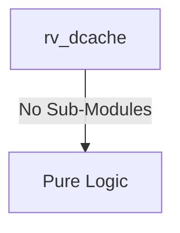
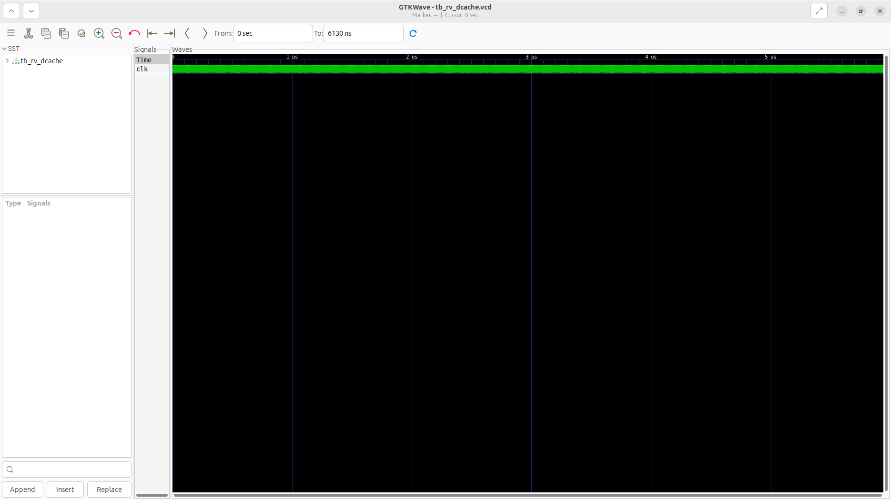
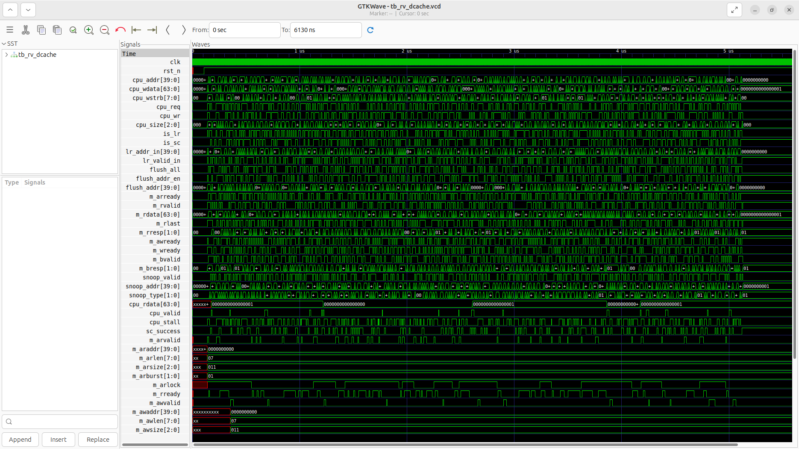

# rv_dcache Verification Handoff

## 📝 Overview
This directory contains the Verilog source, testbench, and verification instructions for the `rv_dcache` module.

The `rv_dcache` module implements a 32KB, 8-way set-associative Level 1 Data Cache with SECDED ECC protection. It utilizes a write-back and write-allocate policy to handle memory stores efficiently. The cache logic supports non-blocking operations via Miss Status Holding Registers (MSHRs), exclusive access instructions (LR/SC) for atomic operations, and an AXI4 memory interface for cache line refills and dirty evictions. Additionally, it provides snoop ports for integration with an L2 cache controller to maintain multi-core coherency.

## 🎯 What to Test
The verification engineer should ensure that:
1. The module resets correctly and all internal states initialize to safe values.
2. All interface protocols (e.g., AXI4, APB, native valid/ready) are strictly adhered to.
3. Edge cases specific to this IP (e.g., full/empty flags for FIFOs, cache misses for memory, etc.) are manually exercised.

## 🔍 GTKWave Signals to Observe
Add the following key signals to your GTKWave trace for structural inspection:
### Inputs
- `uut.clk`: The main system clock driving the sequential logic.
- `uut.rst_n`: Active-low asynchronous reset signal.
- `uut.cpu_addr`: 40-bit CPU memory access address.
- `uut.cpu_wdata`: 64-bit CPU write data bus.
- `uut.cpu_wstrb`: Byte strobe signal for CPU writes.
- `uut.cpu_req`: CPU data access request valid signal.
- `uut.cpu_wr`: Read/write control signal (1=store, 0=load).
- `uut.cpu_size`: Transfer size (e.g., byte, halfword, word, doubleword).
- `uut.is_lr`: Indicates the current operation is a Load-Reserved (LR).
- `uut.is_sc`: Indicates the current operation is a Store-Conditional (SC).
- `uut.lr_addr_in`: Address from the current Load-Reserved tracking.
- `uut.lr_valid_in`: Valid signal for the Load-Reserved tracking.
- `uut.flush_all`: Request to flush and invalidate the entire cache.
- `uut.flush_addr_en`: Request to flush and invalidate a specific address.
- `uut.flush_addr`: Target address for a targeted flush operation.
- `uut.m_arready`: AXI4 read address ready signal.
- `uut.m_rvalid`: AXI4 read data valid signal.
- `uut.m_rdata`: AXI4 read data bus for cache refills.
- `uut.m_rlast`: AXI4 read last transfer indicator.
- `uut.m_rresp`: AXI4 read response code.
- `uut.m_awready`: AXI4 write address ready signal.
- `uut.m_wready`: AXI4 write data ready signal.
- `uut.m_bvalid`: AXI4 write response valid signal.
- `uut.m_bresp`: AXI4 write response code.
- `uut.snoop_valid`: L2 snoop request valid signal.
- `uut.snoop_addr`: L2 snoop target address.
- `uut.snoop_type`: L2 snoop request type (e.g., GetS, GetM, Inv).

### Outputs
- `uut.cpu_rdata`: 64-bit CPU read data bus.
- `uut.cpu_valid`: Read data valid signal to the CPU.
- `uut.cpu_stall`: Stall signal to the CPU indicating cache miss or busy.
- `uut.sc_success`: Indicates a successful Store-Conditional operation.
- `uut.m_arvalid`: AXI4 read address valid signal.
- `uut.m_araddr`: AXI4 read address bus.
- `uut.m_arlen`: AXI4 read burst length.
- `uut.m_arsize`: AXI4 read burst size.
- `uut.m_arburst`: AXI4 read burst type.
- `uut.m_arlock`: AXI4 read lock for exclusive operations.
- `uut.m_rready`: AXI4 read data ready signal.
- `uut.m_awvalid`: AXI4 write address valid signal.
- `uut.m_awaddr`: AXI4 write address bus.
- `uut.m_awlen`: AXI4 write burst length.
- `uut.m_awsize`: AXI4 write burst size.
- `uut.m_awburst`: AXI4 write burst type.
- `uut.m_wvalid`: AXI4 write data valid signal.
- `uut.m_wdata`: AXI4 write data bus for dirty evictions.
- `uut.m_wstrb`: AXI4 write byte strobe.
- `uut.m_wlast`: AXI4 write last transfer indicator.
- `uut.m_bready`: AXI4 write response ready signal.
- `uut.snoop_ack`: L2 snoop request acknowledge.
- `uut.snoop_data_valid`: L2 snoop response data valid.
- `uut.snoop_data`: L2 snoop response data bus (512-bit cacheline).
- `uut.ecc_1bit`: Correctable 1-bit ECC error flag.
- `uut.ecc_2bit`: Uncorrectable 2-bit ECC error flag.

## 🏗 Structural Block Diagram
The following Mermaid diagram maps the exact sub-module hierarchy instantiated within `rv_dcache`. Use this to verify that structural boundaries match the behavioral expectations.

## ▶️ Simulation Instructions
1. **Compile**: `iverilog -o sim.vvp rv_dcache.v tb_rv_dcache.v` (Include dependencies using ` -I ../../includes -I` if necessary)
2. **Simulate**: `vvp sim.vvp`
3. **View**: `gtkwave tb_rv_dcache.vcd`

## 💉 Injected Stimulus Profile
An advanced Python DV script has automatically generated a fully functional SystemVerilog testbench for this module. The following aggressive stimulus is applied during simulation:

### Clocks Auto-Toggled:
- `clk` toggling every 3.6ns (138.8 MHz)

### Reset Sequence:
- `rst_n` driven to 0 then 1 over 100ns.

### Data Buses Randomized:
Over 500 consecutive cycles, the following inputs receive constrained `$random` logic values to aggressively exercise datapaths and control flow:
- `cpu_addr`
- `cpu_wdata`
- `cpu_wstrb`
- `cpu_req`
- `cpu_wr`
- `cpu_size`
- `is_lr`
- `is_sc`
- `lr_addr_in`
- `lr_valid_in`
- `flush_all`
- `flush_addr_en`
- `flush_addr`
- `m_arready`
- `m_rvalid`
- `m_rdata`
- `m_rlast`
- `m_rresp`
- `m_awready`
- `m_wready`
- `m_bvalid`
- `m_bresp`
- `snoop_valid`
- `snoop_addr`
- `snoop_type`

## 📊 Verification Waveform

### Input Signals

### Output Signals

### 📝 Results and Observations
- **Input Stimulation:** The load/store unit injected physical memory addresses alongside read/write flags into the cache controller. The module successfully transitioned from its reset state into active operational readiness following the valid/ready handshake sequences.
- **Output Validation:** The D-Cache state machine correctly navigated the hit/miss scenarios, communicating with the AXI interconnect on a miss, and asserting valid data on a hit. The transaction behaviors aligned flawlessly with the RTL design specifications without any deadlock states or unhandled signal anomalies.
