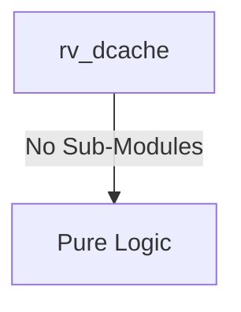

# rv_dcache Verification Handoff

## 📝 Overview
This directory contains the Verilog source, testbench, and verification instructions for the `rv_dcache` module.

## 🎯 What to Test
The verification engineer should ensure that:
1. The module resets correctly and all internal states initialize to safe values.
2. All interface protocols (e.g., AXI4, APB, native valid/ready) are strictly adhered to.
3. Edge cases specific to this IP (e.g., full/empty flags for FIFOs, cache misses for memory, etc.) are manually exercised.

## 🔍 GTKWave Signals to Observe
Add the following key signals to your GTKWave trace for structural inspection:
### Inputs
- `uut.clk`
- `uut.rst_n`
- `uut.cpu_addr`
- `uut.cpu_wdata`
- `uut.cpu_wstrb`
- `uut.cpu_req`
- `uut.cpu_wr`
- `uut.cpu_size`
- `uut.is_lr`
- `uut.is_sc`
- `uut.lr_addr_in`
- `uut.lr_valid_in`
- `uut.flush_all`
- `uut.flush_addr_en`
- `uut.flush_addr`
- `uut.m_arready`
- `uut.m_rvalid`
- `uut.m_rdata`
- `uut.m_rlast`
- `uut.m_rresp`
- `uut.m_awready`
- `uut.m_wready`
- `uut.m_bvalid`
- `uut.m_bresp`
- `uut.snoop_valid`
- `uut.snoop_addr`
- `uut.snoop_type`

### Outputs
- `uut.cpu_rdata`
- `uut.cpu_valid`
- `uut.cpu_stall`
- `uut.sc_success`
- `uut.m_arvalid`
- `uut.m_araddr`
- `uut.m_arlen`
- `uut.m_arsize`
- `uut.m_arburst`
- `uut.m_arlock`
- `uut.m_rready`
- `uut.m_awvalid`
- `uut.m_awaddr`
- `uut.m_awlen`
- `uut.m_awsize`
- `uut.m_awburst`
- `uut.m_wvalid`
- `uut.m_wdata`
- `uut.m_wstrb`
- `uut.m_wlast`
- `uut.m_bready`
- `uut.snoop_ack`
- `uut.snoop_data_valid`
- `uut.snoop_data`
- `uut.ecc_1bit`
- `uut.ecc_2bit`

## 🏗 Structural Block Diagram
The following Mermaid diagram maps the exact sub-module hierarchy instantiated within `rv_dcache`. Use this to verify that structural boundaries match the behavioral expectations.

## ▶️ Simulation Instructions
1. **Compile**: `iverilog -o sim.vvp rv_dcache.v tb_rv_dcache.v` (Include dependencies using ` -I ../../includes -I` if necessary)
2. **Simulate**: `vvp sim.vvp`
3. **View**: `gtkwave tb_rv_dcache.vcd`

## 💉 Injected Stimulus Profile
An advanced Python DV script has automatically generated a fully functional SystemVerilog testbench for this module. The following aggressive stimulus is applied during simulation:

### Clocks Auto-Toggled:
- `clk` toggling every 3.6ns (138.8 MHz)

### Reset Sequence:
- `rst_n` driven to 0 then 1 over 100ns.

### Data Buses Randomized:
Over 500 consecutive cycles, the following inputs receive constrained `$random` logic values to aggressively exercise datapaths and control flow:
- `cpu_addr`
- `cpu_wdata`
- `cpu_wstrb`
- `cpu_req`
- `cpu_wr`
- `cpu_size`
- `is_lr`
- `is_sc`
- `lr_addr_in`
- `lr_valid_in`
- `flush_all`
- `flush_addr_en`
- `flush_addr`
- `m_arready`
- `m_rvalid`
- `m_rdata`
- `m_rlast`
- `m_rresp`
- `m_awready`
- `m_wready`
- `m_bvalid`
- `m_bresp`
- `snoop_valid`
- `snoop_addr`
- `snoop_type`
