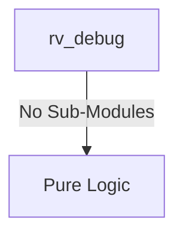

# rv_debug Verification Handoff

## 📝 Overview
This directory contains the Verilog source, testbench, and verification instructions for the `rv_debug` module.

## 🎯 What to Test
The verification engineer should ensure that:
1. The module resets correctly and all internal states initialize to safe values.
2. All interface protocols (e.g., AXI4, APB, native valid/ready) are strictly adhered to.
3. Edge cases specific to this IP (e.g., full/empty flags for FIFOs, cache misses for memory, etc.) are manually exercised.

## 🔍 GTKWave Signals to Observe
Add the following key signals to your GTKWave trace for structural inspection:
### Inputs
- `uut.clk`
- `uut.rst_n`
- `uut.tck`
- `uut.tms`
- `uut.tdi`
- `uut.hart_halted`
- `uut.hart_running`
- `uut.hart_unavail`
- `uut.reg_rdata`
- `uut.cmd_done`
- `uut.cmd_err`
- `uut.sb_arready`
- `uut.sb_rvalid`
- `uut.sb_rdata`
- `uut.sb_rresp`
- `uut.sb_awready`
- `uut.sb_wready`
- `uut.sb_bvalid`

### Outputs
- `uut.tdo`
- `uut.halt_req`
- `uut.resume_req`
- `uut.reg_sel`
- `uut.reg_wr`
- `uut.reg_wdata`
- `uut.cmd_exec`
- `uut.sb_arvalid`
- `uut.sb_araddr`
- `uut.sb_rready`
- `uut.sb_awvalid`
- `uut.sb_awaddr`
- `uut.sb_wvalid`
- `uut.sb_wdata`
- `uut.sb_wstrb`
- `uut.sb_wlast`
- `uut.sb_bready`

## 🏗 Structural Block Diagram
The following Mermaid diagram maps the exact sub-module hierarchy instantiated within `rv_debug`. Use this to verify that structural boundaries match the behavioral expectations.

## ▶️ Simulation Instructions
1. **Compile**: `iverilog -o sim.vvp rv_debug.v tb_rv_debug.v` (Include dependencies using ` -I ../../includes -I` if necessary)
2. **Simulate**: `vvp sim.vvp`
3. **View**: `gtkwave tb_rv_debug.vcd`

## 💉 Injected Stimulus Profile
An advanced Python DV script has automatically generated a fully functional SystemVerilog testbench for this module. The following aggressive stimulus is applied during simulation:

### Clocks Auto-Toggled:
- `clk` toggling every 3.6ns (138.8 MHz)

### Reset Sequence:
- `rst_n` driven to 0 then 1 over 100ns.

### Data Buses Randomized:
Over 500 consecutive cycles, the following inputs receive constrained `$random` logic values to aggressively exercise datapaths and control flow:
- `tck`
- `tms`
- `tdi`
- `hart_halted`
- `hart_running`
- `hart_unavail`
- `reg_rdata`
- `cmd_done`
- `cmd_err`
- `sb_arready`
- `sb_rvalid`
- `sb_rdata`
- `sb_rresp`
- `sb_awready`
- `sb_wready`
- `sb_bvalid`
