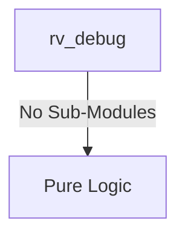

# rv_debug Verification Handoff

## 📝 Overview
This directory contains the Verilog source, testbench, and verification instructions for the `rv_debug` module.

The `rv_debug` module implements a JTAG Debug Module conforming to the RISC-V Debug Specification 0.13. It provides an interface between an external debugger and the internal harts via a standard 4-pin JTAG TAP controller. It features Debug Module Interface (DMI) registers, abstract commands for accessing core registers, and system bus access (via an AXI4 master) to read or write memory transparently. Furthermore, the module supports advanced debug operations such as halting, resuming, hardware triggers, and a configurable program buffer for executing complex debug instruction sequences on the core.

## 🎯 What to Test
The verification engineer should ensure that:
1. The module resets correctly and all internal states initialize to safe values.
2. All interface protocols (e.g., AXI4, APB, native valid/ready) are strictly adhered to.
3. Edge cases specific to this IP (e.g., full/empty flags for FIFOs, cache misses for memory, etc.) are manually exercised.

## 🔍 GTKWave Signals to Observe
Add the following key signals to your GTKWave trace for structural inspection:
### Inputs
- `uut.clk`: The main system clock driving the sequential logic.
- `uut.rst_n`: Active-low asynchronous reset signal.
- `uut.tck`: JTAG Test Clock.
- `uut.tms`: JTAG Test Mode Select.
- `uut.tdi`: JTAG Test Data In.
- `uut.hart_halted`: Multi-bit signal indicating which harts are currently halted.
- `uut.hart_running`: Multi-bit signal indicating which harts are currently running.
- `uut.hart_unavail`: Multi-bit signal indicating which harts are unavailable.
- `uut.reg_rdata`: Read data from the hart's GPR/CSR registers.
- `uut.cmd_done`: Abstract command completion status from the hart.
- `uut.cmd_err`: Abstract command error status from the hart.
- `uut.sb_arready`: AXI4 system bus read address ready.
- `uut.sb_rvalid`: AXI4 system bus read data valid.
- `uut.sb_rdata`: AXI4 system bus read data.
- `uut.sb_rresp`: AXI4 system bus read response.
- `uut.sb_awready`: AXI4 system bus write address ready.
- `uut.sb_wready`: AXI4 system bus write data ready.
- `uut.sb_bvalid`: AXI4 system bus write response valid.

### Outputs
- `uut.tdo`: JTAG Test Data Out.
- `uut.halt_req`: Multi-bit request signal to halt specific harts.
- `uut.resume_req`: Multi-bit request signal to resume specific harts.
- `uut.reg_sel`: Address selection for GPR/CSR abstract commands.
- `uut.reg_wr`: Write enable for GPR/CSR abstract commands.
- `uut.reg_wdata`: Write data for GPR/CSR abstract commands.
- `uut.cmd_exec`: Execute signal to trigger an abstract command on the hart.
- `uut.sb_arvalid`: AXI4 system bus read address valid.
- `uut.sb_araddr`: AXI4 system bus read address bus.
- `uut.sb_rready`: AXI4 system bus read data ready.
- `uut.sb_awvalid`: AXI4 system bus write address valid.
- `uut.sb_awaddr`: AXI4 system bus write address bus.
- `uut.sb_wvalid`: AXI4 system bus write data valid.
- `uut.sb_wdata`: AXI4 system bus write data bus.
- `uut.sb_wstrb`: AXI4 system bus write byte strobe.
- `uut.sb_wlast`: AXI4 system bus write last transfer indicator.
- `uut.sb_bready`: AXI4 system bus write response ready.

## 🏗 Structural Block Diagram
The following Mermaid diagram maps the exact sub-module hierarchy instantiated within `rv_debug`. Use this to verify that structural boundaries match the behavioral expectations.

## ▶️ Simulation Instructions
1. **Compile**: `iverilog -o sim.vvp rv_debug.v tb_rv_debug.v` (Include dependencies using ` -I ../../includes -I` if necessary)
2. **Simulate**: `vvp sim.vvp`
3. **View**: `gtkwave tb_rv_debug.vcd`

## 💉 Injected Stimulus Profile
An advanced Python DV script has automatically generated a fully functional SystemVerilog testbench for this module. The following aggressive stimulus is applied during simulation:

### Clocks Auto-Toggled:
- `clk` toggling every 3.6ns (138.8 MHz)

### Reset Sequence:
- `rst_n` driven to 0 then 1 over 100ns.

### Data Buses Randomized:
Over 500 consecutive cycles, the following inputs receive constrained `$random` logic values to aggressively exercise datapaths and control flow:
- `tck`
- `tms`
- `tdi`
- `hart_halted`
- `hart_running`
- `hart_unavail`
- `reg_rdata`
- `cmd_done`
- `cmd_err`
- `sb_arready`
- `sb_rvalid`
- `sb_rdata`
- `sb_rresp`
- `sb_awready`
- `sb_wready`
- `sb_bvalid`
