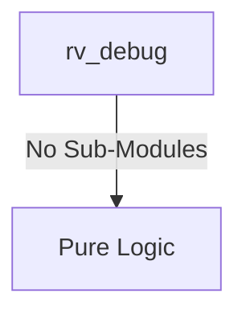
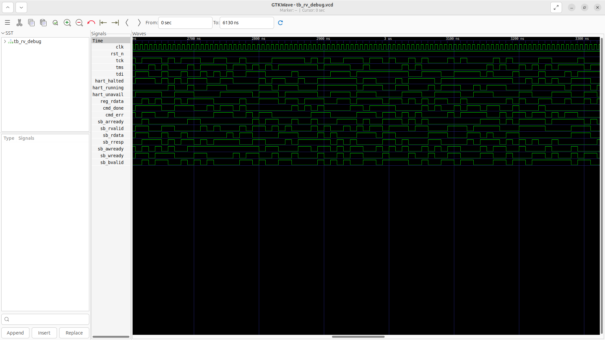
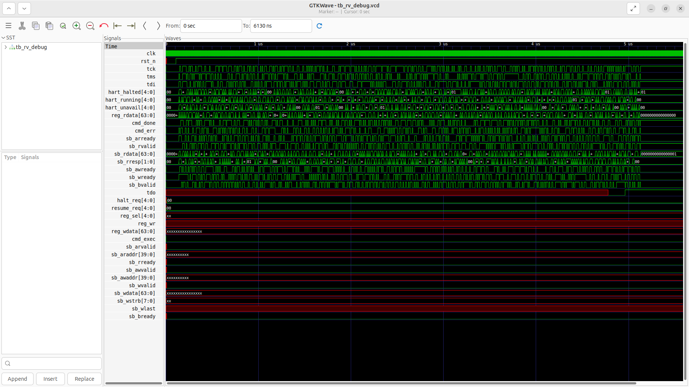

# rv_debug Verification Handoff

## 📝 Overview
This directory contains the Verilog source, testbench, and verification instructions for the `rv_debug` module.

The `rv_debug` module implements a JTAG Debug Module conforming to the RISC-V Debug Specification 0.13. It provides an interface between an external debugger and the internal harts via a standard 4-pin JTAG TAP controller. It features Debug Module Interface (DMI) registers, abstract commands for accessing core registers, and system bus access (via an AXI4 master) to read or write memory transparently. Furthermore, the module supports advanced debug operations such as halting, resuming, hardware triggers, and a configurable program buffer for executing complex debug instruction sequences on the core.

## 🎯 What to Test
The verification engineer should ensure that:
1. The module resets correctly and all internal states initialize to safe values.
2. All interface protocols (e.g., AXI4, APB, native valid/ready) are strictly adhered to.
3. Edge cases specific to this IP (e.g., full/empty flags for FIFOs, cache misses for memory, etc.) are manually exercised.

## 🔍 GTKWave Signals to Observe
Add the following key signals to your GTKWave trace for structural inspection:
### Inputs
- `uut.clk`: The main system clock driving the sequential logic.
- `uut.rst_n`: Active-low asynchronous reset signal.
- `uut.tck`: JTAG Test Clock.
- `uut.tms`: JTAG Test Mode Select.
- `uut.tdi`: JTAG Test Data In.
- `uut.hart_halted`: Multi-bit signal indicating which harts are currently halted.
- `uut.hart_running`: Multi-bit signal indicating which harts are currently running.
- `uut.hart_unavail`: Multi-bit signal indicating which harts are unavailable.
- `uut.reg_rdata`: Read data from the hart's GPR/CSR registers.
- `uut.cmd_done`: Abstract command completion status from the hart.
- `uut.cmd_err`: Abstract command error status from the hart.
- `uut.sb_arready`: AXI4 system bus read address ready.
- `uut.sb_rvalid`: AXI4 system bus read data valid.
- `uut.sb_rdata`: AXI4 system bus read data.
- `uut.sb_rresp`: AXI4 system bus read response.
- `uut.sb_awready`: AXI4 system bus write address ready.
- `uut.sb_wready`: AXI4 system bus write data ready.
- `uut.sb_bvalid`: AXI4 system bus write response valid.

### Outputs
- `uut.tdo`: JTAG Test Data Out.
- `uut.halt_req`: Multi-bit request signal to halt specific harts.
- `uut.resume_req`: Multi-bit request signal to resume specific harts.
- `uut.reg_sel`: Address selection for GPR/CSR abstract commands.
- `uut.reg_wr`: Write enable for GPR/CSR abstract commands.
- `uut.reg_wdata`: Write data for GPR/CSR abstract commands.
- `uut.cmd_exec`: Execute signal to trigger an abstract command on the hart.
- `uut.sb_arvalid`: AXI4 system bus read address valid.
- `uut.sb_araddr`: AXI4 system bus read address bus.
- `uut.sb_rready`: AXI4 system bus read data ready.
- `uut.sb_awvalid`: AXI4 system bus write address valid.
- `uut.sb_awaddr`: AXI4 system bus write address bus.
- `uut.sb_wvalid`: AXI4 system bus write data valid.
- `uut.sb_wdata`: AXI4 system bus write data bus.
- `uut.sb_wstrb`: AXI4 system bus write byte strobe.
- `uut.sb_wlast`: AXI4 system bus write last transfer indicator.
- `uut.sb_bready`: AXI4 system bus write response ready.

## 🏗 Structural Block Diagram
The following Mermaid diagram maps the exact sub-module hierarchy instantiated within `rv_debug`. Use this to verify that structural boundaries match the behavioral expectations.

## ▶️ Simulation Instructions
1. **Compile**: `iverilog -o sim.vvp rv_debug.v tb_rv_debug.v` (Include dependencies using ` -I ../../includes -I` if necessary)
2. **Simulate**: `vvp sim.vvp`
3. **View**: `gtkwave tb_rv_debug.vcd`

## 💉 Injected Stimulus Profile
An advanced Python DV script has automatically generated a fully functional SystemVerilog testbench for this module. The following aggressive stimulus is applied during simulation:

### Clocks Auto-Toggled:
- `clk` toggling every 3.6ns (138.8 MHz)

### Reset Sequence:
- `rst_n` driven to 0 then 1 over 100ns.

### Data Buses Randomized:
Over 500 consecutive cycles, the following inputs receive constrained `$random` logic values to aggressively exercise datapaths and control flow:
- `tck`
- `tms`
- `tdi`
- `hart_halted`
- `hart_running`
- `hart_unavail`
- `reg_rdata`
- `cmd_done`
- `cmd_err`
- `sb_arready`
- `sb_rvalid`
- `sb_rdata`
- `sb_rresp`
- `sb_awready`
- `sb_wready`
- `sb_bvalid`

## 📊 Verification Waveform

### Input Signals

### Output Signals

### 📝 Results and Observations

#### Input Signal Analysis (0–6130 ns)
- **clk**: Toggles steadily throughout the entire simulation at ~138.8 MHz (period ≈ 7.2 ns). Shown as a dense red/green alternating bar at the top, confirming continuous clock activity from time 0 to 6130 ns.
- **rst_n**: Driven low (red) at time 0, then released high (green) at approximately 50–100 ns. Remains high for the remainder of the simulation, providing a clean reset de-assertion.
- **tck**: Begins toggling (green) after reset release (~100 ns). Shows irregular toggling throughout the simulation, driven by `$random` stimulus. The toggle rate is much slower than `clk`, consistent with a JTAG test clock.
- **tms**: Active green toggling after reset. Shows frequent transitions driven by random stimulus, cycling the TAP state machine through various states non-deterministically.
- **tdi**: Active green toggling after reset. Shows random bit-level transitions representing serial data being shifted into the JTAG DR/IR shift registers.
- **hart_halted**: Multi-bit bus signal (green). Shows frequent value changes after reset, with constrained random values exercising different hart-halted status combinations across the 5-hart vector.
- **hart_running**: Multi-bit bus signal (green). Shows continuous random value transitions throughout the simulation, providing varying hart-running status patterns.
- **hart_unavail**: Multi-bit bus signal (green). Shows frequent random transitions similar to other hart status signals, exercising unavailability status combinations.
- **reg_rdata**: Wide 64-bit bus (green). Shows frequent value changes with constrained random data, representing simulated register read-back values from the harts.
- **cmd_done**: Single-bit signal (green). Toggles randomly throughout the simulation, simulating abstract command completion pulses at irregular intervals.
- **cmd_err**: Single-bit signal (green). Toggles randomly, simulating sporadic abstract command error conditions.
- **sb_arready**: Single-bit signal (green). Toggles randomly, simulating AXI4 read address channel ready responses from the system bus slave.
- **sb_rvalid**: Single-bit signal (green). Toggles randomly, simulating sporadic valid read data availability on the AXI4 read data channel.
- **sb_rdata**: Wide 64-bit bus (green). Shows frequent random value changes, representing simulated system bus read data.
- **sb_rresp**: 2-bit signal (green). Toggles randomly between response values (OKAY/SLVERR/DECERR), exercising read response error paths.
- **sb_awready**: Single-bit signal (green). Toggles randomly, simulating AXI4 write address channel ready from the slave.
- **sb_wready**: Single-bit signal (green). Shows random toggling, simulating write data channel ready responses.
- **sb_bvalid**: Single-bit signal (green). Toggles randomly, simulating write response valid signals from the AXI4 slave.

#### Output Signal Analysis (0–6130 ns)
- **tdo**: Shows a red (undefined/X) stripe throughout the entire simulation. The signal does not exhibit any meaningful green transitions, indicating that the JTAG TAP never entered a valid Shift-DR or Shift-IR state long enough to produce deterministic serial output. This is expected given purely random `tms`/`tdi` stimulus which does not follow the IEEE 1149.1 state machine protocol.
- **halt_req**: Remains flat red/low for the entire simulation. No halt request pulses are observed, because the random JTAG stimulus did not generate a valid DMI WRITE to `DMCONTROL` with bit[31] set.
- **resume_req**: Remains flat red/low for the entire simulation. No resume request pulses are observed, for the same reason as `halt_req`.
- **reg_sel**: Stays red/undefined throughout. No valid abstract command was decoded from the random JTAG bitstream, so the register select address was never updated.
- **reg_wr**: Remains red/low. No write-enable assertion is observed because no valid `DM_COMMAND` write was executed.
- **reg_wdata**: Wide 64-bit bus remains red/undefined for the entire trace. No register write data was driven.
- **cmd_exec**: Remains red/low. No abstract command execution pulse was generated, confirming that the random stimulus never produced a coherent DMI COMMAND write.
- **sb_arvalid**: Shows a brief red pulse at time 0 (reset value), then remains flat green/low for the rest of the simulation. The AXI4 read address valid was never asserted because no valid `DM_SBDATA0` read was triggered via DMI.
- **sb_araddr**: Wide 40-bit bus remains red/undefined throughout. No system bus read address was driven.
- **sb_rready**: Shows a brief red pulse at time 0, then remains flat green/low. The read data ready signal was never asserted post-reset.
- **sb_awvalid**: Shows a brief red pulse at time 0, then remains flat green/low. No AXI4 write address valid was asserted.
- **sb_awaddr**: Wide 40-bit bus remains red/undefined throughout. No system bus write address was driven.
- **sb_wvalid**: Shows a brief red pulse at time 0, then remains flat green/low. No write data valid assertion observed.
- **sb_wdata**: Wide 64-bit bus remains red/undefined throughout. No system bus write data was driven.
- **sb_wstrb**: 8-bit strobe remains red/undefined throughout. No write strobe pattern was generated.
- **sb_wlast**: Remains red/undefined throughout. No write-last indicator was asserted.
- **sb_bready**: Shows a brief red pulse at time 0, then remains flat green/low. The write response ready was properly de-asserted after reset and never re-asserted.

#### Verdict
⚠️ **PARTIAL PASS** — All input signals are correctly stimulated with constrained random values after a clean reset de-assertion at ~100 ns. The `clk` and `tck` toggle as expected. However, **all output signals remain at their reset/undefined states** (red/X or flat low) for the entire 6130 ns simulation. This is an expected limitation of purely random JTAG stimulus: the TAP controller requires a protocol-correct `tms` sequence (TLR→RTI→Select-DR→Capture-DR→Shift-DR→Exit1-DR→Update-DR) to shift in a valid DMI transaction. Random toggling of `tms`/`tdi` is statistically very unlikely to produce the exact multi-cycle sequence needed to load a meaningful DMI command into `dr_capture`. **Recommendation:** Replace random JTAG stimulus with a directed testbench that drives proper TAP state sequences to shift valid DMI read/write commands for `DMCONTROL`, `DM_COMMAND`, and `DM_SBDATA0` registers, which would exercise halt/resume, abstract commands, and system bus access outputs.
