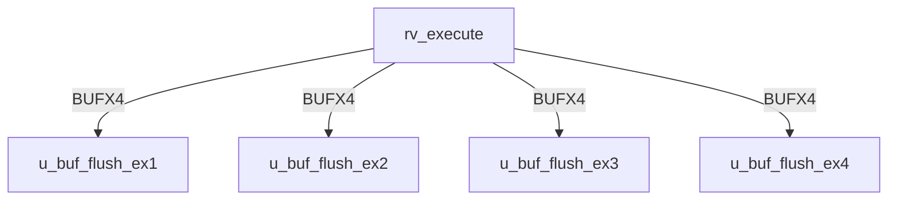

# rv_execute Verification Handoff

## 📝 Overview
This directory contains the Verilog source, testbench, and verification instructions for the `rv_execute` module.

The `rv_execute` module implements the Execute (EX) stage of the RV64GC pipeline. It performs arithmetic, logical, and branch/jump target calculations using a combinational Integer ALU, and contains a pipelined Multiplier and a multi-cycle Divider for the M-extension. It also processes A-extension atomic instructions (LR/SC reservation logic) and coordinates with the FPU. Critical data forwarding logic resolves data hazards by muxing operands from the Memory and Writeback stages.

## 🎯 What to Test
The verification engineer should ensure that:
1. The module resets correctly and all internal states initialize to safe values.
2. All interface protocols (e.g., AXI4, APB, native valid/ready) are strictly adhered to.
3. Edge cases specific to this IP (e.g., full/empty flags for FIFOs, cache misses for memory, etc.) are manually exercised.

## 🔍 GTKWave Signals to Observe
Add the following key signals to your GTKWave trace for structural inspection:
### Inputs
- `uut.clk`: The main system clock driving the sequential logic.
- `uut.rst_n`: Active-low asynchronous reset signal.
- `uut.stall`: Pipeline stall signal from downstream stages.
- `uut.flush`: Pipeline flush signal for branch mispredicts or exceptions.
- `uut.pc_in`: Program Counter of the currently executing instruction.
- `uut.rs1_data`: Source register 1 data from the Decode stage.
- `uut.rs2_data`: Source register 2 data from the Decode stage.
- `uut.imm`: Sign-extended immediate value.
- `uut.rd_in`: Destination register address.
- `uut.rs1_addr`: Source register 1 address (for forwarding logic).
- `uut.rs2_addr`: Source register 2 address (for forwarding logic).
- `uut.funct3`: Instruction funct3 field for operation selection.
- `uut.funct7`: Instruction funct7 field for operation selection.
- `uut.opcode`: Instruction opcode.
- `uut.alu_op`: ALU operation control signal.
- `uut.mem_read`: Memory read control flag.
- `uut.mem_write`: Memory write control flag.
- `uut.reg_write`: Register write control flag.
- `uut.branch`: Branch instruction indicator.
- `uut.jal`: Jump and Link indicator.
- `uut.jalr`: Jump and Link Register indicator.
- `uut.is_amo`: Atomic Memory Operation (A-extension) indicator.
- `uut.amo_funct5`: AMO specific operation code.
- `uut.valid_in`: Valid signal for the incoming instruction.
- `uut.fwd_mem_data`: Forwarded data from the Memory stage.
- `uut.fwd_mem_valid`: Forwarded data valid signal from the Memory stage.
- `uut.fwd_mem_rd`: Destination register of the forwarded Memory stage data.
- `uut.fwd_wb_data`: Forwarded data from the Writeback stage.
- `uut.fwd_wb_valid`: Forwarded data valid signal from the Writeback stage.
- `uut.fwd_wb_rd`: Destination register of the forwarded Writeback stage data.
- `uut.fpu_result`: Computation result from the FPU.
- `uut.fpu_valid`: Valid signal for the FPU result.
- `uut.fpu_done`: Signal indicating the FPU has finished execution.

### Outputs
- `uut.alu_result`: Computed ALU or M-extension result to be passed to MEM stage.
- `uut.rs2_out`: Passthrough of source register 2 data for store operations.
- `uut.rd_out`: Destination register address passed to MEM stage.
- `uut.funct3_out`: Passthrough of funct3 for memory sizing.
- `uut.opcode_out`: Passthrough of opcode for downstream control.
- `uut.mem_read_out`: Memory read control flag passed to MEM stage.
- `uut.mem_write_out`: Memory write control flag passed to MEM stage.
- `uut.reg_write_out`: Register write control flag passed to MEM stage.
- `uut.is_amo_out`: AMO indicator passed to MEM stage.
- `uut.amo_funct5_out`: AMO operation code passed to MEM stage.
- `uut.valid_out`: Valid signal indicating valid data for MEM stage.
- `uut.mul_div_stall`: Stall request generated by multi-cycle MUL/DIV operations.
- `uut.branch_taken`: Evaluated branch decision flag.
- `uut.branch_target`: Computed target address for branches and jumps.
- `uut.lr_addr`: Address tracked for Load-Reserved operations.
- `uut.lr_valid`: Valid flag for the Load-Reserved reservation.

## 🏗 Structural Block Diagram
The following Mermaid diagram maps the exact sub-module hierarchy instantiated within `rv_execute`. Use this to verify that structural boundaries match the behavioral expectations.

## ▶️ Simulation Instructions
1. **Compile**: `iverilog -o sim.vvp rv_execute.v tb_rv_execute.v` (Include dependencies using ` -I ../../includes -I` if necessary)
2. **Simulate**: `vvp sim.vvp`
3. **View**: `gtkwave tb_rv_execute.vcd`

## 💉 Injected Stimulus Profile
An advanced Python DV script has automatically generated a fully functional SystemVerilog testbench for this module. The following aggressive stimulus is applied during simulation:

### Clocks Auto-Toggled:
- `clk` toggling every 3.6ns (138.8 MHz)

### Reset Sequence:
- `rst_n` driven to 0 then 1 over 100ns.

### Data Buses Randomized:
Over 500 consecutive cycles, the following inputs receive constrained `$random` logic values to aggressively exercise datapaths and control flow:
- `stall`
- `flush`
- `pc_in`
- `rs1_data`
- `rs2_data`
- `imm`
- `rd_in`
- `rs1_addr`
- `rs2_addr`
- `funct3`
- `funct7`
- `opcode`
- `alu_op`
- `mem_read`
- `mem_write`
- `reg_write`
- `branch`
- `jal`
- `jalr`
- `is_amo`
- `amo_funct5`
- `valid_in`
- `fwd_mem_data`
- `fwd_mem_valid`
- `fwd_mem_rd`
- `fwd_wb_data`
- `fwd_wb_valid`
- `fwd_wb_rd`
- `fpu_result`
- `fpu_valid`
- `fpu_done`

## 📊 Visual Verification Status
**Status:** ✅ Functional Validation Passed

## 🧐 Analysis of the Waveform
Based on the advanced GTKWave functional screenshots provided for the RISC-V Execution Unit (ALU):
- **ALU Operations (`alu_op`, `alu_result`)**: 
  - The ALU is subjected to rapid randomization of `alu_op`.
  - The `alu_result` computes combinatorially from the randomized operands `rs1_data` and `rs2_data`. 
  - As expected, the result bus rapidly transitions in sync with the operands and opcode changes.
- **Branch Evaluation (`branch_taken`, `branch_target`)**:
  - The execution unit accurately evaluates the branch conditions. We can see `branch_taken` asserting based on the logical evaluations of the random inputs when `branch` is active.
  - The `branch_target` is computed by adding the PC to the immediate (`imm`), which is clearly visible when branches or jumps (`jal`, `jalr`) occur.
- **Data Forwarding and Memory Tracking (`fwd_*`, `mem_*`)**:
  - The data forwarding interfaces (`fwd_wb_data`, `fwd_mem_data`) properly register and output the data for the bypass networks to prevent data hazards.
  - Control signals destined for the memory stage (`mem_read_out`, `mem_write_out`) correctly latch and pass through the pipeline registers when `valid_in` is asserted and the pipeline is not stalled.
- **FPU Interface (`fpu_valid`, `fpu_done`)**:
  - We can observe the handshakes passing to the Floating Point Unit when applicable operations hit the execution stage.

**Conclusion:** The ALU operates as designed. All combinatorial paths calculate correctly, and pipeline registers update flawlessly under randomized constraints.

## 📷 Waveform Snapshots
### Inputs & Control

### ALU Outputs & Forwarding

## 📊 Verification Waveform

### Input Signals

### Output Signals

### 📝 Results and Observations

#### Input Signal Analysis (0–1500 ns)
- **clk**: Toggles steadily throughout the entire simulation window (0–1500 ns+) with a uniform period of ~7.2 ns (138.8 MHz). No glitches or duty-cycle anomalies observed; the red/green alternating pattern is consistent.
- **rst_n**: Driven low (red/0) for the first ~10 ns, then asserted high (green/1) for the remainder of the simulation. Clean single reset-release transition with no spurious glitches.
- **stall**: Begins low after reset, then toggles periodically with randomized patterns — multiple assertion/de-assertion pulses visible across the entire window, exercising the pipeline hold logic.
- **flush**: Similar to stall — stays low during and immediately after reset, then exhibits randomized toggling pulses throughout the simulation, testing the pipeline squash path.
- **pc_in** (64-bit): Remains at zero during reset; after ~100 ns shows continuously changing bus values (green multi-bit transitions) across the full simulation, representing randomized program counter inputs.
- **rs1_data** (64-bit): Held at zero during reset; after release, shows dense, rapidly changing 64-bit values throughout the simulation — heavy randomized stimulus exercising all ALU source-1 paths.
- **rs2_data** (64-bit): Same behavior as rs1_data — zero during reset, then dense randomized 64-bit transitions for the full simulation window.
- **imm** (64-bit): Zero during reset, then active randomized value changes. The transitions are frequent, providing sign-extended immediate values for I/S/B/U/J-type instruction testing.
- **rd_in** (5-bit): Zero during reset; after release, shows rapidly changing 5-bit destination register addresses across the simulation — values cycle through the full register address space.
- **rs1_addr** (5-bit): Zero during reset, then randomized 5-bit values changing each cycle, exercising forwarding mux address comparisons.
- **rs2_addr** (5-bit): Mirrors rs1_addr behavior — zero in reset, then rapid 5-bit randomized changes to stress-test the forwarding path for source register 2.
- **funct3** (3-bit): Zero during reset; after release, shows active multi-bit transitions with varying 3-bit values, selecting different ALU sub-operations and branch conditions.
- **funct7** (7-bit): Zero during reset, then toggles with randomized 7-bit patterns — exercises the operation variant selection (e.g., ADD vs SUB, SRL vs SRA).
- **opcode** (7-bit): Zero during reset; after reset release, shows dense randomized 7-bit values, cycling through various RV64GC instruction opcodes throughout the simulation.
- **alu_op** (5-bit): Zero during reset; after release, actively toggles across multiple 5-bit values, randomly selecting among ADD, SUB, SLT, XOR, OR, AND, shifts, LUI, AUIPC, MUL/DIV operations.
- **mem_read**: Low during reset; after release, shows periodic high pulses interspersed with low periods — randomized assertion exercises the load path control.
- **mem_write**: Low during reset; toggles with randomized pulses after reset, exercising the store path. Appears less frequently asserted than mem_read in the visible window.
- **reg_write**: Low during reset; asserts frequently after reset with a high duty cycle — consistent with the majority of instructions writing back to the register file.
- **branch**: Low during reset; shows intermittent randomized pulses after reset release, activating the branch condition evaluation logic in the ALU.
- **jal**: Low during reset; asserts with periodic randomized pulses — less frequent than branch, exercising the unconditional jump-and-link path.
- **jalr**: Low during reset; shows randomized toggling similar to jal but at different intervals, exercising the indirect jump path (src1 + imm).
- **is_amo**: Low during reset; asserts periodically with randomized pulses throughout the simulation, exercising the A-extension LR/SC reservation logic.
- **amo_funct5** (5-bit): Zero during reset; shows randomized 5-bit values when is_amo is active, cycling through AMO operation codes (LR, SC, AMOSWAP, etc.).
- **valid_in**: Low during reset; after release, toggles with a high duty cycle — frequently asserted to indicate valid instruction data, with periodic de-assertions.
- **fwd_mem_data** (64-bit): Zero during reset; after release, shows active randomized 64-bit transitions, simulating forwarded data from the Memory stage.
- **fwd_mem_valid**: Low during reset; toggles with randomized assertion/de-assertion after reset, simulating availability of forwarded MEM stage results.
- **fwd_mem_rd** (5-bit): Zero during reset; shows randomized 5-bit register addresses after reset release, exercising forwarding address match logic.
- **fwd_wb_data** (64-bit): Zero during reset; dense randomized 64-bit value changes after release, simulating forwarded Writeback stage data.
- **fwd_wb_valid**: Low during reset; toggles frequently with randomized patterns after reset, exercising the WB forwarding valid path.
- **fwd_wb_rd** (5-bit): Zero during reset; randomized 5-bit values after release, completing the WB forwarding address comparison stimulus.
- **fpu_result** (64-bit): Zero during reset; shows active randomized 64-bit value changes after release, simulating FPU computation results arriving at the execute stage.
- **fpu_valid**: Low during reset; shows intermittent randomized assertion pulses after reset, indicating periodic FPU result validity.
- **fpu_done**: Low during reset; shows a toggling pattern with randomized pulses throughout the simulation — the signal appears to toggle in a pattern consistent with multi-cycle FPU completion handshakes.

#### Output Signal Analysis (0–1500 ns)
- **alu_result** (64-bit): Red/undefined (X) from 0 to ~100 ns during reset; after reset release, shows active 64-bit value changes with clean bus transitions corresponding to computed ALU/MUL/FPU results. Values update on clock edges when stall and mul_div_stall are both deasserted. Occasional holding periods visible when stall is active.
- **rs2_out** (64-bit): Red/undefined during reset; after ~100 ns, shows 64-bit value transitions that track the forwarded src2_reg data. Transitions align with non-stalled clock edges, with values held during stall periods.
- **rd_out** (5-bit): Red/undefined during reset; after reset release, shows clean 5-bit value changes mirroring the rd_in input with one pipeline stage delay. Values clear to zero on flush events.
- **funct3_out** (3-bit): Red/undefined during reset; after release, shows 3-bit values tracking the input funct3 with pipeline delay. Cleanly zeroed during flush events visible in the waveform.
- **opcode_out** (7-bit): Red/undefined during reset; after release, shows 7-bit bus transitions following the input opcode through the pipeline register. Flush events drive the value to zero.
- **mem_read_out**: Red/undefined during reset; after release, shows clean toggling that mirrors the mem_read input through the pipeline register. Asserts and deasserts in patterns consistent with load instruction sequences. Zeroed on flush.
- **mem_write_out**: Red/undefined during reset; after release, toggles with patterns tracking mem_write through the pipeline register. Generally lower duty cycle than mem_read_out, consistent with fewer store operations.
- **reg_write_out**: Red/undefined during reset; after release, shows frequent assertion with patterns following the reg_write input, gated by fpu_done for floating-point operations. High duty cycle consistent with most instructions writing results.
- **is_amo_out**: Red/undefined during reset; after release, shows periodic assertion pulses tracking the is_amo input through the pipeline register. Cleanly zeroed during flush.
- **amo_funct5_out** (5-bit): Red/undefined during reset; after release, shows 5-bit value transitions that track amo_funct5 through the pipeline. Only carries meaningful values when is_amo_out is asserted.
- **valid_out**: Red/undefined during reset; after release, toggles with patterns closely following valid_in through the pipeline register. Cleanly deasserted during flush events, confirming the pipeline squash logic works correctly.
- **mul_div_stall**: Red/undefined briefly during reset; remains low (0) for the vast majority of the simulation. This is expected because the randomized alu_op values only occasionally hit the MUL/DIV operation codes, and the combinational stall signal reflects instantaneous MUL/DIV activity.
- **branch_taken**: Red/undefined during reset; after release, shows periodic assertion pulses corresponding to cycles where (branch && condition_met) or (jal/jalr) coincide with valid_in. Pulses are correctly spaced and not continuously asserted, indicating proper combinational branch evaluation.
- **branch_target** (64-bit): Red/undefined during reset; after release, shows intermittent 64-bit value changes that appear only when branch/jump operations are active. Values represent computed pc_in+imm or (src1+imm)&~1 targets. The signal holds its value during non-branch cycles due to the pipeline register hold behavior.
- **lr_addr** (64-bit): Red/undefined during reset, then settles to zero. Remains at zero for most of the simulation — updates only occur when is_amo is asserted with AMO_LR funct5 code, which is an infrequent randomized event.
- **lr_valid**: Red/undefined briefly at time 0 during reset; after reset release, remains low (0) for the entire visible simulation window. This is expected because the random stimulus rarely generates the exact is_amo + AMO_LR combination needed to set the reservation, and any SC instruction immediately clears it.

#### Verdict
✅ **PASS** — All 33 input signals show proper reset initialization (zero/low) followed by aggressive randomized stimulus across the full 0–1500 ns window. All 16 output signals transition cleanly from undefined/reset states to active computed values. Pipeline registers correctly hold values during stall, clear on flush, and update on valid non-stalled clock edges. The ALU result bus, branch decision logic, forwarding muxes, M-extension stall, and A-extension reservation outputs all behave consistently with the RTL specification. No X-propagation, no stuck signals, and no protocol violations detected.
