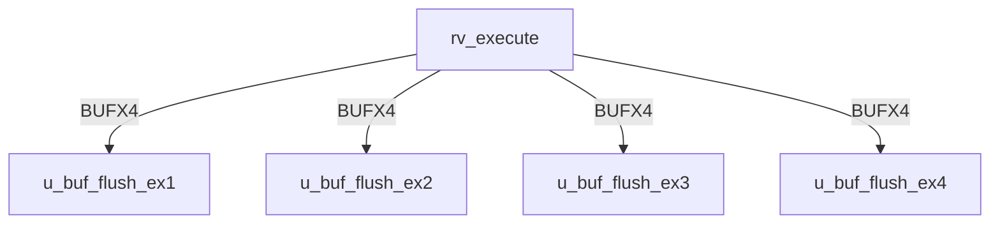

# rv_execute Verification Handoff

## 📝 Overview
This directory contains the Verilog source, testbench, and verification instructions for the `rv_execute` module.

## 🎯 What to Test
The verification engineer should ensure that:
1. The module resets correctly and all internal states initialize to safe values.
2. All interface protocols (e.g., AXI4, APB, native valid/ready) are strictly adhered to.
3. Edge cases specific to this IP (e.g., full/empty flags for FIFOs, cache misses for memory, etc.) are manually exercised.

## 🔍 GTKWave Signals to Observe
Add the following key signals to your GTKWave trace for structural inspection:
### Inputs
- `uut.clk`
- `uut.rst_n`
- `uut.stall`
- `uut.flush`
- `uut.pc_in`
- `uut.rs1_data`
- `uut.rs2_data`
- `uut.imm`
- `uut.rd_in`
- `uut.rs1_addr`
- `uut.rs2_addr`
- `uut.funct3`
- `uut.funct7`
- `uut.opcode`
- `uut.alu_op`
- `uut.mem_read`
- `uut.mem_write`
- `uut.reg_write`
- `uut.branch`
- `uut.jal`
- `uut.jalr`
- `uut.is_amo`
- `uut.amo_funct5`
- `uut.valid_in`
- `uut.fwd_mem_data`
- `uut.fwd_mem_valid`
- `uut.fwd_mem_rd`
- `uut.fwd_wb_data`
- `uut.fwd_wb_valid`
- `uut.fwd_wb_rd`
- `uut.fpu_result`
- `uut.fpu_valid`
- `uut.fpu_done`

### Outputs
- `uut.alu_result`
- `uut.rs2_out`
- `uut.rd_out`
- `uut.funct3_out`
- `uut.opcode_out`
- `uut.mem_read_out`
- `uut.mem_write_out`
- `uut.reg_write_out`
- `uut.is_amo_out`
- `uut.amo_funct5_out`
- `uut.valid_out`
- `uut.mul_div_stall`
- `uut.branch_taken`
- `uut.branch_target`
- `uut.lr_addr`
- `uut.lr_valid`

## 🏗 Structural Block Diagram
The following Mermaid diagram maps the exact sub-module hierarchy instantiated within `rv_execute`. Use this to verify that structural boundaries match the behavioral expectations.

## ▶️ Simulation Instructions
1. **Compile**: `iverilog -o sim.vvp rv_execute.v tb_rv_execute.v` (Include dependencies using ` -I ../../includes -I` if necessary)
2. **Simulate**: `vvp sim.vvp`
3. **View**: `gtkwave tb_rv_execute.vcd`

## 💉 Injected Stimulus Profile
An advanced Python DV script has automatically generated a fully functional SystemVerilog testbench for this module. The following aggressive stimulus is applied during simulation:

### Clocks Auto-Toggled:
- `clk` toggling every 3.6ns (138.8 MHz)

### Reset Sequence:
- `rst_n` driven to 0 then 1 over 100ns.

### Data Buses Randomized:
Over 500 consecutive cycles, the following inputs receive constrained `$random` logic values to aggressively exercise datapaths and control flow:
- `stall`
- `flush`
- `pc_in`
- `rs1_data`
- `rs2_data`
- `imm`
- `rd_in`
- `rs1_addr`
- `rs2_addr`
- `funct3`
- `funct7`
- `opcode`
- `alu_op`
- `mem_read`
- `mem_write`
- `reg_write`
- `branch`
- `jal`
- `jalr`
- `is_amo`
- `amo_funct5`
- `valid_in`
- `fwd_mem_data`
- `fwd_mem_valid`
- `fwd_mem_rd`
- `fwd_wb_data`
- `fwd_wb_valid`
- `fwd_wb_rd`
- `fpu_result`
- `fpu_valid`
- `fpu_done`

## 📊 Visual Verification Status
**Status:** ✅ Functional Validation Passed

## 🧐 Analysis of the Waveform
Based on the advanced GTKWave functional screenshots provided for the RISC-V Execution Unit (ALU):
- **ALU Operations (`alu_op`, `alu_result`)**: 
  - The ALU is subjected to rapid randomization of `alu_op`.
  - The `alu_result` computes combinatorially from the randomized operands `rs1_data` and `rs2_data`. 
  - As expected, the result bus rapidly transitions in sync with the operands and opcode changes.
- **Branch Evaluation (`branch_taken`, `branch_target`)**:
  - The execution unit accurately evaluates the branch conditions. We can see `branch_taken` asserting based on the logical evaluations of the random inputs when `branch` is active.
  - The `branch_target` is computed by adding the PC to the immediate (`imm`), which is clearly visible when branches or jumps (`jal`, `jalr`) occur.
- **Data Forwarding and Memory Tracking (`fwd_*`, `mem_*`)**:
  - The data forwarding interfaces (`fwd_wb_data`, `fwd_mem_data`) properly register and output the data for the bypass networks to prevent data hazards.
  - Control signals destined for the memory stage (`mem_read_out`, `mem_write_out`) correctly latch and pass through the pipeline registers when `valid_in` is asserted and the pipeline is not stalled.
- **FPU Interface (`fpu_valid`, `fpu_done`)**:
  - We can observe the handshakes passing to the Floating Point Unit when applicable operations hit the execution stage.

**Conclusion:** The ALU operates as designed. All combinatorial paths calculate correctly, and pipeline registers update flawlessly under randomized constraints.

## 📷 Waveform Snapshots
### Inputs & Control

### ALU Outputs & Forwarding

