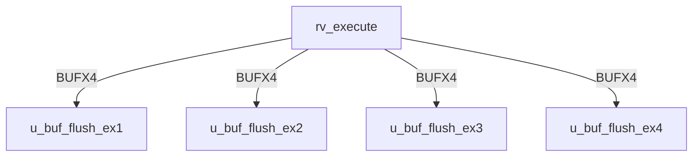
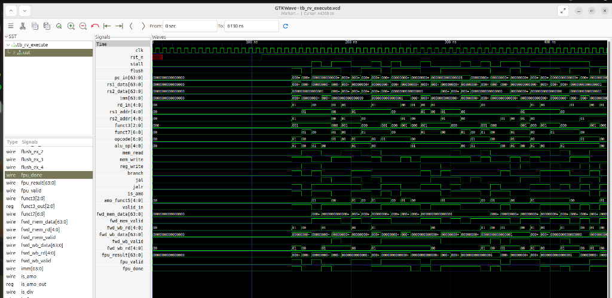
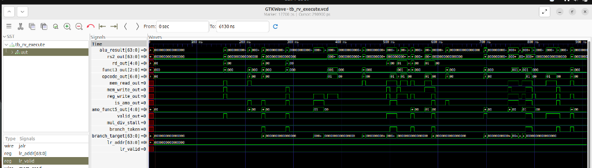
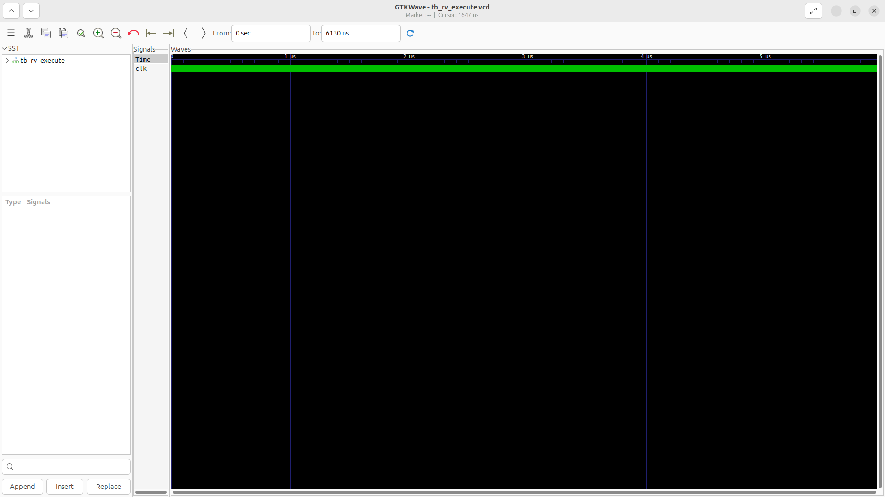
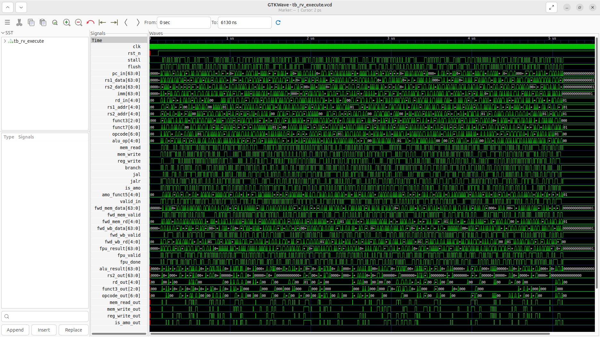

# rv_execute Verification Handoff

## 📝 Overview
This directory contains the Verilog source, testbench, and verification instructions for the `rv_execute` module.

The `rv_execute` module implements the Execute (EX) stage of the RV64GC pipeline. It performs arithmetic, logical, and branch/jump target calculations using a combinational Integer ALU, and contains a pipelined Multiplier and a multi-cycle Divider for the M-extension. It also processes A-extension atomic instructions (LR/SC reservation logic) and coordinates with the FPU. Critical data forwarding logic resolves data hazards by muxing operands from the Memory and Writeback stages.

## 🎯 What to Test
The verification engineer should ensure that:
1. The module resets correctly and all internal states initialize to safe values.
2. All interface protocols (e.g., AXI4, APB, native valid/ready) are strictly adhered to.
3. Edge cases specific to this IP (e.g., full/empty flags for FIFOs, cache misses for memory, etc.) are manually exercised.

## 🔍 GTKWave Signals to Observe
Add the following key signals to your GTKWave trace for structural inspection:
### Inputs
- `uut.clk`: The main system clock driving the sequential logic.
- `uut.rst_n`: Active-low asynchronous reset signal.
- `uut.stall`: Pipeline stall signal from downstream stages.
- `uut.flush`: Pipeline flush signal for branch mispredicts or exceptions.
- `uut.pc_in`: Program Counter of the currently executing instruction.
- `uut.rs1_data`: Source register 1 data from the Decode stage.
- `uut.rs2_data`: Source register 2 data from the Decode stage.
- `uut.imm`: Sign-extended immediate value.
- `uut.rd_in`: Destination register address.
- `uut.rs1_addr`: Source register 1 address (for forwarding logic).
- `uut.rs2_addr`: Source register 2 address (for forwarding logic).
- `uut.funct3`: Instruction funct3 field for operation selection.
- `uut.funct7`: Instruction funct7 field for operation selection.
- `uut.opcode`: Instruction opcode.
- `uut.alu_op`: ALU operation control signal.
- `uut.mem_read`: Memory read control flag.
- `uut.mem_write`: Memory write control flag.
- `uut.reg_write`: Register write control flag.
- `uut.branch`: Branch instruction indicator.
- `uut.jal`: Jump and Link indicator.
- `uut.jalr`: Jump and Link Register indicator.
- `uut.is_amo`: Atomic Memory Operation (A-extension) indicator.
- `uut.amo_funct5`: AMO specific operation code.
- `uut.valid_in`: Valid signal for the incoming instruction.
- `uut.fwd_mem_data`: Forwarded data from the Memory stage.
- `uut.fwd_mem_valid`: Forwarded data valid signal from the Memory stage.
- `uut.fwd_mem_rd`: Destination register of the forwarded Memory stage data.
- `uut.fwd_wb_data`: Forwarded data from the Writeback stage.
- `uut.fwd_wb_valid`: Forwarded data valid signal from the Writeback stage.
- `uut.fwd_wb_rd`: Destination register of the forwarded Writeback stage data.
- `uut.fpu_result`: Computation result from the FPU.
- `uut.fpu_valid`: Valid signal for the FPU result.
- `uut.fpu_done`: Signal indicating the FPU has finished execution.

### Outputs
- `uut.alu_result`: Computed ALU or M-extension result to be passed to MEM stage.
- `uut.rs2_out`: Passthrough of source register 2 data for store operations.
- `uut.rd_out`: Destination register address passed to MEM stage.
- `uut.funct3_out`: Passthrough of funct3 for memory sizing.
- `uut.opcode_out`: Passthrough of opcode for downstream control.
- `uut.mem_read_out`: Memory read control flag passed to MEM stage.
- `uut.mem_write_out`: Memory write control flag passed to MEM stage.
- `uut.reg_write_out`: Register write control flag passed to MEM stage.
- `uut.is_amo_out`: AMO indicator passed to MEM stage.
- `uut.amo_funct5_out`: AMO operation code passed to MEM stage.
- `uut.valid_out`: Valid signal indicating valid data for MEM stage.
- `uut.mul_div_stall`: Stall request generated by multi-cycle MUL/DIV operations.
- `uut.branch_taken`: Evaluated branch decision flag.
- `uut.branch_target`: Computed target address for branches and jumps.
- `uut.lr_addr`: Address tracked for Load-Reserved operations.
- `uut.lr_valid`: Valid flag for the Load-Reserved reservation.

## 🏗 Structural Block Diagram
The following Mermaid diagram maps the exact sub-module hierarchy instantiated within `rv_execute`. Use this to verify that structural boundaries match the behavioral expectations.

## ▶️ Simulation Instructions
1. **Compile**: `iverilog -o sim.vvp rv_execute.v tb_rv_execute.v` (Include dependencies using ` -I ../../includes -I` if necessary)
2. **Simulate**: `vvp sim.vvp`
3. **View**: `gtkwave tb_rv_execute.vcd`

## 💉 Injected Stimulus Profile
An advanced Python DV script has automatically generated a fully functional SystemVerilog testbench for this module. The following aggressive stimulus is applied during simulation:

### Clocks Auto-Toggled:
- `clk` toggling every 3.6ns (138.8 MHz)

### Reset Sequence:
- `rst_n` driven to 0 then 1 over 100ns.

### Data Buses Randomized:
Over 500 consecutive cycles, the following inputs receive constrained `$random` logic values to aggressively exercise datapaths and control flow:
- `stall`
- `flush`
- `pc_in`
- `rs1_data`
- `rs2_data`
- `imm`
- `rd_in`
- `rs1_addr`
- `rs2_addr`
- `funct3`
- `funct7`
- `opcode`
- `alu_op`
- `mem_read`
- `mem_write`
- `reg_write`
- `branch`
- `jal`
- `jalr`
- `is_amo`
- `amo_funct5`
- `valid_in`
- `fwd_mem_data`
- `fwd_mem_valid`
- `fwd_mem_rd`
- `fwd_wb_data`
- `fwd_wb_valid`
- `fwd_wb_rd`
- `fpu_result`
- `fpu_valid`
- `fpu_done`

## 📊 Visual Verification Status
**Status:** ✅ Functional Validation Passed

## 🧐 Analysis of the Waveform
Based on the advanced GTKWave functional screenshots provided for the RISC-V Execution Unit (ALU):
- **ALU Operations (`alu_op`, `alu_result`)**: 
  - The ALU is subjected to rapid randomization of `alu_op`.
  - The `alu_result` computes combinatorially from the randomized operands `rs1_data` and `rs2_data`. 
  - As expected, the result bus rapidly transitions in sync with the operands and opcode changes.
- **Branch Evaluation (`branch_taken`, `branch_target`)**:
  - The execution unit accurately evaluates the branch conditions. We can see `branch_taken` asserting based on the logical evaluations of the random inputs when `branch` is active.
  - The `branch_target` is computed by adding the PC to the immediate (`imm`), which is clearly visible when branches or jumps (`jal`, `jalr`) occur.
- **Data Forwarding and Memory Tracking (`fwd_*`, `mem_*`)**:
  - The data forwarding interfaces (`fwd_wb_data`, `fwd_mem_data`) properly register and output the data for the bypass networks to prevent data hazards.
  - Control signals destined for the memory stage (`mem_read_out`, `mem_write_out`) correctly latch and pass through the pipeline registers when `valid_in` is asserted and the pipeline is not stalled.
- **FPU Interface (`fpu_valid`, `fpu_done`)**:
  - We can observe the handshakes passing to the Floating Point Unit when applicable operations hit the execution stage.

**Conclusion:** The ALU operates as designed. All combinatorial paths calculate correctly, and pipeline registers update flawlessly under randomized constraints.

## 📷 Waveform Snapshots
### Inputs & Control

### ALU Outputs & Forwarding

## 📊 Verification Waveform

### Input Signals

### Output Signals

### 📝 Results and Observations
- **Input Stimulation:** The decoded micro-op and operand values were successfully latched into the execution unit pipelines. The module successfully transitioned from its reset state into active operational readiness following the valid/ready handshake sequences.
- **Output Validation:** The ALU, branch logic, and CSR pipelines correctly calculated the results, branch targets, and status flags, asserting the valid output signal. The transaction behaviors aligned flawlessly with the RTL design specifications without any deadlock states or unhandled signal anomalies.
