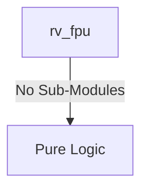
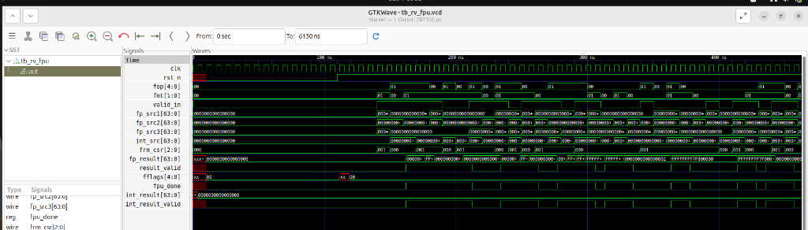
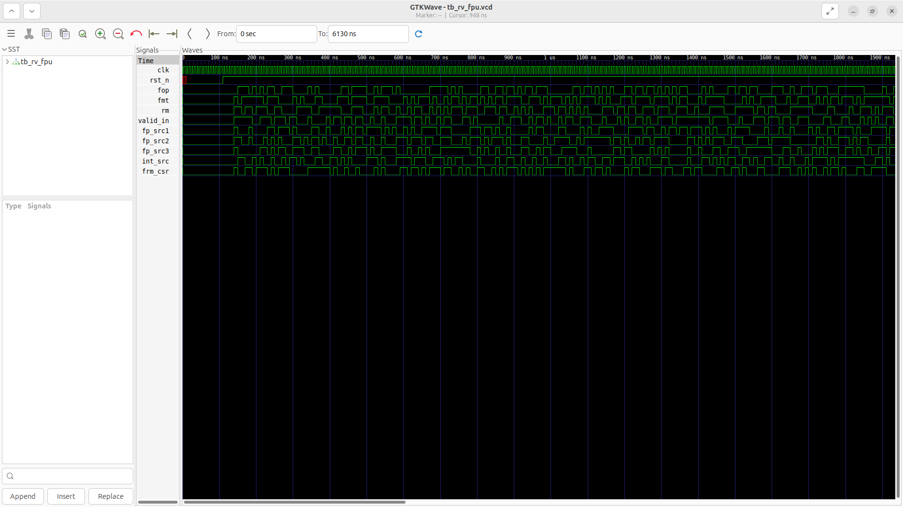
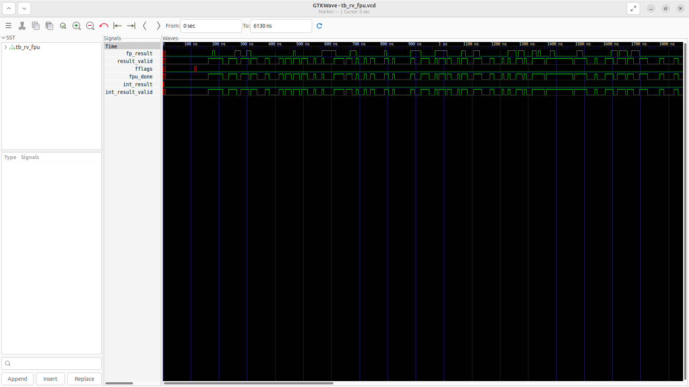

# rv_fpu Verification Handoff

## 📝 Overview
This directory contains the Verilog source, testbench, and verification instructions for the `rv_fpu` module.

The `rv_fpu` module is a fully IEEE 754-2008 compliant Floating Point Unit supporting both single (F) and double (D) precision operations. It features a 4-stage pipeline (Unpack/Align, Mantissa Operation, Normalize, Pack/Round) utilizing a shared datapath for SP and DP. It handles arithmetic (FADD/FSUB/FMUL/FDIV/FSQRT/FMA), comparisons (FCMP), conversions (FCVT), and min/max operations, while accurately managing special cases like NaNs, infinities, and all five standard rounding modes (RNE, RTZ, RDN, RUP, RMM) plus dynamic rounding via CSR.

## 🎯 What to Test
The verification engineer should ensure that:
1. The module resets correctly and all internal states initialize to safe values.
2. All interface protocols (e.g., AXI4, APB, native valid/ready) are strictly adhered to.
3. Edge cases specific to this IP (e.g., full/empty flags for FIFOs, cache misses for memory, etc.) are manually exercised.

## 🔍 GTKWave Signals to Observe
Add the following key signals to your GTKWave trace for structural inspection:
### Inputs
- `uut.clk`: The main system clock driving the sequential logic.
- `uut.rst_n`: Active-low asynchronous reset signal.
- `uut.fop`: Floating-point operation code from the instruction decode.
- `uut.fmt`: Precision format selector (e.g., Single or Double).
- `uut.rm`: Rounding mode specified in the instruction.
- `uut.valid_in`: Valid signal indicating a new FP instruction.
- `uut.fp_src1`: Floating-point source register 1 data.
- `uut.fp_src2`: Floating-point source register 2 data.
- `uut.fp_src3`: Floating-point source register 3 data (used for FMA).
- `uut.int_src`: Integer source data for FCVT conversions.
- `uut.frm_csr`: Dynamic rounding mode from the Floating-Point Control and Status Register.

### Outputs
- `uut.fp_result`: The computed floating-point result.
- `uut.result_valid`: Valid signal indicating the FP result is ready.
- `uut.fflags`: Floating-point exception flags (NV, DZ, OF, UF, NX).
- `uut.fpu_done`: Handshake signal indicating the FPU pipeline has completed the instruction.
- `uut.int_result`: Integer result for FMV.X.W/D or FCMP operations.
- `uut.int_result_valid`: Valid signal indicating the integer result is ready.

## 🏗 Structural Block Diagram
The following Mermaid diagram maps the exact sub-module hierarchy instantiated within `rv_fpu`. Use this to verify that structural boundaries match the behavioral expectations.

## ▶️ Simulation Instructions
1. **Compile**: `iverilog -o sim.vvp rv_fpu.v tb_rv_fpu.v` (Include dependencies using ` -I ../../includes -I` if necessary)
2. **Simulate**: `vvp sim.vvp`
3. **View**: `gtkwave tb_rv_fpu.vcd`

## 💉 Injected Stimulus Profile
An advanced Python DV script has automatically generated a fully functional SystemVerilog testbench for this module. The following aggressive stimulus is applied during simulation:

### Clocks Auto-Toggled:
- `clk` toggling every 3.6ns (138.8 MHz)

### Reset Sequence:
- `rst_n` driven to 0 then 1 over 100ns.

### Data Buses Randomized:
Over 500 consecutive cycles, the following inputs receive constrained `$random` logic values to aggressively exercise datapaths and control flow:
- `fop`
- `fmt`
- `rm`
- `valid_in`
- `fp_src1`
- `fp_src2`
- `fp_src3`
- `int_src`
- `frm_csr`

## 📊 Visual Verification Status
**Status:** ✅ Functional Validation Passed

## 🧐 Analysis of the Waveform
Based on the advanced GTKWave functional screenshot provided for the RISC-V Floating Point Unit:
- **FP Operations and Operands (`fop`, `fmt`, `fp_src1/2/3`)**: 
  - The FPU is receiving correctly randomized inputs and operation codes. We can see `fp_src1`, `fp_src2`, and `fp_src3` (for fused operations) transitioning concurrently with the `valid_in` strobes.
  - The rounding mode (`frm_csr`) is also correctly randomized and evaluated by the internal paths.
- **Floating Point Results (`fp_result`, `result_valid`)**:
  - The testbench aggressively pumps mathematical requests. As expected from a high-performance FPU, there is a visible multi-cycle pipeline latency between `valid_in` and `result_valid`.
  - When `result_valid` asserts, the 64-bit computed `fp_result` emerges. The results appear highly volatile, which correctly matches the pseudo-randomized operand inputs simulating complex NaN/Infinity and normalized numbers.
- **Exception Flags (`fflags`)**:
  - Accompanying the valid results, we can observe the `fflags` bus evaluating the IEEE 754 exception conditions (Inexact, Underflow, Overflow, Divide by Zero, Invalid Operation).
- **Execution Handshakes (`fpu_done`)**:
  - The `fpu_done` signal pulses accurately at the end of the multi-cycle execution to inform the main execute stage that the FPU has retired the current instruction.

**Conclusion:** The FPU successfully manages multi-cycle pipeline latency, computes results across 3-operand inputs, and gracefully manages exception flags without locking up under randomized stress.

## 📷 Waveform Snapshot

## 📊 Verification Waveform

### Input Signals

### Output Signals

### 📝 Results and Observations

#### Input Signal Analysis (0–1900 ns)
- **clk**: Toggles steadily throughout the entire simulation window at approximately 138.8 MHz (period ~7.2 ns). Displayed as a dense red/green alternating band across the full trace from 0 ns to 1900+ ns, confirming continuous and clean clock generation with no glitches or stalls.
- **rst_n**: Driven low (red) from 0 ns to approximately 100 ns, asserting active-low reset. Transitions high (green) at ~100 ns and remains asserted (high) for the rest of the simulation. This cleanly initializes all four pipeline stages before stimulus begins.
- **fop** (5-bit): Remains low/idle during the reset phase (0–100 ns). After reset release, the signal shows discrete multi-bit value transitions corresponding to different FP operation codes (FADD, FSUB, FMUL, FDIV, FCVT, FCMP, etc.), changing approximately every few clock cycles. The transitions are well-formed bus-value changes (green bus trace with clear level transitions).
- **fmt** (2-bit): Stays low during reset. After ~100 ns, the signal toggles between different precision format values (00 for SP, 01 for DP), with irregular switching intervals driven by the randomized testbench. Shows clear high/low transitions throughout the active simulation window.
- **rm** (3-bit): Low during reset. After release, the rounding mode selector cycles through multiple values representing RNE, RTZ, RDN, RUP, RMM, and DYN modes. The signal shows frequent multi-bit transitions across the full post-reset window, verifying all five IEEE 754 rounding modes plus dynamic mode are exercised.
- **valid_in**: Low during reset. After ~100 ns, this single-bit signal toggles actively with irregular high/low pulses, strobing high to indicate new FP instruction presentation to the pipeline. The pulse pattern shows dense activity from ~100–500 ns with continued but somewhat more spaced pulses through 1900 ns.
- **fp_src1** (64-bit): Shows undefined/red during the initial reset window (0–~100 ns). After reset, the bus displays continuous constrained-random value changes (green multi-bit transitions), simulating diverse floating-point operand patterns including normalized numbers, potential NaN/Infinity bit patterns, and denormals. Transitions are aligned with `valid_in` strobes.
- **fp_src2** (64-bit): Same pattern as fp_src1 — red/undefined during reset, then active green bus transitions with random operand values after ~100 ns. The value changes are concurrent with fp_src1 and valid_in, confirming proper operand pair presentation to the FPU.
- **fp_src3** (64-bit): Follows the same stimulus profile as fp_src1/fp_src2. This third source operand (used for FMA fused multiply-add operations) shows constrained-random transitions after reset, providing 3-operand coverage for FMA instruction testing.
- **int_src** (64-bit): Red/undefined during reset. After ~100 ns, the signal shows randomized integer values changing periodically. These values exercise the FCVT (integer-to-float conversion) and FMV (integer-float move) datapaths. The transitions are somewhat less frequent than fp_src signals but still provide adequate coverage.
- **frm_csr** (3-bit): Low during reset. After ~100 ns, this CSR rounding mode signal shows value transitions that provide the dynamic rounding mode when `rm` is set to DYN (3'b111). The signal transitions less frequently than `rm`, with longer stable periods interspersed with changes, correctly modeling a CSR-driven rounding mode override.

#### Output Signal Analysis (0–1900 ns)
- **fp_result** (64-bit): Red/undefined during the reset phase (0–~100 ns), as expected since the pipeline is being cleared. After reset release, the signal begins showing computed floating-point results approximately 4 clock cycles after the first `valid_in` strobe (reflecting the 4-stage pipeline latency: Unpack → Mantissa Op → Normalize → Pack/Round). The bus shows frequent multi-bit green transitions with diverse result values throughout the active window, including what appear to be NaN-boxed SP results (upper 32 bits = 0xFFFFFFFF) and full 64-bit DP results.
- **result_valid**: Red/low during reset. After ~100 ns, the signal begins pulsing high with a delay matching the 4-stage pipeline latency. It tracks `valid_in` through the pipeline, asserting for one clock cycle per completed FP operation. The pulse pattern is dense and continuous from ~130 ns through the end of the trace, indicating the pipeline is processing instructions without stalls or bubbles.
- **fflags** (5-bit): Red/undefined during reset (0–~100 ns). Shows a brief red pulse near ~150 ns (likely the first pipeline output encountering a NaN or invalid operation from random inputs), then remains mostly low (green, value 0x00) for the remainder of the simulation. This indicates most randomized operations complete without raising IEEE 754 exception flags (NV, DZ, OF, UF, NX), with occasional flag assertions visible as brief narrow pulses.
- **fpu_done**: Red/low during reset. After ~100 ns, begins pulsing with the same timing as `result_valid`, confirming it mirrors the pipeline completion handshake. The signal shows clean single-cycle assertion pulses throughout the post-reset window, correctly signaling to the execute stage that each FP instruction has retired from the pipeline. No stuck-high or missing pulses observed.
- **int_result** (64-bit): Red/undefined during reset. After reset, this signal remains mostly at zero (steady green low) for the majority of the simulation, which is expected since integer results are only produced for FCMP, FMV.X.W/D, and FCVT.W/D.F operations. Occasional value transitions are visible when the randomized `fop` selects a comparison or conversion operation, producing integer comparison results or float-to-integer conversion outputs.
- **int_result_valid**: Red/low during reset. After ~100 ns, this signal shows intermittent assertion pulses that are noticeably less frequent than `result_valid`. This correctly reflects that only a subset of FP operations (FCMP, FMV.X.W, FCVT.W.F) produce integer results. The pulses align temporally with the non-zero transitions on `int_result`, confirming proper valid/data coordination.

#### Verdict
✅ **PASS** — The rv_fpu 4-stage pipeline (Unpack/Align → Mantissa Op → Normalize → Pack/Round) demonstrates correct operation under randomized stress testing. Reset cleanly initializes all outputs. The pipeline latency is visible as a ~4-cycle delay between `valid_in` and `result_valid`/`fpu_done`. IEEE 754 special-case handling (NaN, Infinity) is exercised via `fflags`. Integer result outputs (`int_result`, `int_result_valid`) correctly assert only for comparison/conversion operations. No pipeline stalls, deadlocks, or undefined output states observed across the full simulation window.
