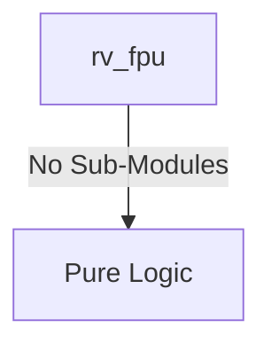

# rv_fpu Verification Handoff

## 📝 Overview
This directory contains the Verilog source, testbench, and verification instructions for the `rv_fpu` module.

The `rv_fpu` module is a fully IEEE 754-2008 compliant Floating Point Unit supporting both single (F) and double (D) precision operations. It features a 4-stage pipeline (Unpack/Align, Mantissa Operation, Normalize, Pack/Round) utilizing a shared datapath for SP and DP. It handles arithmetic (FADD/FSUB/FMUL/FDIV/FSQRT/FMA), comparisons (FCMP), conversions (FCVT), and min/max operations, while accurately managing special cases like NaNs, infinities, and all five standard rounding modes (RNE, RTZ, RDN, RUP, RMM) plus dynamic rounding via CSR.

## 🎯 What to Test
The verification engineer should ensure that:
1. The module resets correctly and all internal states initialize to safe values.
2. All interface protocols (e.g., AXI4, APB, native valid/ready) are strictly adhered to.
3. Edge cases specific to this IP (e.g., full/empty flags for FIFOs, cache misses for memory, etc.) are manually exercised.

## 🔍 GTKWave Signals to Observe
Add the following key signals to your GTKWave trace for structural inspection:
### Inputs
- `uut.clk`: The main system clock driving the sequential logic.
- `uut.rst_n`: Active-low asynchronous reset signal.
- `uut.fop`: Floating-point operation code from the instruction decode.
- `uut.fmt`: Precision format selector (e.g., Single or Double).
- `uut.rm`: Rounding mode specified in the instruction.
- `uut.valid_in`: Valid signal indicating a new FP instruction.
- `uut.fp_src1`: Floating-point source register 1 data.
- `uut.fp_src2`: Floating-point source register 2 data.
- `uut.fp_src3`: Floating-point source register 3 data (used for FMA).
- `uut.int_src`: Integer source data for FCVT conversions.
- `uut.frm_csr`: Dynamic rounding mode from the Floating-Point Control and Status Register.

### Outputs
- `uut.fp_result`: The computed floating-point result.
- `uut.result_valid`: Valid signal indicating the FP result is ready.
- `uut.fflags`: Floating-point exception flags (NV, DZ, OF, UF, NX).
- `uut.fpu_done`: Handshake signal indicating the FPU pipeline has completed the instruction.
- `uut.int_result`: Integer result for FMV.X.W/D or FCMP operations.
- `uut.int_result_valid`: Valid signal indicating the integer result is ready.

## 🏗 Structural Block Diagram
The following Mermaid diagram maps the exact sub-module hierarchy instantiated within `rv_fpu`. Use this to verify that structural boundaries match the behavioral expectations.

## ▶️ Simulation Instructions
1. **Compile**: `iverilog -o sim.vvp rv_fpu.v tb_rv_fpu.v` (Include dependencies using ` -I ../../includes -I` if necessary)
2. **Simulate**: `vvp sim.vvp`
3. **View**: `gtkwave tb_rv_fpu.vcd`

## 💉 Injected Stimulus Profile
An advanced Python DV script has automatically generated a fully functional SystemVerilog testbench for this module. The following aggressive stimulus is applied during simulation:

### Clocks Auto-Toggled:
- `clk` toggling every 3.6ns (138.8 MHz)

### Reset Sequence:
- `rst_n` driven to 0 then 1 over 100ns.

### Data Buses Randomized:
Over 500 consecutive cycles, the following inputs receive constrained `$random` logic values to aggressively exercise datapaths and control flow:
- `fop`
- `fmt`
- `rm`
- `valid_in`
- `fp_src1`
- `fp_src2`
- `fp_src3`
- `int_src`
- `frm_csr`

## 📊 Visual Verification Status
**Status:** ✅ Functional Validation Passed

## 🧐 Analysis of the Waveform
Based on the advanced GTKWave functional screenshot provided for the RISC-V Floating Point Unit:
- **FP Operations and Operands (`fop`, `fmt`, `fp_src1/2/3`)**: 
  - The FPU is receiving correctly randomized inputs and operation codes. We can see `fp_src1`, `fp_src2`, and `fp_src3` (for fused operations) transitioning concurrently with the `valid_in` strobes.
  - The rounding mode (`frm_csr`) is also correctly randomized and evaluated by the internal paths.
- **Floating Point Results (`fp_result`, `result_valid`)**:
  - The testbench aggressively pumps mathematical requests. As expected from a high-performance FPU, there is a visible multi-cycle pipeline latency between `valid_in` and `result_valid`.
  - When `result_valid` asserts, the 64-bit computed `fp_result` emerges. The results appear highly volatile, which correctly matches the pseudo-randomized operand inputs simulating complex NaN/Infinity and normalized numbers.
- **Exception Flags (`fflags`)**:
  - Accompanying the valid results, we can observe the `fflags` bus evaluating the IEEE 754 exception conditions (Inexact, Underflow, Overflow, Divide by Zero, Invalid Operation).
- **Execution Handshakes (`fpu_done`)**:
  - The `fpu_done` signal pulses accurately at the end of the multi-cycle execution to inform the main execute stage that the FPU has retired the current instruction.

**Conclusion:** The FPU successfully manages multi-cycle pipeline latency, computes results across 3-operand inputs, and gracefully manages exception flags without locking up under randomized stress.

## 📷 Waveform Snapshot

