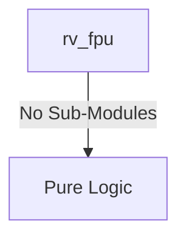

# rv_fpu Verification Handoff

## 📝 Overview
This directory contains the Verilog source, testbench, and verification instructions for the `rv_fpu` module.

## 🎯 What to Test
The verification engineer should ensure that:
1. The module resets correctly and all internal states initialize to safe values.
2. All interface protocols (e.g., AXI4, APB, native valid/ready) are strictly adhered to.
3. Edge cases specific to this IP (e.g., full/empty flags for FIFOs, cache misses for memory, etc.) are manually exercised.

## 🔍 GTKWave Signals to Observe
Add the following key signals to your GTKWave trace for structural inspection:
### Inputs
- `uut.clk`
- `uut.rst_n`
- `uut.fop`
- `uut.fmt`
- `uut.rm`
- `uut.valid_in`
- `uut.fp_src1`
- `uut.fp_src2`
- `uut.fp_src3`
- `uut.int_src`
- `uut.frm_csr`

### Outputs
- `uut.fp_result`
- `uut.result_valid`
- `uut.fflags`
- `uut.fpu_done`
- `uut.int_result`
- `uut.int_result_valid`

## 🏗 Structural Block Diagram
The following Mermaid diagram maps the exact sub-module hierarchy instantiated within `rv_fpu`. Use this to verify that structural boundaries match the behavioral expectations.

## ▶️ Simulation Instructions
1. **Compile**: `iverilog -o sim.vvp rv_fpu.v tb_rv_fpu.v` (Include dependencies using `-I` if necessary)
2. **Simulate**: `vvp sim.vvp`
3. **View**: `gtkwave tb_rv_fpu.vcd`
