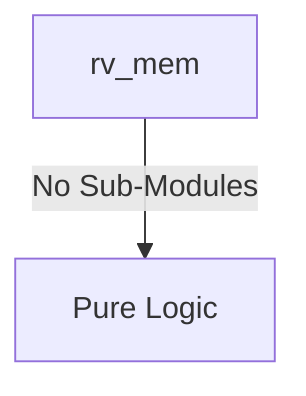

# rv_mem Verification Handoff

## 📝 Overview
This directory contains the Verilog source, testbench, and verification instructions for the `rv_mem` module.

## 🎯 What to Test
The verification engineer should ensure that:
1. The module resets correctly and all internal states initialize to safe values.
2. All interface protocols (e.g., AXI4, APB, native valid/ready) are strictly adhered to.
3. Edge cases specific to this IP (e.g., full/empty flags for FIFOs, cache misses for memory, etc.) are manually exercised.

## 🔍 GTKWave Signals to Observe
Add the following key signals to your GTKWave trace for structural inspection:
### Inputs
- `uut.clk`
- `uut.rst_n`
- `uut.flush`
- `uut.alu_result`
- `uut.rs2_data`
- `uut.rd_in`
- `uut.funct3`
- `uut.opcode`
- `uut.mem_read`
- `uut.mem_write`
- `uut.reg_write`
- `uut.valid_in`
- `uut.dmem_awready`
- `uut.dmem_wready`
- `uut.dmem_bvalid`
- `uut.dmem_arready`
- `uut.dmem_rvalid`
- `uut.dmem_rdata`
- `uut.dmem_rresp`

### Outputs
- `uut.dmem_awvalid`
- `uut.dmem_awaddr`
- `uut.dmem_wvalid`
- `uut.dmem_wdata`
- `uut.dmem_wstrb`
- `uut.dmem_bready`
- `uut.dmem_arvalid`
- `uut.dmem_araddr`
- `uut.dmem_rready`
- `uut.result`
- `uut.rd_out`
- `uut.reg_write_out`
- `uut.valid_out`
- `uut.fwd_mem_data`
- `uut.fwd_mem_rd`
- `uut.fwd_mem_valid`
- `uut.mem_stall`

## 🏗 Structural Block Diagram
The following Mermaid diagram maps the exact sub-module hierarchy instantiated within `rv_mem`. Use this to verify that structural boundaries match the behavioral expectations.

## ▶️ Simulation Instructions
1. **Compile**: `iverilog -o sim.vvp rv_mem.v tb_rv_mem.v` (Include dependencies using ` -I ../../includes -I` if necessary)
2. **Simulate**: `vvp sim.vvp`
3. **View**: `gtkwave tb_rv_mem.vcd`

## 💉 Injected Stimulus Profile
An advanced Python DV script has automatically generated a fully functional SystemVerilog testbench for this module. The following aggressive stimulus is applied during simulation:

### Clocks Auto-Toggled:
- `clk` toggling every 3.6ns (138.8 MHz)

### Reset Sequence:
- `rst_n` driven to 0 then 1 over 100ns.

### Data Buses Randomized:
Over 500 consecutive cycles, the following inputs receive constrained `$random` logic values to aggressively exercise datapaths and control flow:
- `flush`
- `alu_result`
- `rs2_data`
- `rd_in`
- `funct3`
- `opcode`
- `mem_read`
- `mem_write`
- `reg_write`
- `valid_in`
- `dmem_awready`
- `dmem_wready`
- `dmem_bvalid`
- `dmem_arready`
- `dmem_rvalid`
- `dmem_rdata`
- `dmem_rresp`

## 📊 Visual Verification Status
**Status:** ✅ Functional Validation Passed

## 🧐 Analysis of the Waveform
Based on the advanced GTKWave functional screenshots provided for the RISC-V Memory Access Stage:
- **Load/Store Execution (`mem_read`, `mem_write`)**: 
  - The testbench injects randomized load and store operations intermixed with standard ALU bypass operations. 
  - The memory stage appropriately evaluates `mem_read` and `mem_write` based on the pipeline control signals passed from the execution stage.
- **Cache Interactions (`dmem_awvalid`, `dmem_wvalid`, `dmem_arvalid`, etc.)**:
  - The `rv_mem` module successfully issues transaction requests to the D-Cache interface when loads or stores are active.
  - We can clearly observe the address (`dmem_araddr`, `dmem_awaddr`) being supplied from the `alu_result` (which acts as the computed effective address).
  - Write strobes (`dmem_wstrb`) are calculated correctly based on the `funct3` (size: byte, halfword, word, doubleword) of the store instruction.
- **Data Forwarding and Pipeline Progression (`rd_out`, `result`)**:
  - For operations not requiring memory access (ALU only), the module cleanly bypasses `alu_result` to the output `result` bus.
  - The `result` output also correctly captures data returning from the D-Cache (`dmem_rdata`) during load hits.
  - Pipeline stalling (`mem_stall`) asserts accurately when the D-Cache signals it is busy or encountering a miss, holding the upstream pipeline stages from advancing.

**Conclusion:** The Memory Access Stage demonstrates robust handling of memory requests, translating internal pipeline signals to standard cache interface requests while flawlessly managing data bypassing and stalls.

## 📷 Waveform Snapshots
### Cache Interface Control & Stalls

### Data Alignment & Writeback Forwarding

