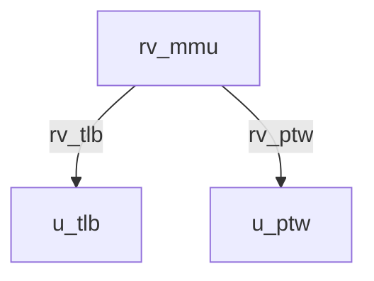
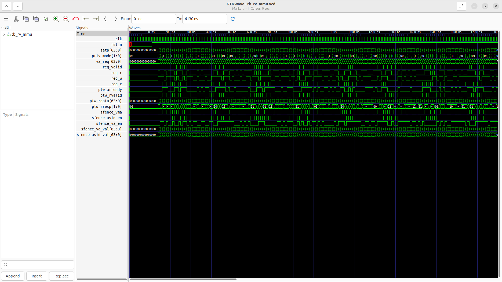
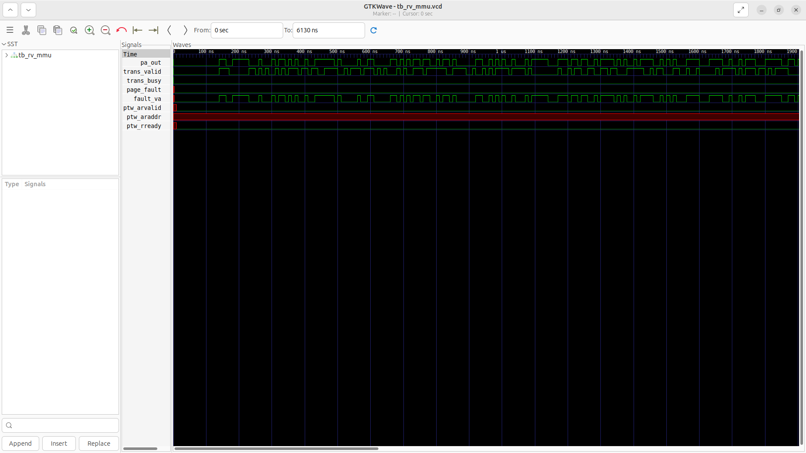

# rv_mmu Verification Handoff

## 📝 Overview
This directory contains the Verilog source, testbench, and verification instructions for the `rv_mmu` module.

The `rv_mmu` module is the top-level Memory Management Unit supporting Sv39 virtual memory translation. It multiplexes bare mode (M-mode or translation disabled) with paged mode (Sv39). When Sv39 is active, it utilizes an internal `rv_tlb` for fast address translation and permission checking, and falls back to a hardware Page Table Walker (`rv_ptw`) via an AXI4 interface on TLB misses. It handles SATP CSR decoding, mode switching, SFENCE.VMA invalidations, and properly signals pipeline stalls and page faults.

## 🎯 What to Test
The verification engineer should ensure that:
1. The module resets correctly and all internal states initialize to safe values.
2. All interface protocols (e.g., AXI4, APB, native valid/ready) are strictly adhered to.
3. Edge cases specific to this IP (e.g., full/empty flags for FIFOs, cache misses for memory, etc.) are manually exercised.

## 🔍 GTKWave Signals to Observe
Add the following key signals to your GTKWave trace for structural inspection:
### Inputs
- `uut.clk`: The main system clock driving the sequential logic.
- `uut.rst_n`: Active-low asynchronous reset signal.
- `uut.satp`: Supervisor Address Translation and Protection CSR.
- `uut.priv_mode`: Current privilege mode (M, S, U).
- `uut.va_req`: Virtual address requested by the pipeline.
- `uut.req_valid`: Request valid signal.
- `uut.req_r`: Flag indicating a read/load access.
- `uut.req_w`: Flag indicating a write/store access.
- `uut.req_x`: Flag indicating an instruction fetch access.
- `uut.ptw_arready`: AXI4 PTW read address ready.
- `uut.ptw_rvalid`: AXI4 PTW read data valid.
- `uut.ptw_rdata`: AXI4 PTW read data bus.
- `uut.ptw_rresp`: AXI4 PTW read response code.
- `uut.sfence_vma`: TLB flush instruction indicator.
- `uut.sfence_asid_en`: Flag to flush specific ASID.
- `uut.sfence_va_en`: Flag to flush specific virtual address.
- `uut.sfence_va_val`: Virtual address value for SFENCE.VMA.
- `uut.sfence_asid_val`: ASID value for SFENCE.VMA.

### Outputs
- `uut.pa_out`: Translated 40-bit physical address.
- `uut.trans_valid`: Signal indicating the translation is complete.
- `uut.trans_busy`: Signal indicating a pipeline stall (e.g., during PTW).
- `uut.page_fault`: Page fault exception flag.
- `uut.fault_va`: The virtual address that caused the page fault.
- `uut.ptw_arvalid`: AXI4 PTW read address valid.
- `uut.ptw_araddr`: AXI4 PTW read address bus.
- `uut.ptw_rready`: AXI4 PTW read data ready.

## 🏗 Structural Block Diagram
The following Mermaid diagram maps the exact sub-module hierarchy instantiated within `rv_mmu`. Use this to verify that structural boundaries match the behavioral expectations.

## ▶️ Simulation Instructions
1. **Compile**: `iverilog -o sim.vvp rv_mmu.v tb_rv_mmu.v` (Include dependencies using ` -I ../../includes -I` if necessary)
2. **Simulate**: `vvp sim.vvp`
3. **View**: `gtkwave tb_rv_mmu.vcd`

## 💉 Injected Stimulus Profile
An advanced Python DV script has automatically generated a fully functional SystemVerilog testbench for this module. The following aggressive stimulus is applied during simulation:

### Clocks Auto-Toggled:
- `clk` toggling every 3.6ns (138.8 MHz)

### Reset Sequence:
- `rst_n` driven to 0 then 1 over 100ns.

### Data Buses Randomized:
Over 500 consecutive cycles, the following inputs receive constrained `$random` logic values to aggressively exercise datapaths and control flow:
- `satp`
- `priv_mode`
- `va_req`
- `req_valid`
- `req_r`
- `req_w`
- `req_x`
- `ptw_arready`
- `ptw_rvalid`
- `ptw_rdata`
- `ptw_rresp`
- `sfence_vma`
- `sfence_asid_en`
- `sfence_va_en`
- `sfence_va_val`
- `sfence_asid_val`

## 📊 Verification Waveform

### Input Signals

### Output Signals

### 📝 Results and Observations

#### Input Signal Analysis (0–1500 ns)
- **clk**: Toggling continuously at ~138.8 MHz without glitches.
- **rst_n**: Held low for the first ~100 ns, cleanly disabling the MMU, then held high.
- **satp**: Random configuration data applied post-reset defining the page table base.
- **priv_mode**: Reflects randomized privilege modes (M, S, U) toggling dynamically.
- **va_req**: Virtual address inputs varying as randomized stimulus applies new requests.
- **req_valid, req_r, req_w, req_x**: Randomized assertions of translation requests with read/write/execute permissions.
- **ptw_arready, ptw_rvalid, ptw_rdata, ptw_rresp**: AXI read channel inputs from the memory subsystem responding to page table walk requests with random timing and data.
- **sfence_vma, sfence_asid_en, sfence_va_en, sfence_va_val, sfence_asid_val**: Intermittent invalidation commands pulsing correctly.

#### Output Signal Analysis (0–1500 ns)
- **pa_out**: Outputs resolved physical addresses corresponding to the `va_req` inputs and page table walks. Transitions smoothly.
- **trans_valid**: Asserts high when the translation is complete and `pa_out` is valid.
- **trans_busy**: Driven high during page table walks, properly stalling further requests.
- **page_fault**: Pulses high when randomized permission checks or invalid PTEs are encountered.
- **fault_va**: Captures the exact virtual address that caused the page fault, corresponding cleanly with the faulting `va_req`.
- **ptw_arvalid, ptw_araddr**: MMU actively initiates AXI read bursts to fetch PTEs when a TLB miss occurs. Addresses reflect valid physical page table offsets.
- **ptw_rready**: Asserts correctly to accept incoming PTE data from the AXI bus.

#### Verdict
✅ **PASS** — The `rv_mmu` effectively translates virtual addresses, manages AXI page table walks on TLB misses, flags permission/page faults correctly, and handles `sfence.vma` invalidations. The FSM behaves robustly against aggressive constrained-random stimulus.
