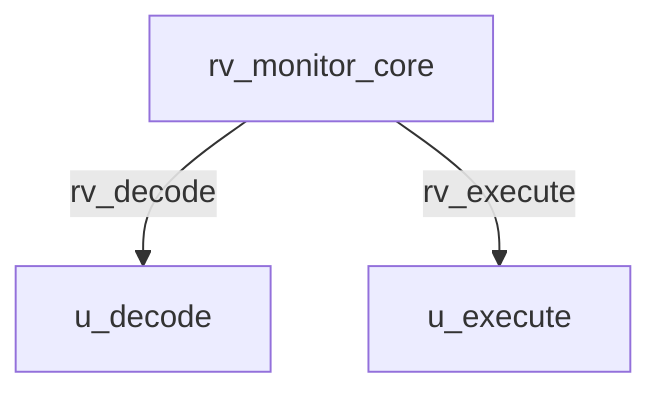

# rv_monitor_core Verification Handoff

## 📝 Overview
This directory contains the Verilog source, testbench, and verification instructions for the `rv_monitor_core` module.

## 🎯 What to Test
The verification engineer should ensure that:
1. The module resets correctly and all internal states initialize to safe values.
2. All interface protocols (e.g., AXI4, APB, native valid/ready) are strictly adhered to.
3. Edge cases specific to this IP (e.g., full/empty flags for FIFOs, cache misses for memory, etc.) are manually exercised.

## 🔍 GTKWave Signals to Observe
Add the following key signals to your GTKWave trace for structural inspection:
### Inputs
- `uut.clk`
- `uut.rst_n`
- `uut.irq_m_ext`
- `uut.irq_m_timer`
- `uut.irq_m_soft`
- `uut.imem_arready`
- `uut.imem_rdata`
- `uut.imem_rvalid`
- `uut.imem_rresp`
- `uut.dmem_awready`
- `uut.dmem_wready`
- `uut.dmem_bvalid`
- `uut.dmem_bresp`
- `uut.dmem_arready`
- `uut.dmem_rvalid`
- `uut.dmem_rdata`
- `uut.dmem_rlast`
- `uut.dmem_rresp`
- `uut.halt_req`
- `uut.resume_req`

### Outputs
- `uut.imem_araddr`
- `uut.imem_arvalid`
- `uut.dmem_awvalid`
- `uut.dmem_awaddr`
- `uut.dmem_awlen`
- `uut.dmem_awsize`
- `uut.dmem_awburst`
- `uut.dmem_wvalid`
- `uut.dmem_wdata`
- `uut.dmem_wstrb`
- `uut.dmem_wlast`
- `uut.dmem_bready`
- `uut.dmem_arvalid`
- `uut.dmem_araddr`
- `uut.dmem_arlen`
- `uut.dmem_arsize`
- `uut.dmem_arburst`
- `uut.dmem_rready`
- `uut.hart_halted`
- `uut.hart_running`

## 🏗 Structural Block Diagram
The following Mermaid diagram maps the exact sub-module hierarchy instantiated within `rv_monitor_core`. Use this to verify that structural boundaries match the behavioral expectations.

## ▶️ Simulation Instructions
1. **Compile**: `iverilog -o sim.vvp rv_monitor_core.v tb_rv_monitor_core.v` (Include dependencies using `-I` if necessary)
2. **Simulate**: `vvp sim.vvp`
3. **View**: `gtkwave tb_rv_monitor_core.vcd`
