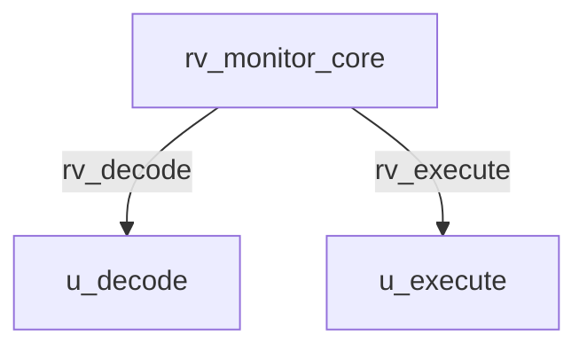

# rv_monitor_core Verification Handoff

## 📝 Overview
This directory contains the Verilog source, testbench, and verification instructions for the `rv_monitor_core` module.

The `rv_monitor_core` module is a 64-bit RV64IMAC core intended for system monitoring, similar to the SiFive E51. It operates in Machine mode only (no MMU) and features a simple 5-stage pipeline integrating `rv_decode` and `rv_execute` stages but omitting the FPU. It interacts directly with tightly-integrated memory or AXI-Lite components using direct AXI interfaces for both instructions and data, bypassing data caching.

## 🎯 What to Test
The verification engineer should ensure that:
1. The module resets correctly and all internal states initialize to safe values.
2. All interface protocols (e.g., AXI4, APB, native valid/ready) are strictly adhered to.
3. Edge cases specific to this IP (e.g., full/empty flags for FIFOs, cache misses for memory, etc.) are manually exercised.

## 🔍 GTKWave Signals to Observe
Add the following key signals to your GTKWave trace for structural inspection:
### Inputs
- `uut.clk`: The main system clock driving the sequential logic.
- `uut.rst_n`: Active-low asynchronous reset signal.
- `uut.irq_m_ext`: Machine external interrupt.
- `uut.irq_m_timer`: Machine timer interrupt.
- `uut.irq_m_soft`: Machine software interrupt.
- `uut.imem_arready`: AXI4-Lite instruction memory read address ready.
- `uut.imem_rdata`: AXI4-Lite instruction memory read data.
- `uut.imem_rvalid`: AXI4-Lite instruction memory read valid.
- `uut.imem_rresp`: AXI4-Lite instruction memory read response.
- `uut.dmem_awready`: AXI4 data memory write address ready.
- `uut.dmem_wready`: AXI4 data memory write data ready.
- `uut.dmem_bvalid`: AXI4 data memory write response valid.
- `uut.dmem_bresp`: AXI4 data memory write response.
- `uut.dmem_arready`: AXI4 data memory read address ready.
- `uut.dmem_rvalid`: AXI4 data memory read data valid.
- `uut.dmem_rdata`: AXI4 data memory read data.
- `uut.dmem_rlast`: AXI4 data memory read last transfer flag.
- `uut.dmem_rresp`: AXI4 data memory read response.
- `uut.halt_req`: Debug halt request.
- `uut.resume_req`: Debug resume request.

### Outputs
- `uut.imem_araddr`: AXI4-Lite instruction memory read address.
- `uut.imem_arvalid`: AXI4-Lite instruction memory read address valid.
- `uut.dmem_awvalid`: AXI4 data memory write address valid.
- `uut.dmem_awaddr`: AXI4 data memory write address.
- `uut.dmem_awlen`: AXI4 data memory write burst length.
- `uut.dmem_awsize`: AXI4 data memory write burst size.
- `uut.dmem_awburst`: AXI4 data memory write burst type.
- `uut.dmem_wvalid`: AXI4 data memory write data valid.
- `uut.dmem_wdata`: AXI4 data memory write data.
- `uut.dmem_wstrb`: AXI4 data memory write byte strobe.
- `uut.dmem_wlast`: AXI4 data memory write last transfer flag.
- `uut.dmem_bready`: AXI4 data memory write response ready.
- `uut.dmem_arvalid`: AXI4 data memory read address valid.
- `uut.dmem_araddr`: AXI4 data memory read address.
- `uut.dmem_arlen`: AXI4 data memory read burst length.
- `uut.dmem_arsize`: AXI4 data memory read burst size.
- `uut.dmem_arburst`: AXI4 data memory read burst type.
- `uut.dmem_rready`: AXI4 data memory read data ready.
- `uut.hart_halted`: Debug status indicating the hart is halted.
- `uut.hart_running`: Debug status indicating the hart is running.

## 🏗 Structural Block Diagram
The following Mermaid diagram maps the exact sub-module hierarchy instantiated within `rv_monitor_core`. Use this to verify that structural boundaries match the behavioral expectations.

## ▶️ Simulation Instructions
1. **Compile**: `iverilog -o sim.vvp rv_monitor_core.v tb_rv_monitor_core.v` (Include dependencies using ` -I ../../includes -I` if necessary)
2. **Simulate**: `vvp sim.vvp`
3. **View**: `gtkwave tb_rv_monitor_core.vcd`

## 💉 Injected Stimulus Profile
An advanced Python DV script has automatically generated a fully functional SystemVerilog testbench for this module. The following aggressive stimulus is applied during simulation:

### Clocks Auto-Toggled:
- `clk` toggling every 3.6ns (138.8 MHz)

### Reset Sequence:
- `rst_n` driven to 0 then 1 over 100ns.

### Data Buses Randomized:
Over 500 consecutive cycles, the following inputs receive constrained `$random` logic values to aggressively exercise datapaths and control flow:
- `irq_m_ext`
- `irq_m_timer`
- `irq_m_soft`
- `imem_arready`
- `imem_rdata`
- `imem_rvalid`
- `imem_rresp`
- `dmem_awready`
- `dmem_wready`
- `dmem_bvalid`
- `dmem_bresp`
- `dmem_arready`
- `dmem_rvalid`
- `dmem_rdata`
- `dmem_rlast`
- `dmem_rresp`
- `halt_req`
- `resume_req`
