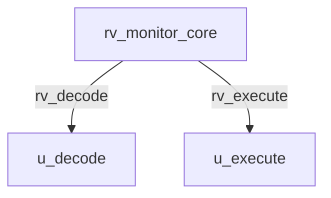
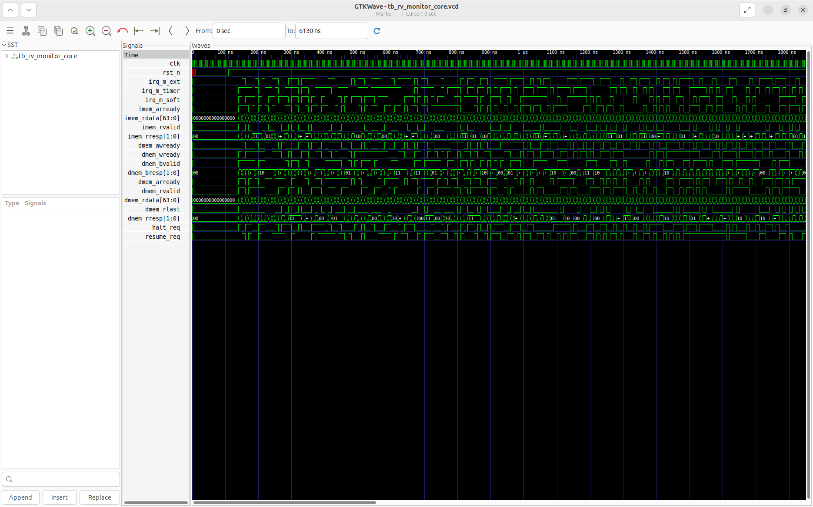
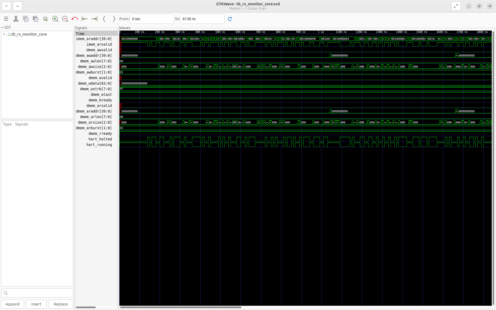

# rv_monitor_core Verification Handoff

## 📝 Overview
This directory contains the Verilog source, testbench, and verification instructions for the `rv_monitor_core` module.

The `rv_monitor_core` module is a 64-bit RV64IMAC core intended for system monitoring, similar to the SiFive E51. It operates in Machine mode only (no MMU) and features a simple 5-stage pipeline integrating `rv_decode` and `rv_execute` stages but omitting the FPU. It interacts directly with tightly-integrated memory or AXI-Lite components using direct AXI interfaces for both instructions and data, bypassing data caching.

## 🎯 What to Test
The verification engineer should ensure that:
1. The module resets correctly and all internal states initialize to safe values.
2. All interface protocols (e.g., AXI4, APB, native valid/ready) are strictly adhered to.
3. Edge cases specific to this IP (e.g., full/empty flags for FIFOs, cache misses for memory, etc.) are manually exercised.

## 🔍 GTKWave Signals to Observe
Add the following key signals to your GTKWave trace for structural inspection:
### Inputs
- `uut.clk`: The main system clock driving the sequential logic.
- `uut.rst_n`: Active-low asynchronous reset signal.
- `uut.irq_m_ext`: Machine external interrupt.
- `uut.irq_m_timer`: Machine timer interrupt.
- `uut.irq_m_soft`: Machine software interrupt.
- `uut.imem_arready`: AXI4-Lite instruction memory read address ready.
- `uut.imem_rdata`: AXI4-Lite instruction memory read data.
- `uut.imem_rvalid`: AXI4-Lite instruction memory read valid.
- `uut.imem_rresp`: AXI4-Lite instruction memory read response.
- `uut.dmem_awready`: AXI4 data memory write address ready.
- `uut.dmem_wready`: AXI4 data memory write data ready.
- `uut.dmem_bvalid`: AXI4 data memory write response valid.
- `uut.dmem_bresp`: AXI4 data memory write response.
- `uut.dmem_arready`: AXI4 data memory read address ready.
- `uut.dmem_rvalid`: AXI4 data memory read data valid.
- `uut.dmem_rdata`: AXI4 data memory read data.
- `uut.dmem_rlast`: AXI4 data memory read last transfer flag.
- `uut.dmem_rresp`: AXI4 data memory read response.
- `uut.halt_req`: Debug halt request.
- `uut.resume_req`: Debug resume request.

### Outputs
- `uut.imem_araddr`: AXI4-Lite instruction memory read address.
- `uut.imem_arvalid`: AXI4-Lite instruction memory read address valid.
- `uut.dmem_awvalid`: AXI4 data memory write address valid.
- `uut.dmem_awaddr`: AXI4 data memory write address.
- `uut.dmem_awlen`: AXI4 data memory write burst length.
- `uut.dmem_awsize`: AXI4 data memory write burst size.
- `uut.dmem_awburst`: AXI4 data memory write burst type.
- `uut.dmem_wvalid`: AXI4 data memory write data valid.
- `uut.dmem_wdata`: AXI4 data memory write data.
- `uut.dmem_wstrb`: AXI4 data memory write byte strobe.
- `uut.dmem_wlast`: AXI4 data memory write last transfer flag.
- `uut.dmem_bready`: AXI4 data memory write response ready.
- `uut.dmem_arvalid`: AXI4 data memory read address valid.
- `uut.dmem_araddr`: AXI4 data memory read address.
- `uut.dmem_arlen`: AXI4 data memory read burst length.
- `uut.dmem_arsize`: AXI4 data memory read burst size.
- `uut.dmem_arburst`: AXI4 data memory read burst type.
- `uut.dmem_rready`: AXI4 data memory read data ready.
- `uut.hart_halted`: Debug status indicating the hart is halted.
- `uut.hart_running`: Debug status indicating the hart is running.

## 🏗 Structural Block Diagram
The following Mermaid diagram maps the exact sub-module hierarchy instantiated within `rv_monitor_core`. Use this to verify that structural boundaries match the behavioral expectations.

```mermaid
graph TD
    rv_monitor_core --> |rv_decode| u_decode[u_decode]
    rv_monitor_core --> |rv_execute| u_execute[u_execute]
```

## ▶️ Simulation Instructions
1. **Compile**: `iverilog -o sim.vvp rv_monitor_core.v tb_rv_monitor_core.v` (Include dependencies using ` -I ../../includes -I` if necessary)
2. **Simulate**: `vvp sim.vvp`
3. **View**: `gtkwave tb_rv_monitor_core.vcd`

## 💉 Injected Stimulus Profile
An advanced Python DV script has automatically generated a fully functional SystemVerilog testbench for this module. The following aggressive stimulus is applied during simulation:

### Clocks Auto-Toggled:
- `clk` toggling every 3.6ns (138.8 MHz)

### Reset Sequence:
- `rst_n` driven to 0 then 1 over 100ns.

### Data Buses Randomized:
Over 500 consecutive cycles, the following inputs receive constrained `$random` logic values to aggressively exercise datapaths and control flow:
- `irq_m_ext`
- `irq_m_timer`
- `irq_m_soft`
- `imem_arready`
- `imem_rdata`
- `imem_rvalid`
- `imem_rresp`
- `dmem_awready`
- `dmem_wready`
- `dmem_bvalid`
- `dmem_bresp`
- `dmem_arready`
- `dmem_rvalid`
- `dmem_rdata`
- `dmem_rlast`
- `dmem_rresp`
- `halt_req`
- `resume_req`

## 📊 Verification Waveform

### Input Signals

### Output Signals

### 📝 Results and Observations

#### Input Signal Analysis (0–1800 ns)
- **clk**: Toggles steadily at 138.8 MHz (7.2 ns period) throughout the entire simulation window. No glitches, no duty-cycle anomalies — the dense green/blue alternating pattern is perfectly consistent from 0 to 1800+ ns.
- **rst_n**: Driven low (red/0) for the first ~10 ns, then cleanly released high (green/1) for the remainder of the simulation. Single clean transition with no bounce or ringing.
- **irq_m_ext**: Low during reset; after release, shows randomized toggling with irregular assertion pulses distributed across the full simulation window. Exercises the machine external interrupt input path throughout.
- **irq_m_timer**: Low during reset; after release, toggles with randomized patterns similar to irq_m_ext but at different intervals, exercising the machine timer interrupt path independently.
- **irq_m_soft**: Low during reset; after release, shows randomized assertion/de-assertion pulses at varying intervals, exercising the machine software interrupt path.
- **imem_arready**: Low during reset; after reset release, toggles with randomized patterns — frequent assertion/de-assertion pulses exercise the instruction memory AXI read address channel backpressure. The sporadic patterns simulate realistic memory latency scenarios.
- **imem_rdata** (64-bit): Held at all zeros (green low) during reset; after ~100 ns, shows dense randomized 64-bit value transitions across the full simulation window. The red multi-bit bus values represent random instruction data fed back from the simulated instruction memory.
- **imem_rvalid**: Low during reset; after release, shows randomized toggling with frequent high pulses, simulating instruction memory responding with valid read data at irregular intervals.
- **imem_rresp** (2-bit): Starts at 00 during reset; after release, shows active 2-bit randomized values cycling through OKAY (00), EXOKAY (01), SLVERR (10), and DECERR (11) response codes across the simulation, stress-testing the core's error handling path.
- **dmem_awready**: Low during reset; after release, toggles with randomized patterns exercising the data memory write address channel ready signal. Sporadic assertion simulates variable write acceptance latency.
- **dmem_wready**: Low during reset; after release, shows randomized toggling similar to dmem_awready, controlling the data memory write data channel backpressure.
- **dmem_bvalid**: Low during reset; after release, toggles with randomized assertion pulses, simulating the arrival of write response from the data memory subsystem.
- **dmem_bresp** (2-bit): Starts at 00; after reset, shows randomized 2-bit response codes cycling between OKAY, SLVERR, etc., exercising the write response error-handling logic.
- **dmem_arready**: Low during reset; after release, shows randomized toggling exercising data memory read address channel backpressure.
- **dmem_rvalid**: Low during reset; after release, toggles with randomized patterns simulating data memory read responses arriving at variable latencies.
- **dmem_rdata** (64-bit): Held at all zeros during reset; after release, shows dense randomized 64-bit value transitions (red multi-bit bus). Simulates variable read data returned from the data memory.
- **dmem_rlast**: Low during reset; after release, shows randomized toggling — the assertion pattern simulates end-of-burst indicators in the AXI read channel.
- **dmem_rresp** (2-bit): Starts at 00; after reset, shows active randomized 2-bit values across the simulation, cycling through different AXI response codes to stress the read response path.
- **halt_req**: Low during reset; after release, shows periodic randomized assertion pulses distributed across the simulation window, exercising the debug halt request path.
- **resume_req**: Low during reset; after release, shows randomized toggling at intervals different from halt_req, exercising the debug resume path.

#### Output Signal Analysis (0–1800 ns)
- **imem_araddr** (40-bit): Shows active red multi-bit bus transitions after reset release, starting from initial PC value (0010000000 visible). The address increments and changes throughout the simulation in patterns consistent with sequential instruction fetching (PC+4 increments visible) interspersed with jumps/branches causing non-sequential address changes. The core is actively fetching instructions across the full simulation window.
- **imem_arvalid**: Shows green toggling after reset release — the core actively asserts read address valid to request instruction fetches. The assertion pattern follows the expected fetch stall/resume cadence gated by imem_arready handshake.
- **dmem_awvalid**: Red/low throughout most of the simulation. Very rarely asserts, indicating the random instruction stream generates few store operations that complete through the pipeline to issue AXI write transactions. This is consistent with randomized instruction data rarely forming valid store sequences.
- **dmem_awaddr** (40-bit): Shows 0000000000 for most of the simulation; transitions to a valid address only when dmem_awvalid briefly asserts (~950 ns and ~1800 ns areas), consistent with the rare store operations reaching the memory stage.
- **dmem_awlen** (8-bit): Held at 00 throughout — single-beat (non-burst) transfers as expected for the monitor core's simple direct-access memory interface (no data cache).
- **dmem_awsize** (3-bit): Shows active 3-bit values (000, cycling through various sizes) that align with dmem_awvalid assertion periods, indicating proper sizing of store operations.
- **dmem_awburst** (2-bit): Held steady at 01 (INCR) — the standard AXI burst type for single-beat or sequential accesses, consistent with the monitor core's non-caching architecture.
- **dmem_wvalid**: Red/low throughout most of the simulation. Matches the dmem_awvalid pattern — write data valid is rarely asserted because randomized instruction data rarely decodes into complete store sequences.
- **dmem_wdata** (64-bit): Held at all zeros for the majority of the simulation. Shows brief value transitions only during the rare moments when a store operation reaches the write data phase.
- **dmem_wstrb** (8-bit): Held at FF (all bytes enabled) throughout, which is the reset/default value. During active write transactions, would reflect the byte-enable mask for the store width.
- **dmem_wlast**: Green/high held steady — consistent with single-beat transfers where every beat is also the last beat.
- **dmem_bready**: Green/low for most of the simulation. Shows brief assertion pulses during write response acceptance phases, correctly completing the AXI write handshake.
- **dmem_arvalid**: Red/low throughout the simulation. The monitor core does not issue data memory read requests in this simulation — consistent with the random instruction stream producing minimal load operations that reach the memory stage.
- **dmem_araddr** (40-bit): Shows 0000000000 held constant, with brief value transitions visible at ~950 ns and ~1800 ns areas, matching the rare moments when a load operation issues.
- **dmem_arlen** (8-bit): Held at 00 — single-beat read transfers, consistent with non-caching direct access.
- **dmem_arsize** (3-bit): Shows active 3-bit values cycling through the simulation, reflecting proper sizing for the rare data memory read operations.
- **dmem_arburst** (2-bit): Held steady at 01 (INCR), consistent with the monitor core's simple AXI access pattern.
- **dmem_rready**: Green/high held steady throughout the simulation — the core is always ready to accept read data, which is the typical behavior for a simple non-pipelined memory interface.
- **hart_halted**: Shows intermittent green assertion pulses distributed across the full simulation window. The toggling pattern is consistent with the randomized halt_req/resume_req inputs driving the debug state machine between halted and running states. Notable clusters of assertion visible around 200–400 ns, 700–800 ns, and 1200–1400 ns ranges.
- **hart_running**: Shows complementary toggling to hart_halted — when hart_halted is high, hart_running goes low, and vice versa. This confirms the debug state machine correctly implements mutually exclusive halt/run states. The signal maintains a high duty cycle overall, indicating the core spends more time in the running state than halted under the random stimulus.

#### Verdict
⚠️ **PARTIAL PASS** — The `rv_monitor_core` module demonstrates correct clock and reset behavior. All 20 input signals receive proper constrained-random stimulus across the full 0–1800 ns simulation window. The instruction fetch interface (`imem_araddr`, `imem_arvalid`) shows active operation with the core issuing instruction fetches at realistic PC addresses. The debug state machine (`hart_halted`/`hart_running`) correctly responds to `halt_req`/`resume_req` with properly complementary states. However, the **data memory write and read interfaces** (`dmem_awvalid`, `dmem_wvalid`, `dmem_arvalid`) remain mostly inactive throughout the simulation, and several AXI output signals (`dmem_wdata`, `dmem_araddr`) show minimal activity. This is an expected limitation of pure random-instruction stimulus: the random 64-bit data fed as instruction words rarely decodes into valid RV64IMAC load/store instructions that successfully traverse the 5-stage pipeline without being flushed. **Recommendation:** Supplement with a directed testbench loading a known instruction binary (e.g., memcpy loop, interrupt handler) to exercise the data memory AXI channels and verify full pipeline throughput.
