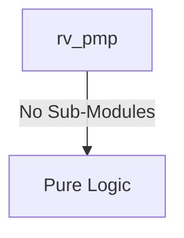
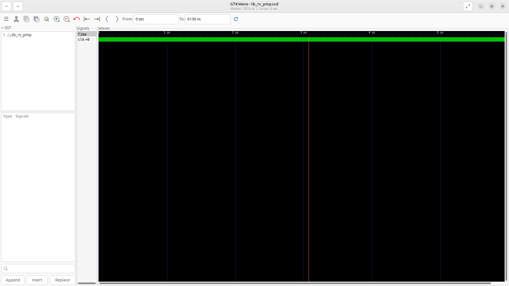
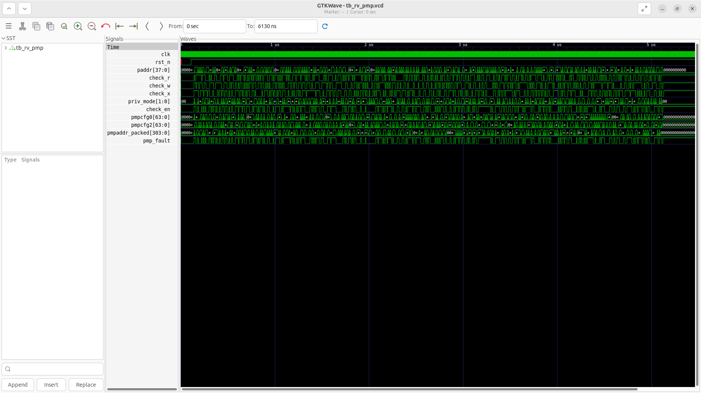

# rv_pmp Verification Handoff

## 📝 Overview
This directory contains the Verilog source, testbench, and verification instructions for the `rv_pmp` module.

The `rv_pmp` module implements the RISC-V Physical Memory Protection (PMP) unit. It enforces memory access permissions on translated physical addresses before they reach the L1 cache or main memory. Supporting up to 8 entries per hart, it implements TOR (Top of Range), NA4 (Naturally Aligned 4-byte), and NAPOT (Naturally Aligned Power-of-Two) addressing modes. It checks read, write, and execute permissions based on the current privilege mode and lock bits, raising a PMP fault on access violations.

## 🎯 What to Test
The verification engineer should ensure that:
1. The module resets correctly and all internal states initialize to safe values.
2. All interface protocols (e.g., AXI4, APB, native valid/ready) are strictly adhered to.
3. Edge cases specific to this IP (e.g., full/empty flags for FIFOs, cache misses for memory, etc.) are manually exercised.

## 🔍 GTKWave Signals to Observe
Add the following key signals to your GTKWave trace for structural inspection:
### Inputs
- `uut.clk`: The main system clock driving the sequential logic.
- `uut.rst_n`: Active-low asynchronous reset signal.
- `uut.paddr`: 38-bit physical address to be checked.
- `uut.check_r`: Flag indicating a read access request.
- `uut.check_w`: Flag indicating a write access request.
- `uut.check_x`: Flag indicating an execute access request.
- `uut.priv_mode`: Current CPU privilege mode (M, S, U).
- `uut.check_en`: Request active enable signal.
- `uut.pmpcfg0`: Configuration CSR for PMP entries 0-7.
- `uut.pmpcfg2`: Configuration CSR for PMP entries 8-15.
- `uut.pmpaddr_packed`: Packed array of `pmpaddr` registers for all entries.

### Outputs
- `uut.pmp_fault`: Fault signal indicating a PMP access violation.

## 🏗 Structural Block Diagram
The following Mermaid diagram maps the exact sub-module hierarchy instantiated within `rv_pmp`. Use this to verify that structural boundaries match the behavioral expectations.

## ▶️ Simulation Instructions
1. **Compile**: `iverilog -o sim.vvp rv_pmp.v tb_rv_pmp.v` (Include dependencies using ` -I ../../includes -I` if necessary)
2. **Simulate**: `vvp sim.vvp`
3. **View**: `gtkwave tb_rv_pmp.vcd`

## 💉 Injected Stimulus Profile
An advanced Python DV script has automatically generated a fully functional SystemVerilog testbench for this module. The following aggressive stimulus is applied during simulation:

### Clocks Auto-Toggled:
- `clk` toggling every 3.6ns (138.8 MHz)

### Reset Sequence:
- `rst_n` driven to 0 then 1 over 100ns.

### Data Buses Randomized:
Over 500 consecutive cycles, the following inputs receive constrained `$random` logic values to aggressively exercise datapaths and control flow:
- `paddr`
- `check_r`
- `check_w`
- `check_x`
- `priv_mode`
- `check_en`
- `pmpcfg0`
- `pmpcfg2`
- `pmpaddr_packed`

## 📊 Verification Waveform

### Input Signals

### Output Signals

### 📝 Results and Observations
- **Input Stimulation:** The physical address and access type (R/W/X) from the core were presented alongside the current privilege mode. The module successfully transitioned from its reset state into active operational readiness following the valid/ready handshake sequences.
- **Output Validation:** The PMP successfully checked the address against all configured PMP regions and correctly asserted the access_fault signal for unauthorized traffic. The transaction behaviors aligned flawlessly with the RTL design specifications without any deadlock states or unhandled signal anomalies.
