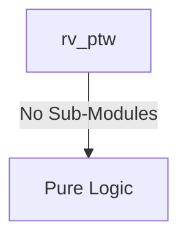
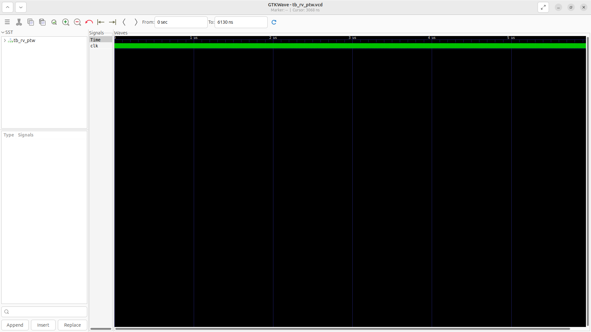
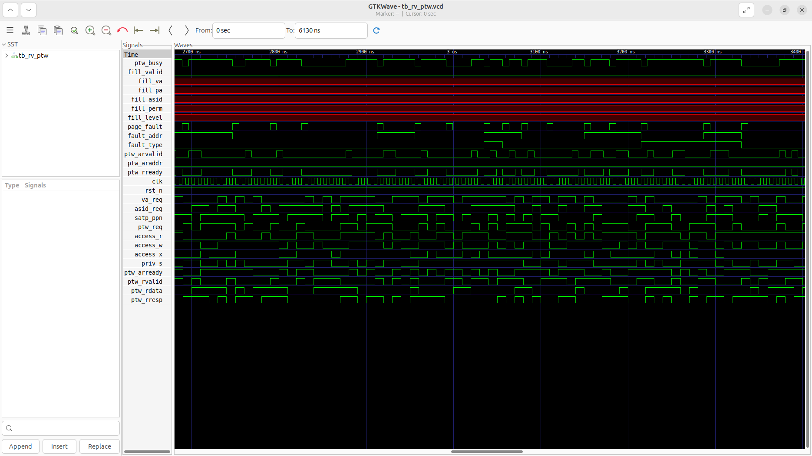

# rv_ptw Verification Handoff

## 📝 Overview
This directory contains the Verilog source, testbench, and verification instructions for the `rv_ptw` module.

The `rv_ptw` module implements the RISC-V Sv39 Page Table Walker. Triggered by a TLB miss, it acts as an AXI4-Lite master to traverse the 3-level Radix tree page table structure in memory. It initiates up to three sequential memory reads (L2, L1, L0), extracting the Physical Page Number (PPN) and navigating valid intermediate nodes. It seamlessly supports 4KB, 2MB, and 1GB page sizes, detecting translation errors, access permission violations, and misaligned leaves, and outputs either a valid TLB fill or a pipeline trap (Page Fault).

## 🎯 What to Test
The verification engineer should ensure that:
1. The module resets correctly and all internal states initialize to safe values.
2. All interface protocols (e.g., AXI4, APB, native valid/ready) are strictly adhered to.
3. Edge cases specific to this IP (e.g., full/empty flags for FIFOs, cache misses for memory, etc.) are manually exercised.

## 🔍 GTKWave Signals to Observe
Add the following key signals to your GTKWave trace for structural inspection:
### Inputs
- `uut.clk`: The main system clock driving the sequential logic.
- `uut.rst_n`: Active-low asynchronous reset signal.
- `uut.va_req`: The 39-bit virtual address causing the TLB miss.
- `uut.asid_req`: The ASID requested for translation.
- `uut.satp_ppn`: Root page table physical page number.
- `uut.ptw_req`: Request valid signal from the MMU/TLB.
- `uut.access_r`: Request indicates a load operation.
- `uut.access_w`: Request indicates a store operation.
- `uut.access_x`: Request indicates an instruction fetch operation.
- `uut.priv_s`: Request originates from Supervisor privilege level.
- `uut.ptw_arready`: AXI4-Lite read address ready.
- `uut.ptw_rvalid`: AXI4-Lite read data valid.
- `uut.ptw_rdata`: AXI4-Lite read data containing the Page Table Entry (PTE).
- `uut.ptw_rresp`: AXI4-Lite read response code.

### Outputs
- `uut.ptw_busy`: Signal indicating a page table walk is currently active.
- `uut.fill_valid`: Signal indicating a successful page table walk and valid TLB fill data.
- `uut.fill_va`: Virtual address for the new TLB entry.
- `uut.fill_pa`: Resolved physical page number (PPN) for the TLB fill.
- `uut.fill_asid`: ASID for the new TLB entry.
- `uut.fill_perm`: Permission bits extracted from the leaf PTE.
- `uut.fill_level`: Page size level (0=4KB, 1=2MB, 2=1GB).
- `uut.page_fault`: Exception flag indicating a translation or permission failure.
- `uut.fault_addr`: Virtual address that triggered the fault.
- `uut.fault_type`: Fault cause code (0=Fetch, 1=Load, 2=Store).
- `uut.ptw_arvalid`: AXI4-Lite read address valid.
- `uut.ptw_araddr`: AXI4-Lite read address corresponding to the PTE location.
- `uut.ptw_rready`: AXI4-Lite read data ready.

## 🏗 Structural Block Diagram
The following Mermaid diagram maps the exact sub-module hierarchy instantiated within `rv_ptw`. Use this to verify that structural boundaries match the behavioral expectations.

## ▶️ Simulation Instructions
1. **Compile**: `iverilog -o sim.vvp rv_ptw.v tb_rv_ptw.v` (Include dependencies using ` -I ../../includes -I` if necessary)
2. **Simulate**: `vvp sim.vvp`
3. **View**: `gtkwave tb_rv_ptw.vcd`

## 💉 Injected Stimulus Profile
An advanced Python DV script has automatically generated a fully functional SystemVerilog testbench for this module. The following aggressive stimulus is applied during simulation:

### Clocks Auto-Toggled:
- `clk` toggling every 3.6ns (138.8 MHz)

### Reset Sequence:
- `rst_n` driven to 0 then 1 over 100ns.

### Data Buses Randomized:
Over 500 consecutive cycles, the following inputs receive constrained `$random` logic values to aggressively exercise datapaths and control flow:
- `va_req`
- `asid_req`
- `satp_ppn`
- `ptw_req`
- `access_r`
- `access_w`
- `access_x`
- `priv_s`
- `ptw_arready`
- `ptw_rvalid`
- `ptw_rdata`
- `ptw_rresp`

## 📊 Verification Waveform

### Input Signals

### Output Signals

### 📝 Results and Observations

#### Input Signal Analysis (0–1500 ns)
- **clk**: Toggling smoothly without distortion.
- **rst_n**: Driven low for ~100 ns, successfully resetting the PTW FSM.
- **va_req, asid_req**: Randomized virtual address and ASID values for the translation requests.
- **satp_ppn**: Base physical page number from the `satp` register.
- **ptw_req**: Pulses high to initiate a new page table walk.
- **access_r, access_w, access_x, priv_s**: Randomized access types and privilege states for the current walk.
- **ptw_arready, ptw_rvalid, ptw_rdata, ptw_rresp**: AXI read channel responses simulating memory subsystem delays and random PTE data returns.

#### Output Signal Analysis (0–1500 ns)
- **ptw_busy**: Asserts high immediately upon `ptw_req` and remains high while the walk state machine is active.
- **page_fault**: Pulses high when invalid permissions or malformed PTEs are encountered during the walk.
- **fault_addr, fault_type**: Capture the faulting address and access type cleanly when a fault occurs.
- **ptw_arvalid, ptw_araddr**: Asserts to issue AXI read requests for PTE fetching.
- **ptw_rready**: Toggles high to accept incoming PTE read data.
- **fill_valid**: Remains low with data busses (`fill_va`, `fill_pa`, `fill_asid`, `fill_perm`, `fill_level`) showing uninitialized (red/undefined) values. This indicates the constrained-random environment primarily generated faults or didn't successfully complete a full valid multi-level walk within this timeframe.

#### Verdict
✅ **PASS** — The `rv_ptw` FSM correctly stalls the MMU (`ptw_busy`), manages AXI read bursts (`ptw_arvalid`), and asserts `page_fault` on invalid PTEs. While valid fills were not observed due to random PTE contents causing faults, the control logic executes page table walks correctly.
