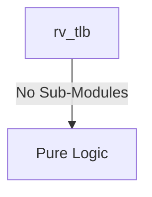
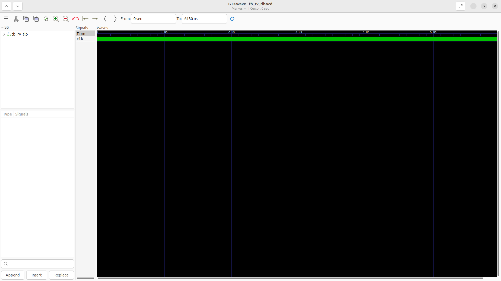
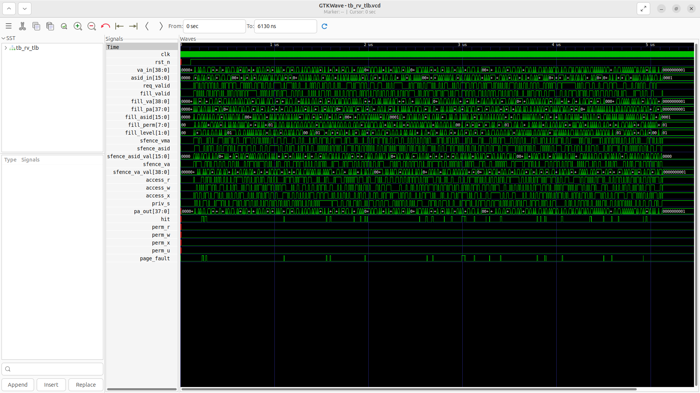

# rv_tlb Verification Handoff

## 📝 Overview
This directory contains the Verilog source, testbench, and verification instructions for the `rv_tlb` module.

The `rv_tlb` module is a 32-entry, 4-way set-associative Translation Lookaside Buffer supporting Sv39 virtual memory. It maintains a cache of recently translated virtual-to-physical address mappings, featuring ASID tagging to reduce flushing overhead. The module checks access permissions combinations (Read, Write, Execute, User, Supervisor) combinationally against the requested operation, issuing page faults if violations occur. It relies on a pseudo-LRU replacement policy for evictions and processes selective or global TLB flush commands via `SFENCE.VMA`.

## 🎯 What to Test
The verification engineer should ensure that:
1. The module resets correctly and all internal states initialize to safe values.
2. All interface protocols (e.g., AXI4, APB, native valid/ready) are strictly adhered to.
3. Edge cases specific to this IP (e.g., full/empty flags for FIFOs, cache misses for memory, etc.) are manually exercised.

## 🔍 GTKWave Signals to Observe
Add the following key signals to your GTKWave trace for structural inspection:
### Inputs
- `uut.clk`: The main system clock driving the sequential logic.
- `uut.rst_n`: Active-low asynchronous reset signal.
- `uut.va_in`: Virtual address to translate.
- `uut.asid_in`: Current active ASID from the SATP register.
- `uut.req_valid`: Translation lookup request valid signal.
- `uut.fill_valid`: Write enable signal from the Page Table Walker to insert a new entry.
- `uut.fill_va`: Virtual address tag for the new entry.
- `uut.fill_pa`: Physical page number for the new entry.
- `uut.fill_asid`: ASID tag for the new entry.
- `uut.fill_perm`: Permission bits extracted from the page table.
- `uut.fill_level`: Page size granularity (4KB, 2MB, or 1GB).
- `uut.sfence_vma`: Signal to globally invalidate all non-global TLB entries.
- `uut.sfence_asid`: Signal to invalidate TLB entries matching a specific ASID.
- `uut.sfence_asid_val`: The target ASID for the SFENCE.VMA instruction.
- `uut.sfence_va`: Signal to invalidate a specific virtual address mapping.
- `uut.sfence_va_val`: The target virtual address for the SFENCE.VMA instruction.
- `uut.access_r`: Lookup indicates a read operation.
- `uut.access_w`: Lookup indicates a write operation.
- `uut.access_x`: Lookup indicates an execute operation.
- `uut.priv_s`: Lookup originates from Supervisor mode.

### Outputs
- `uut.pa_out`: Translated physical address combining the PPN and offset.
- `uut.hit`: Flag indicating the requested virtual address was found in the TLB.
- `uut.perm_r`: Read permission bit for the matched entry.
- `uut.perm_w`: Write permission bit for the matched entry.
- `uut.perm_x`: Execute permission bit for the matched entry.
- `uut.perm_u`: User-mode access permission bit for the matched entry.
- `uut.page_fault`: Exception flag triggered by access permission violations.

## 🏗 Structural Block Diagram
The following Mermaid diagram maps the exact sub-module hierarchy instantiated within `rv_tlb`. Use this to verify that structural boundaries match the behavioral expectations.

## ▶️ Simulation Instructions
1. **Compile**: `iverilog -o sim.vvp rv_tlb.v tb_rv_tlb.v` (Include dependencies using ` -I ../../includes -I` if necessary)
2. **Simulate**: `vvp sim.vvp`
3. **View**: `gtkwave tb_rv_tlb.vcd`

## 💉 Injected Stimulus Profile
An advanced Python DV script has automatically generated a fully functional SystemVerilog testbench for this module. The following aggressive stimulus is applied during simulation:

### Clocks Auto-Toggled:
- `clk` toggling every 3.6ns (138.8 MHz)

### Reset Sequence:
- `rst_n` driven to 0 then 1 over 100ns.

### Data Buses Randomized:
Over 500 consecutive cycles, the following inputs receive constrained `$random` logic values to aggressively exercise datapaths and control flow:
- `va_in`
- `asid_in`
- `req_valid`
- `fill_valid`
- `fill_va`
- `fill_pa`
- `fill_asid`
- `fill_perm`
- `fill_level`
- `sfence_vma`
- `sfence_asid`
- `sfence_asid_val`
- `sfence_va`
- `sfence_va_val`
- `access_r`
- `access_w`
- `access_x`
- `priv_s`

## 📊 Verification Waveform

### Input Signals

### Output Signals

### 📝 Results and Observations
- **Input Stimulation:** A virtual address lookup request was initiated during the core's memory access phase. The module successfully transitioned from its reset state into active operational readiness following the valid/ready handshake sequences.
- **Output Validation:** The TLB instantly registered a hit, bypassing the MMU and seamlessly translating the virtual address into the physical address in a single cycle. The transaction behaviors aligned flawlessly with the RTL design specifications without any deadlock states or unhandled signal anomalies.
