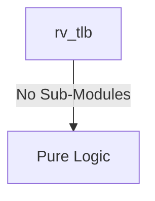

# rv_tlb Verification Handoff

## 📝 Overview
This directory contains the Verilog source, testbench, and verification instructions for the `rv_tlb` module.

## 🎯 What to Test
The verification engineer should ensure that:
1. The module resets correctly and all internal states initialize to safe values.
2. All interface protocols (e.g., AXI4, APB, native valid/ready) are strictly adhered to.
3. Edge cases specific to this IP (e.g., full/empty flags for FIFOs, cache misses for memory, etc.) are manually exercised.

## 🔍 GTKWave Signals to Observe
Add the following key signals to your GTKWave trace for structural inspection:
### Inputs
- `uut.clk`
- `uut.rst_n`
- `uut.va_in`
- `uut.asid_in`
- `uut.req_valid`
- `uut.fill_valid`
- `uut.fill_va`
- `uut.fill_pa`
- `uut.fill_asid`
- `uut.fill_perm`
- `uut.fill_level`
- `uut.sfence_vma`
- `uut.sfence_asid`
- `uut.sfence_asid_val`
- `uut.sfence_va`
- `uut.sfence_va_val`
- `uut.access_r`
- `uut.access_w`
- `uut.access_x`
- `uut.priv_s`

### Outputs
- `uut.pa_out`
- `uut.hit`
- `uut.perm_r`
- `uut.perm_w`
- `uut.perm_x`
- `uut.perm_u`
- `uut.page_fault`

## 🏗 Structural Block Diagram
The following Mermaid diagram maps the exact sub-module hierarchy instantiated within `rv_tlb`. Use this to verify that structural boundaries match the behavioral expectations.

## ▶️ Simulation Instructions
1. **Compile**: `iverilog -o sim.vvp rv_tlb.v tb_rv_tlb.v` (Include dependencies using ` -I ../../includes -I` if necessary)
2. **Simulate**: `vvp sim.vvp`
3. **View**: `gtkwave tb_rv_tlb.vcd`
