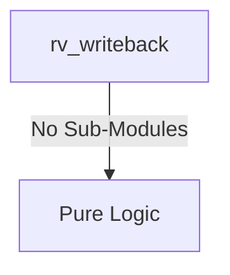

# rv_writeback Verification Handoff

## 📝 Overview
This directory contains the Verilog source, testbench, and verification instructions for the `rv_writeback` module.

The `rv_writeback` module represents the Writeback stage of the RV64I processor pipeline. It registers the instruction execution result and destination register ID, outputting a write enable signal to update the core's register file, ensuring that the hardwired zero register (`x0`) is not overwritten. Additionally, the module exposes combinatorial forwarding paths for the current writeback data, destination register, and valid flag to allow preceding pipeline stages to resolve data hazards efficiently.

## 🎯 What to Test
The verification engineer should ensure that:
1. The module resets correctly and all internal states initialize to safe values.
2. All interface protocols (e.g., AXI4, APB, native valid/ready) are strictly adhered to.
3. Edge cases specific to this IP (e.g., full/empty flags for FIFOs, cache misses for memory, etc.) are manually exercised.

## 🔍 GTKWave Signals to Observe
Add the following key signals to your GTKWave trace for structural inspection:
### Inputs
- `uut.clk`: The main system clock driving the sequential logic.
- `uut.rst_n`: Active-low asynchronous reset signal.
- `uut.result`: The 64-bit computed result from the preceding stage (e.g., ALU or memory).
- `uut.rd_in`: The 5-bit destination register address for the current instruction.
- `uut.reg_write`: Control signal indicating whether the current instruction writes to a register.
- `uut.valid_in`: Control signal indicating that the input data to this stage is valid.

### Outputs
- `uut.wb_data`: The 64-bit registered data to be written into the register file.
- `uut.wb_rd`: The 5-bit registered destination register address for the register file write.
- `uut.wb_we`: The write enable signal for the register file, guarded to prevent writes to register zero.
- `uut.fwd_wb_data`: Combinatorial forwarded writeback data for data hazard resolution.
- `uut.fwd_wb_rd`: Combinatorial forwarded destination register address.
- `uut.fwd_wb_valid`: Combinatorial forwarded write enable flag indicating valid data for forwarding.

## 🏗 Structural Block Diagram
The following Mermaid diagram maps the exact sub-module hierarchy instantiated within `rv_writeback`. Use this to verify that structural boundaries match the behavioral expectations.

## ▶️ Simulation Instructions
1. **Compile**: `iverilog -o sim.vvp rv_writeback.v tb_rv_writeback.v` (Include dependencies using ` -I ../../includes -I` if necessary)
2. **Simulate**: `vvp sim.vvp`
3. **View**: `gtkwave tb_rv_writeback.vcd`

## 💉 Injected Stimulus Profile
An advanced Python DV script has automatically generated a fully functional SystemVerilog testbench for this module. The following aggressive stimulus is applied during simulation:

### Clocks Auto-Toggled:
- `clk` toggling every 3.6ns (138.8 MHz)

### Reset Sequence:
- `rst_n` driven to 0 then 1 over 100ns.

### Data Buses Randomized:
Over 500 consecutive cycles, the following inputs receive constrained `$random` logic values to aggressively exercise datapaths and control flow:
- `result`
- `rd_in`
- `reg_write`
- `valid_in`
