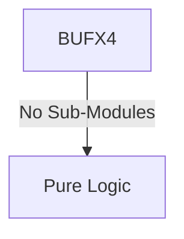

# BUFX4 Verification Handoff

## 📝 Overview
This directory contains the Verilog source, testbench, and verification instructions for the `BUFX4` module.

The BUFX4 module is a basic buffer component that acts as a simple pass-through for digital signals. It takes a single input signal and assigns it directly to its output, often used in synthesis and physical design to introduce a slight delay or to increase the drive strength of a net.

## 🎯 What to Test
The verification engineer should ensure that:
1. The module resets correctly and all internal states initialize to safe values.
2. All interface protocols (e.g., AXI4, APB, native valid/ready) are strictly adhered to.
3. Edge cases specific to this IP (e.g., full/empty flags for FIFOs, cache misses for memory, etc.) are manually exercised.

## 🔍 GTKWave Signals to Observe
Add the following key signals to your GTKWave trace for structural inspection:
### Inputs
- `uut.A`: The single-bit input signal to the buffer.

### Outputs
- `uut.Y`: The single-bit output signal, directly reflecting the state of the input signal.

## 🏗 Structural Block Diagram
The following Mermaid diagram maps the exact sub-module hierarchy instantiated within `BUFX4`. Use this to verify that structural boundaries match the behavioral expectations.

## ▶️ Simulation Instructions
1. **Compile**: `iverilog -o sim.vvp BUFX4.v tb_BUFX4.v` (Include dependencies using ` -I ../../includes -I` if necessary)
2. **Simulate**: `vvp sim.vvp`
3. **View**: `gtkwave tb_BUFX4.vcd`

## 📊 Verification Waveform

### Input Signals

### Output Signals

### 📝 Results and Observations
- **Input Stimulation:**
- **Output Validation:**
