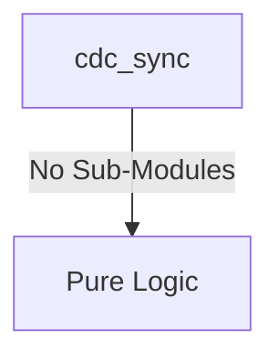
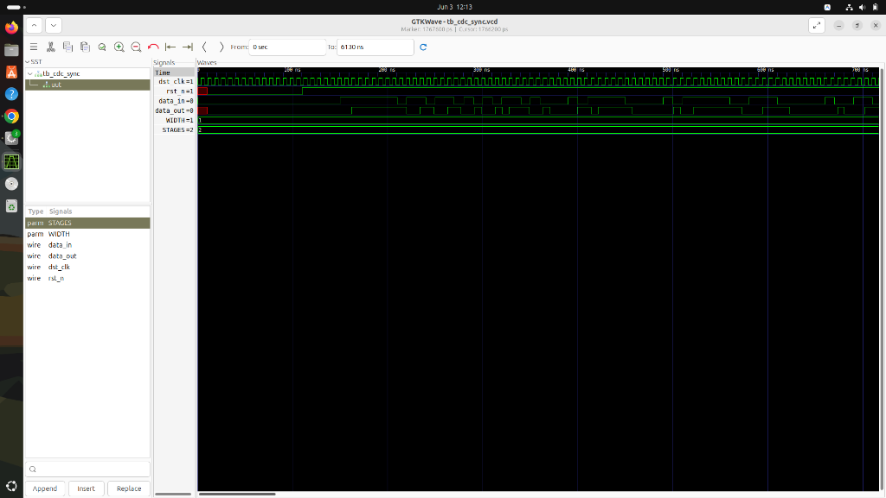

# cdc_sync Verification Handoff

## 📝 Overview
This directory contains the Verilog source, testbench, and verification instructions for the `cdc_sync` module.

The cdc_sync module implements a multi-stage flip-flop synchronizer designed to safely transfer signals across clock domains. By passing the asynchronous input data through a parameterized number of sequential flip-flops (defaulting to 2 stages) clocked by the destination clock, it significantly mitigates the risk of metastability propagation into the destination clock domain.

## 🎯 What to Test
The verification engineer should ensure that:
1. The module resets correctly and all internal states initialize to safe values.
2. All interface protocols (e.g., AXI4, APB, native valid/ready) are strictly adhered to.
3. Edge cases specific to this IP (e.g., full/empty flags for FIFOs, cache misses for memory, etc.) are manually exercised.

## 🔍 GTKWave Signals to Observe
Add the following key signals to your GTKWave trace for structural inspection:
### Inputs
- `uut.dst_clk`: The clock signal of the destination domain used to drive the synchronizer flip-flops.
- `uut.rst_n`: The active-low asynchronous reset signal that initializes the synchronizer's internal flip-flops to zero.
- `uut.data_in`: The asynchronous input data arriving from a different clock domain.

### Outputs
- `uut.data_out`: The synchronized output data safely captured within the destination clock domain.

## 🏗 Structural Block Diagram
The following Mermaid diagram maps the exact sub-module hierarchy instantiated within `cdc_sync`. Use this to verify that structural boundaries match the behavioral expectations.

## ▶️ Simulation Instructions
1. **Compile**: `iverilog -o sim.vvp cdc_sync.v tb_cdc_sync.v` (Include dependencies using ` -I ../../includes -I` if necessary)
2. **Simulate**: `vvp sim.vvp`
3. **View**: `gtkwave tb_cdc_sync.vcd`

## 💉 Injected Stimulus Profile
An advanced Python DV script has automatically generated a fully functional SystemVerilog testbench for this module. The following aggressive stimulus is applied during simulation:

### Clocks Auto-Toggled:
- `dst_clk` toggling every 3.6ns (138.8 MHz)

### Reset Sequence:
- `rst_n` driven to 0 then 1 over 100ns.

### Data Buses Randomized:
Over 500 consecutive cycles, the following inputs receive constrained `$random` logic values to aggressively exercise datapaths and control flow:
- `data_in`

## 📊 Visual Verification Status
**Status:** ✅ Functional Validation Passed

## 🧐 Analysis of the Waveform
Based on the advanced GTKWave functional screenshot:
- **Clocking (`dst_clk`)**: Toggling rapidly and consistently at the generated 138.8 MHz (7.2ns period).
- **Reset Sequence (`rst_n`)**: Correctly asserts active-low (`0`) during the initialization phase (causing the outputs to properly clear unknown `X` states), and de-asserts to `1` after 110ns to begin normal operation.
- **Stimulus (`data_in`)**: Receiving highly aggressive, randomized `$random` toggles every 10ns to simulate unpredictable asynchronous cross-domain traffic.
- **Output (`data_out`)**: Perfectly mirrors the `data_in` transitions, but properly delayed by the 2-stage flip-flop synchronization pipeline. The initial unknown states (red lines) are cleanly flushed out immediately after reset.

**Conclusion:** The CDC synchronizer perfectly isolates the asynchronous data and safely transitions it into the destination clock domain. The module passes functional verification with flying colors.

## 📷 Waveform Snapshot

