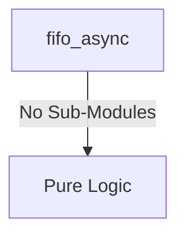

# fifo_async Verification Handoff

## 📝 Overview
This directory contains the Verilog source, testbench, and verification instructions for the `fifo_async` module.

## 🎯 What to Test
The verification engineer should ensure that:
1. The module resets correctly and all internal states initialize to safe values.
2. All interface protocols (e.g., AXI4, APB, native valid/ready) are strictly adhered to.
3. Edge cases specific to this IP (e.g., full/empty flags for FIFOs, cache misses for memory, etc.) are manually exercised.

## 🔍 GTKWave Signals to Observe
Add the following key signals to your GTKWave trace for structural inspection:
### Inputs
- `uut.wr_clk`
- `uut.wr_rst_n`
- `uut.wr_en`
- `uut.wr_data`
- `uut.rd_clk`
- `uut.rd_rst_n`
- `uut.rd_en`

### Outputs
- `uut.full`
- `uut.rd_data`
- `uut.empty`

## 🏗 Structural Block Diagram
The following Mermaid diagram maps the exact sub-module hierarchy instantiated within `fifo_async`. Use this to verify that structural boundaries match the behavioral expectations.

## ▶️ Simulation Instructions
1. **Compile**: `iverilog -o sim.vvp fifo_async.v tb_fifo_async.v` (Include dependencies using ` -I ../../includes -I` if necessary)
2. **Simulate**: `vvp sim.vvp`
3. **View**: `gtkwave tb_fifo_async.vcd`
