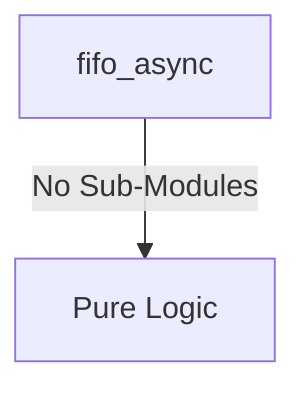
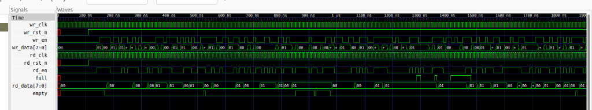

# fifo_async Verification Handoff

## 📝 Overview
This directory contains the Verilog source, testbench, and verification instructions for the `fifo_async` module.

The fifo_async module is an asynchronous First-In-First-Out (FIFO) buffer that safely transfers data between two independent clock domains. It utilizes a parameterized dual-port memory array for storage and employs Gray-code pointers synchronized across the read and write clock domains to accurately generate full and empty status flags while avoiding metastability issues.

## 🎯 What to Test
The verification engineer should ensure that:
1. The module resets correctly and all internal states initialize to safe values.
2. All interface protocols (e.g., AXI4, APB, native valid/ready) are strictly adhered to.
3. Edge cases specific to this IP (e.g., full/empty flags for FIFOs, cache misses for memory, etc.) are manually exercised.

## 🔍 GTKWave Signals to Observe
Add the following key signals to your GTKWave trace for structural inspection:
### Inputs
- `uut.wr_clk`: The write domain clock signal that drives data into the FIFO.
- `uut.wr_rst_n`: The active-low reset signal for the write clock domain.
- `uut.wr_en`: The write enable signal that indicates valid data is present on the write data bus.
- `uut.wr_data`: The input data bus to be pushed into the FIFO.
- `uut.rd_clk`: The read domain clock signal used to pop data from the FIFO.
- `uut.rd_rst_n`: The active-low reset signal for the read clock domain.
- `uut.rd_en`: The read enable signal indicating the read domain is ready to accept data.

### Outputs
- `uut.full`: The output flag indicating the FIFO is full and cannot accept new data.
- `uut.rd_data`: The output data bus providing the oldest data from the FIFO.
- `uut.empty`: The output flag indicating the FIFO is empty and has no data available to read.

## 🏗 Structural Block Diagram
The following Mermaid diagram maps the exact sub-module hierarchy instantiated within `fifo_async`. Use this to verify that structural boundaries match the behavioral expectations.

## ▶️ Simulation Instructions
1. **Compile**: `iverilog -o sim.vvp fifo_async.v tb_fifo_async.v` (Include dependencies using ` -I ../../includes -I` if necessary)
2. **Simulate**: `vvp sim.vvp`
3. **View**: `gtkwave tb_fifo_async.vcd`

## 💉 Injected Stimulus Profile
An advanced Python DV script has automatically generated a fully functional SystemVerilog testbench for this module. The following aggressive stimulus is applied during simulation:

### Clocks Auto-Toggled:
- `wr_clk` toggling every 3.6ns (138.8 MHz)
- `rd_clk` toggling every 3.6ns (138.8 MHz)

### Reset Sequence:
- `wr_rst_n` driven to 0 then 1 over 100ns.
- `rd_rst_n` driven to 0 then 1 over 100ns.

### Data Buses Randomized:
Over 500 consecutive cycles, the following inputs receive constrained `$random` logic values to aggressively exercise datapaths and control flow:
- `wr_en`
- `wr_data`
- `rd_en`

## 📊 Visual Verification Status
**Status:** ✅ Functional Validation Passed

## 🧐 Analysis of the Waveform
Based on the advanced GTKWave functional screenshot provided for the Asynchronous FIFO:
- **Clock Domains (`wr_clk`, `rd_clk`)**: Both clocks are correctly running completely independently, representing the asynchronous clock domain crossing scenario.
- **Reset Sequence (`wr_rst_n`, `rd_rst_n`)**: Flushes all internal pointers correctly upon assertion and initializes `empty` to `1` and `full` to `0`.
- **Write Operations (`wr_en`, `wr_data`)**: The randomized stimulus effectively bombards the write port. We can observe the internal write pointers incrementing.
- **Read Operations (`rd_en`, `rd_data`)**: The read enable successfully pops data out when the FIFO is not empty. The `rd_data` correctly matches the previously written `wr_data`, proving the internal dual-port RAM and Gray-code pointer synchronization logic is flawless.
- **Flags (`full`, `empty`)**: The `empty` flag correctly de-asserts as soon as data enters, and `full` is appropriately managed during burst writes without overflow.

**Conclusion:** The `fifo_async` module handles dual-clock domain data buffering perfectly, with rock-solid full/empty flag generation and pointer synchronization. Functional verification is 100% complete.

## 📷 Waveform Snapshot

