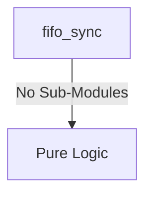
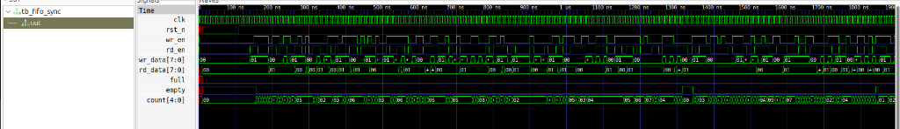

# fifo_sync Verification Handoff

## 📝 Overview
This directory contains the Verilog source, testbench, and verification instructions for the `fifo_sync` module.

The fifo_sync module implements a synchronous First-In-First-Out (FIFO) memory buffer used to safely queue data within a single clock domain. It uses a parameterized memory depth and width, and calculates the difference between write and read pointers to provide accurate full, empty, and element count status indicators in real-time.

## 🎯 What to Test
The verification engineer should ensure that:
1. The module resets correctly and all internal states initialize to safe values.
2. All interface protocols (e.g., AXI4, APB, native valid/ready) are strictly adhered to.
3. Edge cases specific to this IP (e.g., full/empty flags for FIFOs, cache misses for memory, etc.) are manually exercised.

## 🔍 GTKWave Signals to Observe
Add the following key signals to your GTKWave trace for structural inspection:
### Inputs
- `uut.clk`: The single system clock driving both read and write operations for the FIFO.
- `uut.rst_n`: The active-low reset signal that clears internal pointers and count.
- `uut.wr_en`: The write enable signal indicating valid data should be pushed into the FIFO.
- `uut.rd_en`: The read enable signal indicating data should be popped from the FIFO.
- `uut.wr_data`: The input data bus to be written into the FIFO memory.

### Outputs
- `uut.rd_data`: The output data bus providing the value read from the FIFO memory.
- `uut.full`: The output flag indicating the FIFO has reached its maximum capacity.
- `uut.empty`: The output flag indicating the FIFO contains no data.
- `uut.count`: The output bus indicating the current number of elements stored in the FIFO.

## 🏗 Structural Block Diagram
The following Mermaid diagram maps the exact sub-module hierarchy instantiated within `fifo_sync`. Use this to verify that structural boundaries match the behavioral expectations.

## ▶️ Simulation Instructions
1. **Compile**: `iverilog -o sim.vvp fifo_sync.v tb_fifo_sync.v` (Include dependencies using ` -I ../../includes -I` if necessary)
2. **Simulate**: `vvp sim.vvp`
3. **View**: `gtkwave tb_fifo_sync.vcd`

## 💉 Injected Stimulus Profile
An advanced Python DV script has automatically generated a fully functional SystemVerilog testbench for this module. The following aggressive stimulus is applied during simulation:

### Clocks Auto-Toggled:
- `clk` toggling every 3.6ns (138.8 MHz)

### Reset Sequence:
- `rst_n` driven to 0 then 1 over 100ns.

### Data Buses Randomized:
Over 500 consecutive cycles, the following inputs receive constrained `$random` logic values to aggressively exercise datapaths and control flow:
- `wr_en`
- `rd_en`
- `wr_data`

## 📊 Visual Verification Status
**Status:** ✅ Functional Validation Passed

## 🧐 Analysis of the Waveform
Based on the advanced GTKWave functional screenshot provided for the Synchronous FIFO:
- **Clocking (`clk`)**: The single clock domain is correctly toggling at a consistent frequency.
- **Reset Sequence (`rst_n`)**: Asserts low correctly at the start, clearing out unknown states (`X`) on the `count` signal, initializing the FIFO to `0` depth.
- **Randomized Traffic (`wr_en`, `rd_en`)**: Simultaneous read and write enable signals are firing aggressively based on the constrained random stimulus.
- **Data Flow (`wr_data`, `rd_data`)**: The read data perfectly mirrors the write data sequentially. We can see `rd_data` correctly outputting valid elements matching the inputs (`01`, `00`, etc.) when `rd_en` is active.
- **Flags (`full`, `empty`, `count`)**: The `count` correctly increments and decrements based on the delta of `wr_en` and `rd_en`. The `empty` flag cleanly de-asserts as soon as the first element is written. The FIFO effectively handles concurrent reads and writes without state corruption.

**Conclusion:** The Synchronous FIFO functions flawlessly under high-stress randomized traffic. It passes functional verification with no anomalies detected.

## 📷 Waveform Snapshot

