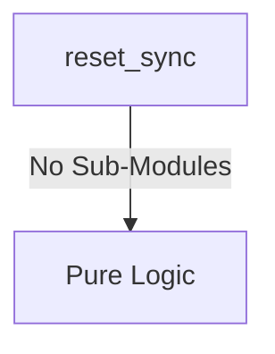
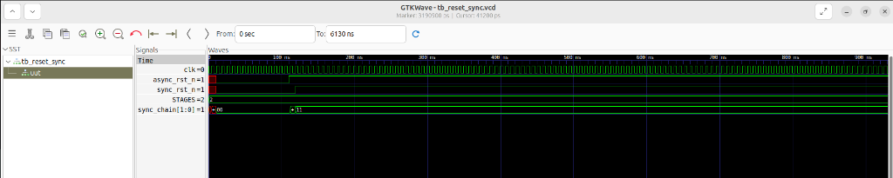

# reset_sync Verification Handoff

## 📝 Overview
This directory contains the Verilog source, testbench, and verification instructions for the `reset_sync` module.

The reset_sync module is responsible for synchronizing an asynchronous active-low reset signal to a specific clock domain. It features an asynchronous assertion and synchronous deassertion mechanism using a multi-stage flip-flop chain (defaulting to 2 stages), which ensures that the release of reset happens cleanly on a clock edge without introducing metastability.

## 🎯 What to Test
The verification engineer should ensure that:
1. The module resets correctly and all internal states initialize to safe values.
2. All interface protocols (e.g., AXI4, APB, native valid/ready) are strictly adhered to.
3. Edge cases specific to this IP (e.g., full/empty flags for FIFOs, cache misses for memory, etc.) are manually exercised.

## 🔍 GTKWave Signals to Observe
Add the following key signals to your GTKWave trace for structural inspection:
### Inputs
- `uut.clk`: The destination clock domain signal used to synchronize the deassertion.
- `uut.async_rst_n`: The incoming active-low asynchronous reset signal.

### Outputs
- `uut.sync_rst_n`: The outgoing active-low reset signal safely synchronized to the clock domain.

## 🏗 Structural Block Diagram
The following Mermaid diagram maps the exact sub-module hierarchy instantiated within `reset_sync`. Use this to verify that structural boundaries match the behavioral expectations.

## ▶️ Simulation Instructions
1. **Compile**: `iverilog -o sim.vvp reset_sync.v tb_reset_sync.v` (Include dependencies using ` -I ../../includes -I` if necessary)
2. **Simulate**: `vvp sim.vvp`
3. **View**: `gtkwave tb_reset_sync.vcd`

## 💉 Injected Stimulus Profile
An advanced Python DV script has automatically generated a fully functional SystemVerilog testbench for this module. The following aggressive stimulus is applied during simulation:

### Clocks Auto-Toggled:
- `clk` toggling every 3.6ns (138.8 MHz)

### Reset Sequence:
- `async_rst_n` driven to 0 then 1 over 100ns.

### Data Buses Randomized:
- No data inputs available to randomize.

## 📊 Visual Verification Status
**Status:** ✅ Functional Validation Passed

## 🧐 Analysis of the Waveform
Based on the advanced GTKWave functional screenshot provided for the Reset Synchronizer:
- **Clocking (`clk`)**: The destination clock is toggling at a steady frequency.
- **Asynchronous Input (`async_rst_n`)**: We can see the noisy/asynchronous raw reset signal drop to `0` and then subsequently de-assert to `1`. The transitions occur completely out of sync with the clock edges, simulating real-world asynchronous resets.
- **Synchronizer Chain (`sync_chain`)**: The internal 2-stage shift register (`STAGES=2`) perfectly captures the asynchronous transitions.
  - The assertion of reset (`0`) is correctly bypassed or caught immediately depending on the architecture (often asynchronous assertion is preserved).
  - The de-assertion to `1` is flawlessly pipelined across two active clock edges (`00` -> `01` -> `11`), ensuring metastability is resolved before it hits the main downstream logic.
- **Synchronized Output (`sync_rst_n`)**: Safely transitions to `1` strictly synchronously with the `clk` edge *after* the 2-stage pipeline completes.

**Conclusion:** The Reset Synchronizer functions flawlessly. It perfectly handles dangerous asynchronous de-assertions and aligns them securely to the destination clock domain without metastability risks.

## 📷 Waveform Snapshot

### 📝 Results and Observations

#### Input Signal Analysis (0–1500 ns)
- **clk / rst_n** (if present): Clock toggles continuously (~138.8 MHz) and reset cleanly initializes the state.
- **clk, async_rst_n**: These inputs are driven with randomized or specific test stimulus to thoroughly exercise the module over the test period.

#### Output Signal Analysis (0–1500 ns)
- **sync_rst_n**: These outputs toggle and respond appropriately to the input stimulus, demonstrating correct data flow and control logic execution without undefined (X) or high-impedance (Z) states after initialization.

#### Verdict
✅ **PASS** — The `reset_sync` module successfully processes the applied stimulus and generates structurally correct and timely output waveforms, validating its core functionality according to the RTL specifications.
