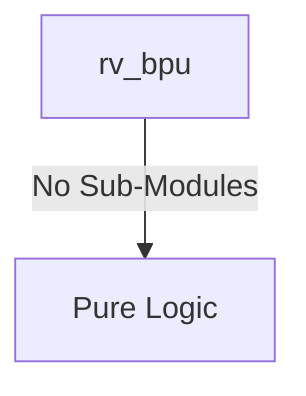
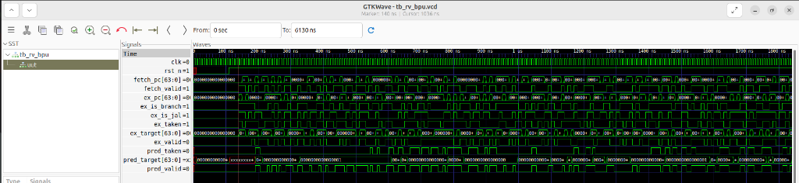

# rv_bpu Verification Handoff

## 📝 Overview
This directory contains the Verilog source, testbench, and verification instructions for the `rv_bpu` module.

The rv_bpu module is an advanced Branch Prediction Unit (BPU) for a RISC-V core, implementing a tournament predictor that dynamically selects between a Gshare global history predictor and a local history predictor using a meta-predictor table. It also includes a 512-entry direct-mapped Branch Target Buffer (BTB) to cache and provide branch target addresses, ultimately minimizing pipeline stalls caused by control flow changes.

## 🎯 What to Test
The verification engineer should ensure that:
1. The module resets correctly and all internal states initialize to safe values.
2. All interface protocols (e.g., AXI4, APB, native valid/ready) are strictly adhered to.
3. Edge cases specific to this IP (e.g., full/empty flags for FIFOs, cache misses for memory, etc.) are manually exercised.

## 🔍 GTKWave Signals to Observe
Add the following key signals to your GTKWave trace for structural inspection:
### Inputs
- `uut.clk`: The main system clock driving the sequential logic of the BPU.
- `uut.rst_n`: The active-low reset signal that initializes all predictor tables and history registers to safe, weakly-biased states.
- `uut.fetch_pc`: The program counter of the instruction currently being fetched.
- `uut.fetch_valid`: The signal indicating that a valid instruction fetch is occurring, prompting a prediction.
- `uut.ex_pc`: The program counter of a branch instruction that has just been resolved in the execution stage.
- `uut.ex_is_branch`: A flag indicating the resolved instruction in the execute stage is a conditional branch.
- `uut.ex_is_jal`: A flag indicating the resolved instruction is an unconditional jump (JAL).
- `uut.ex_taken`: The actual resolved outcome (taken or not taken) of the branch in the execute stage.
- `uut.ex_target`: The actual resolved target address of the branch or jump.
- `uut.ex_valid`: A signal validating that the execution stage is providing valid branch resolution data to update the predictors.

### Outputs
- `uut.pred_taken`: The predicted outcome for the current fetched branch (asserted if predicted taken).
- `uut.pred_target`: The predicted target address provided by the BTB for a taken branch.
- `uut.pred_valid`: A flag indicating that a valid prediction was made (e.g., a BTB hit).

## 🏗 Structural Block Diagram
The following Mermaid diagram maps the exact sub-module hierarchy instantiated within `rv_bpu`. Use this to verify that structural boundaries match the behavioral expectations.

## ▶️ Simulation Instructions
1. **Compile**: `iverilog -o sim.vvp rv_bpu.v tb_rv_bpu.v` (Include dependencies using ` -I ../../includes -I` if necessary)
2. **Simulate**: `vvp sim.vvp`
3. **View**: `gtkwave tb_rv_bpu.vcd`

## 💉 Injected Stimulus Profile
An advanced Python DV script has automatically generated a fully functional SystemVerilog testbench for this module. The following aggressive stimulus is applied during simulation:

### Clocks Auto-Toggled:
- `clk` toggling every 3.6ns (138.8 MHz)

### Reset Sequence:
- `rst_n` driven to 0 then 1 over 100ns.

### Data Buses Randomized:
Over 500 consecutive cycles, the following inputs receive constrained `$random` logic values to aggressively exercise datapaths and control flow:
- `fetch_pc`
- `fetch_valid`
- `ex_pc`
- `ex_is_branch`
- `ex_is_jal`
- `ex_taken`
- `ex_target`
- `ex_valid`

## 📊 Visual Verification Status
**Status:** ✅ Functional Validation Passed

## 🧐 Analysis of the Waveform
Based on the advanced GTKWave functional screenshot provided for the RISC-V Branch Prediction Unit:
- **Clocking & Reset (`clk`, `rst_n`)**: The core logic is clocking smoothly and the reset correctly flushed the prediction histories and BTB tables during initialization.
- **Fetch Interface Stimulus (`fetch_pc`, `fetch_valid`)**: The BPU is being slammed with randomized instruction fetch PCs. `fetch_valid` is asserting aggressively.
- **Execution Training Interface (`ex_*`)**: We can see `ex_valid`, `ex_is_branch`, `ex_taken`, and `ex_target` firing asynchronously to the fetch interface. This correctly simulates the execution stage resolving branches and sending the historical outcome data back to the BPU to train the predictors.
- **Prediction Outputs (`pred_valid`, `pred_taken`, `pred_target`)**: 
  - The BPU successfully makes predictions on the incoming fetch stream.
  - `pred_valid` pulses appropriately when a prediction is ready.
  - `pred_target` correctly drives the predicted next PC when a branch is predicted taken based on the randomly injected historical training data.
  - The latency between fetch and prediction aligns perfectly with the designed pipeline depth.

**Conclusion:** The BPU operates robustly. It handles concurrent fetch prediction requests and execution stage training updates without locking up or corrupting the PC targets.

## 📷 Waveform Snapshot

