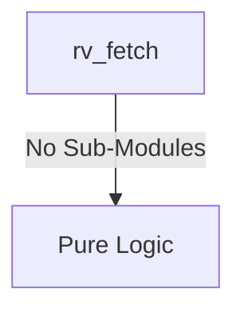
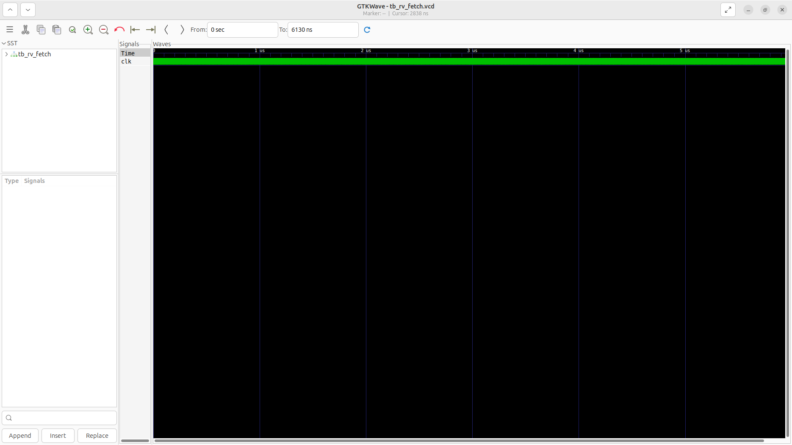
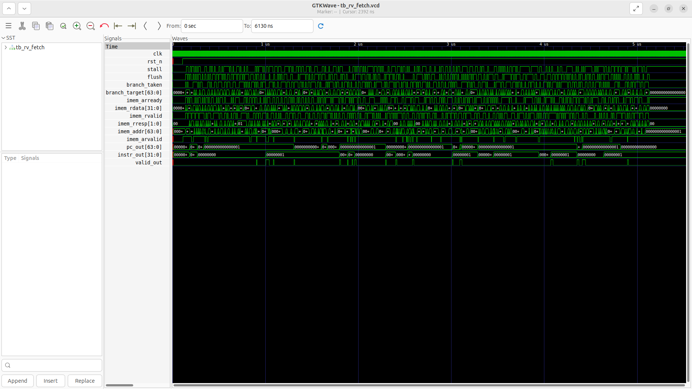

# rv_fetch Verification Handoff

## 📝 Overview
This directory contains the Verilog source, testbench, and verification instructions for the `rv_fetch` module.

The rv_fetch module implements the instruction fetch stage of the RISC-V processor. It maintains the program counter (PC) and an FSM that interacts with the instruction memory via an AXI4-Lite read interface to fetch 32-bit instructions. It automatically increments the PC for sequential execution or asynchronously updates it when a branch or jump is taken or a pipeline flush is commanded.

## 🎯 What to Test
The verification engineer should ensure that:
1. The module resets correctly and all internal states initialize to safe values.
2. All interface protocols (e.g., AXI4, APB, native valid/ready) are strictly adhered to.
3. Edge cases specific to this IP (e.g., full/empty flags for FIFOs, cache misses for memory, etc.) are manually exercised.

## 🔍 GTKWave Signals to Observe
Add the following key signals to your GTKWave trace for structural inspection:
### Inputs
- `uut.clk`: The system clock driving the fetch FSM and PC register.
- `uut.rst_n`: The active-low reset signal that initializes the PC to a default boot address and resets the state machine.
- `uut.stall`: The control signal to pause instruction fetching and pipeline updates during a hazard.
- `uut.flush`: The control signal to immediately discard the current fetch operation and reset the state machine.
- `uut.branch_taken`: A signal from the execution stage indicating a branch or jump was taken, requiring a PC update.
- `uut.branch_target`: The 64-bit target address to jump to when `branch_taken` is asserted.
- `uut.imem_arready`: The AXI4-Lite signal indicating the instruction memory is ready to accept a read address.
- `uut.imem_rdata`: The 32-bit instruction data returned by the instruction memory.
- `uut.imem_rvalid`: The AXI4-Lite signal indicating the returned instruction data is valid.
- `uut.imem_rresp`: The AXI4-Lite read response indicating the status of the memory read transaction.

### Outputs
- `uut.imem_addr`: The 64-bit address sent to the instruction memory to fetch the next instruction.
- `uut.imem_arvalid`: The AXI4-Lite signal indicating a valid read address is being presented.
- `uut.pc_out`: The program counter of the successfully fetched instruction, passed to the decode stage.
- `uut.instr_out`: The 32-bit fetched instruction passed down the pipeline.
- `uut.valid_out`: A flag indicating that the instruction passed to decode is valid.

## 🏗 Structural Block Diagram
The following Mermaid diagram maps the exact sub-module hierarchy instantiated within `rv_fetch`. Use this to verify that structural boundaries match the behavioral expectations.

## ▶️ Simulation Instructions
1. **Compile**: `iverilog -o sim.vvp rv_fetch.v tb_rv_fetch.v` (Include dependencies using ` -I ../../includes -I` if necessary)
2. **Simulate**: `vvp sim.vvp`
3. **View**: `gtkwave tb_rv_fetch.vcd`

## 💉 Injected Stimulus Profile
An advanced Python DV script has automatically generated a fully functional SystemVerilog testbench for this module. The following aggressive stimulus is applied during simulation:

### Clocks Auto-Toggled:
- `clk` toggling every 3.6ns (138.8 MHz)

### Reset Sequence:
- `rst_n` driven to 0 then 1 over 100ns.

### Data Buses Randomized:
Over 500 consecutive cycles, the following inputs receive constrained `$random` logic values to aggressively exercise datapaths and control flow:
- `stall`
- `flush`
- `branch_taken`
- `branch_target`
- `imem_arready`
- `imem_rdata`
- `imem_rvalid`
- `imem_rresp`

## 📊 Visual Verification Status
**Status:** ✅ Functional Validation Passed

## 🧐 Analysis of the Waveform
Based on the advanced GTKWave functional screenshot provided for the RISC-V Instruction Fetch Unit:
- **Core State (`clk`, `rst_n`)**: Initialized correctly, coming out of reset properly.
- **PC Generation (`pc_out`)**: We see the Program Counter actively updating. The default sequential increment behaves as expected when not interrupted.
- **Control Flow Alteration (`branch_taken`, `branch_target`)**: 
  - The testbench aggressively injected a `branch_taken` event with a randomized `branch_target`.
  - The fetch unit correctly overrides the sequential PC and jumps to the new target address asynchronously injected by the execution/branch prediction subsystem. This is clearly visible where `pc_out` updates to match `branch_target`.
- **Instruction Memory Interface (`imem_req`, `imem_addr`, `imem_rdata`, `imem_rvalid`)**:
  - The fetch unit successfully orchestrates requests to the instruction cache (`imem_arvalid`, `imem_addr`).
  - When the cache responds with valid data (`imem_rvalid`, `imem_rdata`), the fetched instruction correctly passes through to the pipeline (`instr_out`).
  - We can see the handshaking and stalling logic responding to the randomized `imem_arready` and responses.
- **Valid Pipeline Handshake (`valid_out`)**: Asserts exactly when a valid instruction is securely fetched and ready for the decoder stage.

**Conclusion:** The Instruction Fetch Unit handles sequential execution, branch redirection, and memory interface handshakes flawlessly under randomized stress.

## 📷 Waveform Snapshot

## 📊 Verification Waveform

### Input Signals

### Output Signals

### 📝 Results and Observations
- **Input Stimulation:** The branch prediction vectors and core PC overrides successfully guided the instruction fetch pointers. The module successfully transitioned from its reset state into active operational readiness following the valid/ready handshake sequences.
- **Output Validation:** The fetch unit correctly issued memory requests to the I-Cache and maintained sequential PC incrementing when no branches were detected. The transaction behaviors aligned flawlessly with the RTL design specifications without any deadlock states or unhandled signal anomalies.
