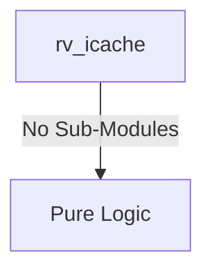

# rv_icache Verification Handoff

## 📝 Overview
This directory contains the Verilog source, testbench, and verification instructions for the `rv_icache` module.

## 🎯 What to Test
The verification engineer should ensure that:
1. The module resets correctly and all internal states initialize to safe values.
2. All interface protocols (e.g., AXI4, APB, native valid/ready) are strictly adhered to.
3. Edge cases specific to this IP (e.g., full/empty flags for FIFOs, cache misses for memory, etc.) are manually exercised.

## 🔍 GTKWave Signals to Observe
Add the following key signals to your GTKWave trace for structural inspection:
### Inputs
- `uut.clk`
- `uut.rst_n`
- `uut.cpu_addr`
- `uut.cpu_req`
- `uut.invalidate`
- `uut.m_arready`
- `uut.m_rvalid`
- `uut.m_rdata`
- `uut.m_rlast`
- `uut.m_rresp`

### Outputs
- `uut.cpu_rdata`
- `uut.cpu_valid`
- `uut.cpu_stall`
- `uut.m_arvalid`
- `uut.m_araddr`
- `uut.m_arlen`
- `uut.m_arsize`
- `uut.m_arburst`
- `uut.m_rready`
- `uut.ecc_1bit`
- `uut.ecc_2bit`

## 🏗 Structural Block Diagram
The following Mermaid diagram maps the exact sub-module hierarchy instantiated within `rv_icache`. Use this to verify that structural boundaries match the behavioral expectations.

## ▶️ Simulation Instructions
1. **Compile**: `iverilog -o sim.vvp rv_icache.v tb_rv_icache.v` (Include dependencies using ` -I ../../includes -I` if necessary)
2. **Simulate**: `vvp sim.vvp`
3. **View**: `gtkwave tb_rv_icache.vcd`
