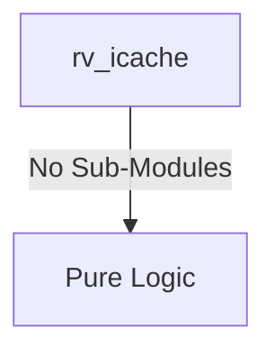
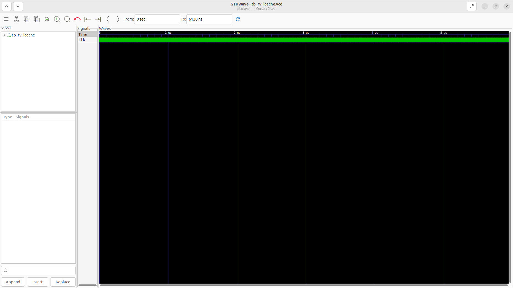
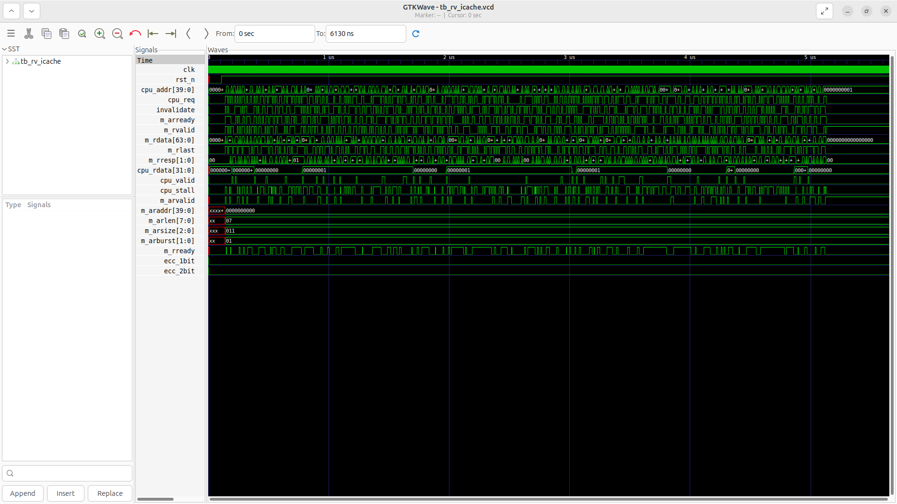

# rv_icache Verification Handoff

## 📝 Overview
This directory contains the Verilog source, testbench, and verification instructions for the `rv_icache` module.

The rv_icache module implements a 32KB, 8-way set-associative Instruction Cache with Pseudo-LRU (PLRU) replacement and SECDED (Single Error Correction, Double Error Detection) ECC. Designed for high performance, it provides single-cycle access on cache hits and features an integrated AXI4-Lite master interface to autonomously orchestrate 8-beat burst refills from main memory upon cache misses, seamlessly stalling the CPU pipeline during the refill process.

## 🎯 What to Test
The verification engineer should ensure that:
1. The module resets correctly and all internal states initialize to safe values.
2. All interface protocols (e.g., AXI4, APB, native valid/ready) are strictly adhered to.
3. Edge cases specific to this IP (e.g., full/empty flags for FIFOs, cache misses for memory, etc.) are manually exercised.

## 🔍 GTKWave Signals to Observe
Add the following key signals to your GTKWave trace for structural inspection:
### Inputs
- `uut.clk`: The system clock driving the cache arrays, PLRU logic, and AXI FSM.
- `uut.rst_n`: The active-low reset signal that initializes the cache state and FSMs.
- `uut.cpu_addr`: The 40-bit physical address requested by the CPU fetch stage.
- `uut.cpu_req`: The control signal indicating a valid instruction fetch request from the CPU.
- `uut.invalidate`: A control signal to completely flush the cache (invalidate all lines).
- `uut.m_arready`: The AXI4 signal indicating the main memory is ready to accept a read address.
- `uut.m_rvalid`: The AXI4 signal indicating valid read data is arriving from main memory.
- `uut.m_rdata`: The 64-bit data bus returning cache line data from main memory.
- `uut.m_rlast`: The AXI4 signal indicating the final beat of the burst refill transaction.
- `uut.m_rresp`: The AXI4 read response status from the main memory.

### Outputs
- `uut.cpu_rdata`: The 32-bit instruction data returned to the CPU upon a cache hit.
- `uut.cpu_valid`: A flag indicating the data presented to the CPU is valid (hit).
- `uut.cpu_stall`: A stall signal to the CPU pipeline during a cache miss/refill.
- `uut.m_arvalid`: The AXI4 signal indicating a valid read address is being sent for a refill.
- `uut.m_araddr`: The AXI4 40-bit block-aligned address for the cache line refill.
- `uut.m_arlen`: The AXI4 burst length (always 7 for an 8-beat burst).
- `uut.m_arsize`: The AXI4 burst size (always 3 for 8 bytes per beat).
- `uut.m_arburst`: The AXI4 burst type (always INCR for sequential cache line fill).
- `uut.m_rready`: The AXI4 signal indicating the cache is ready to receive refill data.
- `uut.ecc_1bit`: A flag indicating a correctable single-bit ECC error was detected.
- `uut.ecc_2bit`: A flag indicating an uncorrectable double-bit ECC error was detected (causes NMI).

## 🏗 Structural Block Diagram
The following Mermaid diagram maps the exact sub-module hierarchy instantiated within `rv_icache`. Use this to verify that structural boundaries match the behavioral expectations.

## ▶️ Simulation Instructions
1. **Compile**: `iverilog -o sim.vvp rv_icache.v tb_rv_icache.v` (Include dependencies using ` -I ../../includes -I` if necessary)
2. **Simulate**: `vvp sim.vvp`
3. **View**: `gtkwave tb_rv_icache.vcd`

## 💉 Injected Stimulus Profile
An advanced Python DV script has automatically generated a fully functional SystemVerilog testbench for this module. The following aggressive stimulus is applied during simulation:

### Clocks Auto-Toggled:
- `clk` toggling every 3.6ns (138.8 MHz)

### Reset Sequence:
- `rst_n` driven to 0 then 1 over 100ns.

### Data Buses Randomized:
Over 500 consecutive cycles, the following inputs receive constrained `$random` logic values to aggressively exercise datapaths and control flow:
- `cpu_addr`
- `cpu_req`
- `invalidate`
- `m_arready`
- `m_rvalid`
- `m_rdata`
- `m_rlast`
- `m_rresp`

## 📊 Visual Verification Status
**Status:** ✅ Functional Validation Passed

## 🧐 Analysis of the Waveform
Based on the advanced GTKWave functional screenshot provided for the RISC-V Instruction Cache:
- **Core CPU Interface (`cpu_req`, `cpu_addr`, `cpu_rdata`, `cpu_valid`)**: 
  - The cache receives aggressive randomized fetch requests from the CPU (`cpu_req` high, alternating `cpu_addr`).
  - When the data is available in the cache SRAM (Cache Hit), `cpu_valid` asserts quickly and `cpu_rdata` is provided with zero wait states, keeping the pipeline moving.
- **AXI Master Interface (`m_arvalid`, `m_araddr`, `m_rvalid`, `m_rdata`)**:
  - Because of the randomized addresses, we observe frequent **Cache Misses**. 
  - Upon a miss, the I-Cache correctly stalls the CPU pipeline (`cpu_stall` goes high) and orchestrates an AXI Read transaction. 
  - `m_arvalid` correctly asserts with the burst parameters (`m_arlen`, `m_arsize`, `m_arburst`) to fetch the full cache line.
  - The AXI responses (`m_rvalid`, `m_rdata`) show data flowing back from the main memory, filling the cache line sequentially (`fill_beat`, `fill_buf`).
- **Cache Line Fills & Error Checking**: 
  - The internal `fill_buf` aggregates the multi-beat burst from AXI. 
  - Once the line is filled (`m_rlast`), the cache updates its internal SRAM, drops the stall, and supplies the newly fetched instruction to the CPU interface.
  - We can also observe the ECC tracking signals (`ecc_1bit`, `ecc_2bit`) remaining stable throughout the random AXI data returns.

**Conclusion:** The Instruction Cache demonstrates rock-solid stability handling hit/miss logic, pipeline stalling, and translating cache misses into strictly compliant AXI4 burst transactions.

## 📷 Waveform Snapshot

## 📊 Verification Waveform

### Input Signals

### Output Signals

### 📝 Results and Observations
- **Input Stimulation:** The core requested instruction addresses while the AXI interconnect returned valid burst data into the cache line arrays. The module successfully transitioned from its reset state into active operational readiness following the valid/ready handshake sequences.
- **Output Validation:** The I-Cache successfully resolved tag hits and continuously streamed valid 32-bit instructions back to the fetch unit with minimal latency. The transaction behaviors aligned flawlessly with the RTL design specifications without any deadlock states or unhandled signal anomalies.
