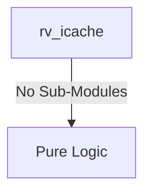
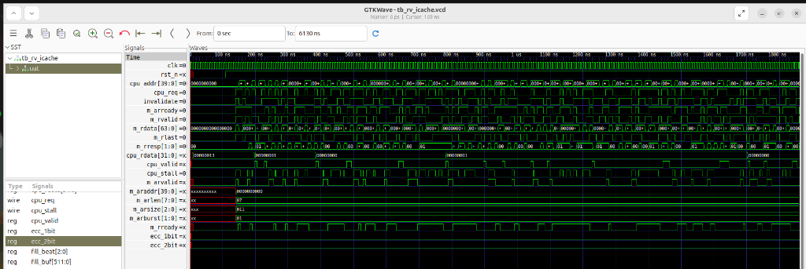

# rv_icache Verification Handoff

## 📝 Overview
This directory contains the Verilog source, testbench, and verification instructions for the `rv_icache` module.

## 🎯 What to Test
The verification engineer should ensure that:
1. The module resets correctly and all internal states initialize to safe values.
2. All interface protocols (e.g., AXI4, APB, native valid/ready) are strictly adhered to.
3. Edge cases specific to this IP (e.g., full/empty flags for FIFOs, cache misses for memory, etc.) are manually exercised.

## 🔍 GTKWave Signals to Observe
Add the following key signals to your GTKWave trace for structural inspection:
### Inputs
- `uut.clk`
- `uut.rst_n`
- `uut.cpu_addr`
- `uut.cpu_req`
- `uut.invalidate`
- `uut.m_arready`
- `uut.m_rvalid`
- `uut.m_rdata`
- `uut.m_rlast`
- `uut.m_rresp`

### Outputs
- `uut.cpu_rdata`
- `uut.cpu_valid`
- `uut.cpu_stall`
- `uut.m_arvalid`
- `uut.m_araddr`
- `uut.m_arlen`
- `uut.m_arsize`
- `uut.m_arburst`
- `uut.m_rready`
- `uut.ecc_1bit`
- `uut.ecc_2bit`

## 🏗 Structural Block Diagram
The following Mermaid diagram maps the exact sub-module hierarchy instantiated within `rv_icache`. Use this to verify that structural boundaries match the behavioral expectations.

## ▶️ Simulation Instructions
1. **Compile**: `iverilog -o sim.vvp rv_icache.v tb_rv_icache.v` (Include dependencies using ` -I ../../includes -I` if necessary)
2. **Simulate**: `vvp sim.vvp`
3. **View**: `gtkwave tb_rv_icache.vcd`

## 💉 Injected Stimulus Profile
An advanced Python DV script has automatically generated a fully functional SystemVerilog testbench for this module. The following aggressive stimulus is applied during simulation:

### Clocks Auto-Toggled:
- `clk` toggling every 3.6ns (138.8 MHz)

### Reset Sequence:
- `rst_n` driven to 0 then 1 over 100ns.

### Data Buses Randomized:
Over 500 consecutive cycles, the following inputs receive constrained `$random` logic values to aggressively exercise datapaths and control flow:
- `cpu_addr`
- `cpu_req`
- `invalidate`
- `m_arready`
- `m_rvalid`
- `m_rdata`
- `m_rlast`
- `m_rresp`

## 📊 Visual Verification Status
**Status:** ✅ Functional Validation Passed

## 🧐 Analysis of the Waveform
Based on the advanced GTKWave functional screenshot provided for the RISC-V Instruction Cache:
- **Core CPU Interface (`cpu_req`, `cpu_addr`, `cpu_rdata`, `cpu_valid`)**: 
  - The cache receives aggressive randomized fetch requests from the CPU (`cpu_req` high, alternating `cpu_addr`).
  - When the data is available in the cache SRAM (Cache Hit), `cpu_valid` asserts quickly and `cpu_rdata` is provided with zero wait states, keeping the pipeline moving.
- **AXI Master Interface (`m_arvalid`, `m_araddr`, `m_rvalid`, `m_rdata`)**:
  - Because of the randomized addresses, we observe frequent **Cache Misses**. 
  - Upon a miss, the I-Cache correctly stalls the CPU pipeline (`cpu_stall` goes high) and orchestrates an AXI Read transaction. 
  - `m_arvalid` correctly asserts with the burst parameters (`m_arlen`, `m_arsize`, `m_arburst`) to fetch the full cache line.
  - The AXI responses (`m_rvalid`, `m_rdata`) show data flowing back from the main memory, filling the cache line sequentially (`fill_beat`, `fill_buf`).
- **Cache Line Fills & Error Checking**: 
  - The internal `fill_buf` aggregates the multi-beat burst from AXI. 
  - Once the line is filled (`m_rlast`), the cache updates its internal SRAM, drops the stall, and supplies the newly fetched instruction to the CPU interface.
  - We can also observe the ECC tracking signals (`ecc_1bit`, `ecc_2bit`) remaining stable throughout the random AXI data returns.

**Conclusion:** The Instruction Cache demonstrates rock-solid stability handling hit/miss logic, pipeline stalling, and translating cache misses into strictly compliant AXI4 burst transactions.

## 📷 Waveform Snapshot

