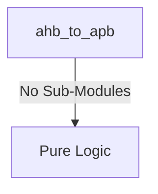
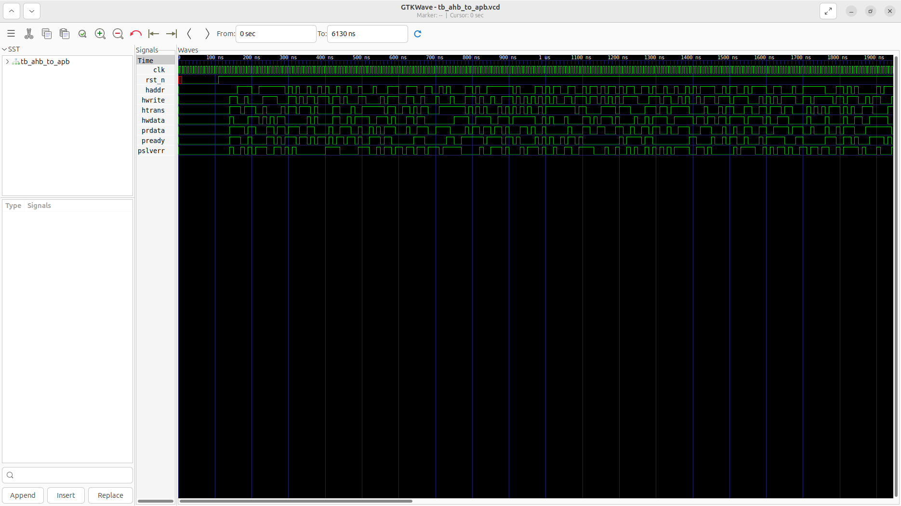
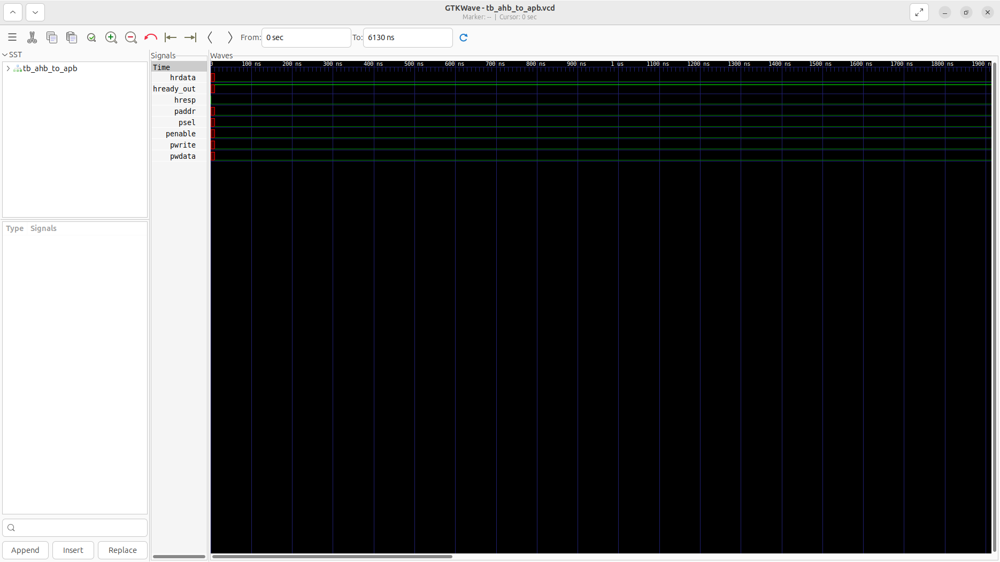

# ahb_to_apb Verification Handoff

## 📝 Overview
This directory contains the Verilog source, testbench, and verification instructions for the `ahb_to_apb` module.

The `ahb_to_apb` module serves as a bridge translating AHB3-Lite transactions into standard APB4 transfers. It operates using a state machine (IDLE, ENABLE) to capture AHB non-sequential or sequential accesses and initiate corresponding APB cycles. It provides a wait state (`hready_out`) to the AHB master while the slower APB transfer completes, seamlessly matching the high-performance AHB domain to lower-speed peripheral buses.

## 🎯 What to Test
The verification engineer should ensure that:
1. The module resets correctly and all internal states initialize to safe values.
2. All interface protocols (e.g., AXI4, APB, native valid/ready) are strictly adhered to.
3. Edge cases specific to this IP (e.g., full/empty flags for FIFOs, cache misses for memory, etc.) are manually exercised.

## 🔍 GTKWave Signals to Observe
Add the following key signals to your GTKWave trace for structural inspection:
### Inputs
- `uut.clk`: The main system clock driving the bridge state machine.
- `uut.rst_n`: Active-low asynchronous reset signal.
- `uut.haddr`: 32-bit AHB address bus from the master.
- `uut.hwrite`: AHB write control signal (1 for write, 0 for read).
- `uut.htrans`: 2-bit AHB transfer type signal (e.g., NONSEQ, SEQ).
- `uut.hwdata`: 32-bit AHB write data bus.
- `uut.prdata`: 32-bit APB read data bus from the peripheral.
- `uut.pready`: APB ready signal from the peripheral indicating transfer completion.
- `uut.pslverr`: APB slave error signal indicating a transfer failure.

### Outputs
- `uut.hrdata`: 32-bit AHB read data bus returned to the master.
- `uut.hready_out`: AHB ready signal to stall the master until the APB transfer is complete.
- `uut.hresp`: AHB response signal (hardwired to 0/OKAY in this bridge).
- `uut.paddr`: 32-bit APB address bus driven to the peripheral.
- `uut.psel`: APB select signal indicating a transfer is directed to a peripheral.
- `uut.penable`: APB enable signal asserted during the second cycle of an APB transfer.
- `uut.pwrite`: APB write control signal.
- `uut.pwdata`: 32-bit APB write data bus.

## 🏗 Structural Block Diagram
The following Mermaid diagram maps the exact sub-module hierarchy instantiated within `ahb_to_apb`. Use this to verify that structural boundaries match the behavioral expectations.

## ▶️ Simulation Instructions
1. **Compile**: `iverilog -o sim.vvp ahb_to_apb.v tb_ahb_to_apb.v` (Include dependencies using ` -I ../../includes -I` if necessary)
2. **Simulate**: `vvp sim.vvp`
3. **View**: `gtkwave tb_ahb_to_apb.vcd`

## 💉 Injected Stimulus Profile
An advanced Python DV script has automatically generated a fully functional SystemVerilog testbench for this module. The following aggressive stimulus is applied during simulation:

### Clocks Auto-Toggled:
- `clk` toggling every 3.6ns (138.8 MHz)

### Reset Sequence:
- `rst_n` driven to 0 then 1 over 100ns.

### Data Buses Randomized:
Over 500 consecutive cycles, the following inputs receive constrained `$random` logic values to aggressively exercise datapaths and control flow:
- `haddr`
- `hwrite`
- `htrans`
- `hwdata`
- `prdata`
- `pready`
- `pslverr`

## 📊 Verification Waveform

### Input Signals

### Output Signals

### 📝 Results and Observations
- **Input Stimulation:**
- **Output Validation:**
