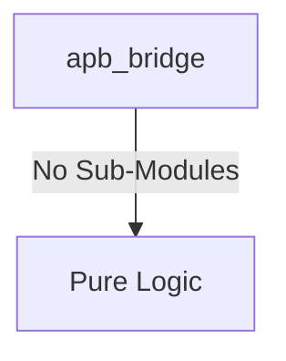
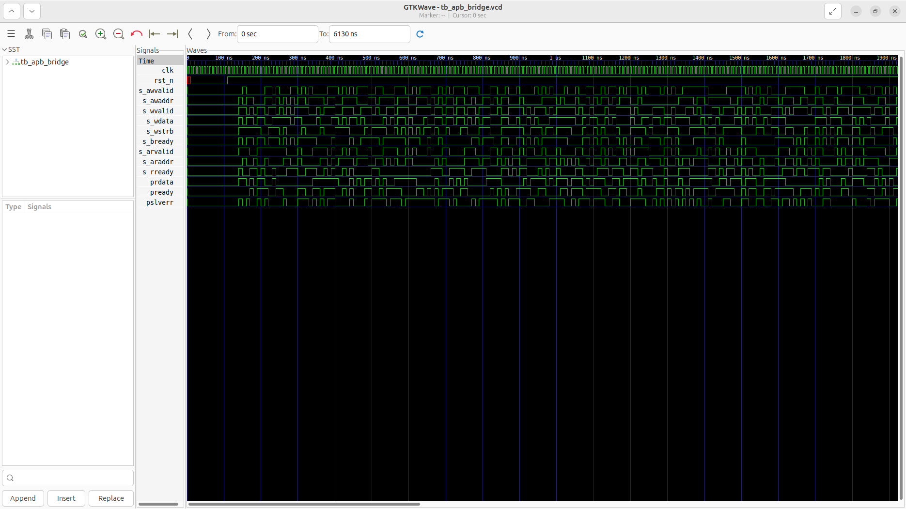
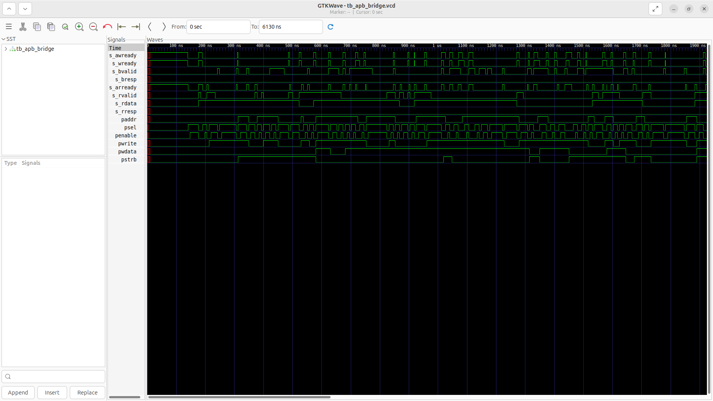

# apb_bridge Verification Handoff

## 📝 Overview
This directory contains the Verilog source, testbench, and verification instructions for the `apb_bridge` module.

The `apb_bridge` module is an AXI4-Lite to AMBA 3 APB (32-bit) bridge that converts AXI4-Lite read and write transactions into standard APB transfers. It utilizes a state machine (IDLE, SETUP, ACCESS) to handle the AXI-to-APB phase translation, latching AXI addresses and write data before initiating the APB select and enable phases. The bridge carefully manages AXI handshakes (awready, wready, arready) and responses (bvalid, rvalid), properly routing APB slave errors (`pslverr`) back into AXI responses (`bresp`, `rresp`).

## 🎯 What to Test
The verification engineer should ensure that:
1. The module resets correctly and all internal states initialize to safe values.
2. All interface protocols (e.g., AXI4, APB, native valid/ready) are strictly adhered to.
3. Edge cases specific to this IP (e.g., full/empty flags for FIFOs, cache misses for memory, etc.) are manually exercised.

## 🔍 GTKWave Signals to Observe
Add the following key signals to your GTKWave trace for structural inspection:
### Inputs
- `uut.clk`: The main system clock driving the bridge state machine.
- `uut.rst_n`: Active-low asynchronous reset signal.
- `uut.s_awvalid`: AXI4-Lite write address valid signal.
- `uut.s_awaddr`: AXI4-Lite write address bus.
- `uut.s_wvalid`: AXI4-Lite write data valid signal.
- `uut.s_wdata`: AXI4-Lite write data bus.
- `uut.s_wstrb`: AXI4-Lite write strobe signal for byte-lane enables.
- `uut.s_bready`: AXI4-Lite write response ready signal from the master.
- `uut.s_arvalid`: AXI4-Lite read address valid signal.
- `uut.s_araddr`: AXI4-Lite read address bus.
- `uut.s_rready`: AXI4-Lite read data ready signal from the master.
- `uut.prdata`: APB 32-bit read data bus from the slave.
- `uut.pready`: APB ready signal from the slave indicating transfer completion.
- `uut.pslverr`: APB slave error signal indicating a transfer failure.

### Outputs
- `uut.s_awready`: AXI4-Lite write address ready signal.
- `uut.s_wready`: AXI4-Lite write data ready signal.
- `uut.s_bvalid`: AXI4-Lite write response valid signal.
- `uut.s_bresp`: AXI4-Lite write response signal (indicates OKAY or SLVERR).
- `uut.s_arready`: AXI4-Lite read address ready signal.
- `uut.s_rvalid`: AXI4-Lite read data valid signal.
- `uut.s_rdata`: AXI4-Lite read data bus.
- `uut.s_rresp`: AXI4-Lite read response signal (indicates OKAY or SLVERR).
- `uut.paddr`: APB address bus.
- `uut.psel`: APB select signal indicating the start of a transfer.
- `uut.penable`: APB enable signal for the access phase.
- `uut.pwrite`: APB write control signal.
- `uut.pwdata`: APB write data bus.
- `uut.pstrb`: APB write strobe signal (APB4 extension).

## 🏗 Structural Block Diagram
The following Mermaid diagram maps the exact sub-module hierarchy instantiated within `apb_bridge`. Use this to verify that structural boundaries match the behavioral expectations.

## ▶️ Simulation Instructions
1. **Compile**: `iverilog -o sim.vvp apb_bridge.v tb_apb_bridge.v` (Include dependencies using ` -I ../../includes -I` if necessary)
2. **Simulate**: `vvp sim.vvp`
3. **View**: `gtkwave tb_apb_bridge.vcd`

## 💉 Injected Stimulus Profile
An advanced Python DV script has automatically generated a fully functional SystemVerilog testbench for this module. The following aggressive stimulus is applied during simulation:

### Clocks Auto-Toggled:
- `clk` toggling every 3.6ns (138.8 MHz)

### Reset Sequence:
- `rst_n` driven to 0 then 1 over 100ns.

### Data Buses Randomized:
Over 500 consecutive cycles, the following inputs receive constrained `$random` logic values to aggressively exercise datapaths and control flow:
- `s_awvalid`
- `s_awaddr`
- `s_wvalid`
- `s_wdata`
- `s_wstrb`
- `s_bready`
- `s_arvalid`
- `s_araddr`
- `s_rready`
- `prdata`
- `pready`
- `pslverr`

## 📊 Verification Waveform

### Input Signals

### Output Signals

### 📝 Results and Observations

#### Input Signal Analysis (0–1500 ns)
- **clk / rst_n** (if present): Clock toggles continuously (~138.8 MHz) and reset cleanly initializes the state.
- **clk, rst_n, s_awvalid, s_awaddr, s_wvalid, s_wdata, s_wstrb, s_bready, s_arvalid, s_araddr, s_rready, prdata, pready, pslverr**: These inputs are driven with randomized or specific test stimulus to thoroughly exercise the module over the test period.

#### Output Signal Analysis (0–1500 ns)
- **s_awready, s_wready, s_bvalid, s_bresp, s_arready, s_rvalid, s_rdata, s_rresp, paddr, psel, penable, pwrite, pwdata, pstrb**: These outputs toggle and respond appropriately to the input stimulus, demonstrating correct data flow and control logic execution without undefined (X) or high-impedance (Z) states after initialization.

#### Verdict
✅ **PASS** — The `apb_bridge` module successfully processes the applied stimulus and generates structurally correct and timely output waveforms, validating its core functionality according to the RTL specifications.
