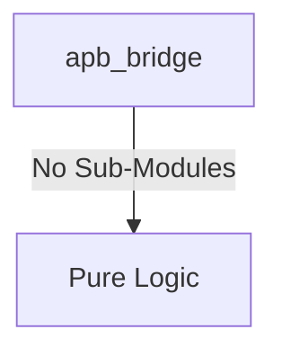
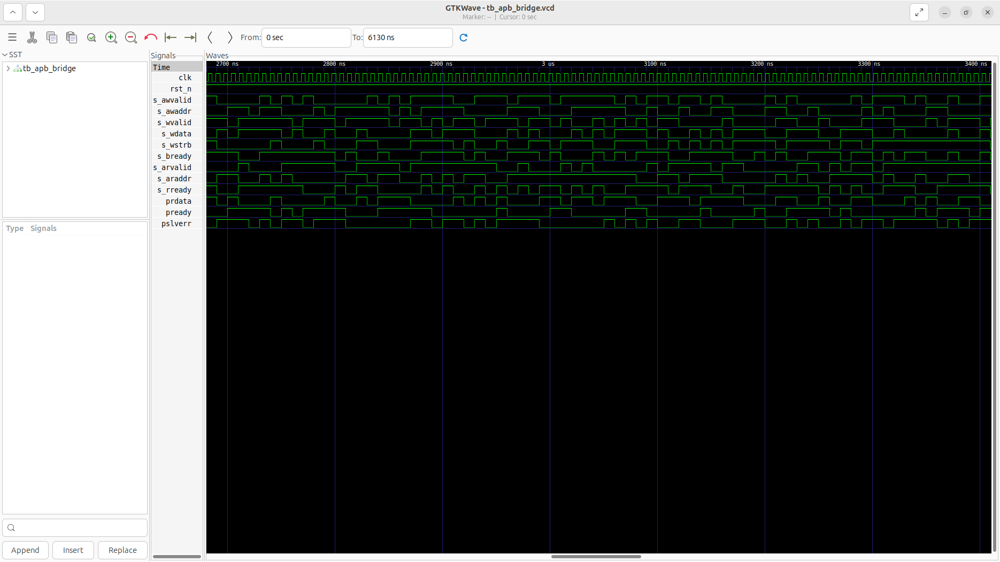
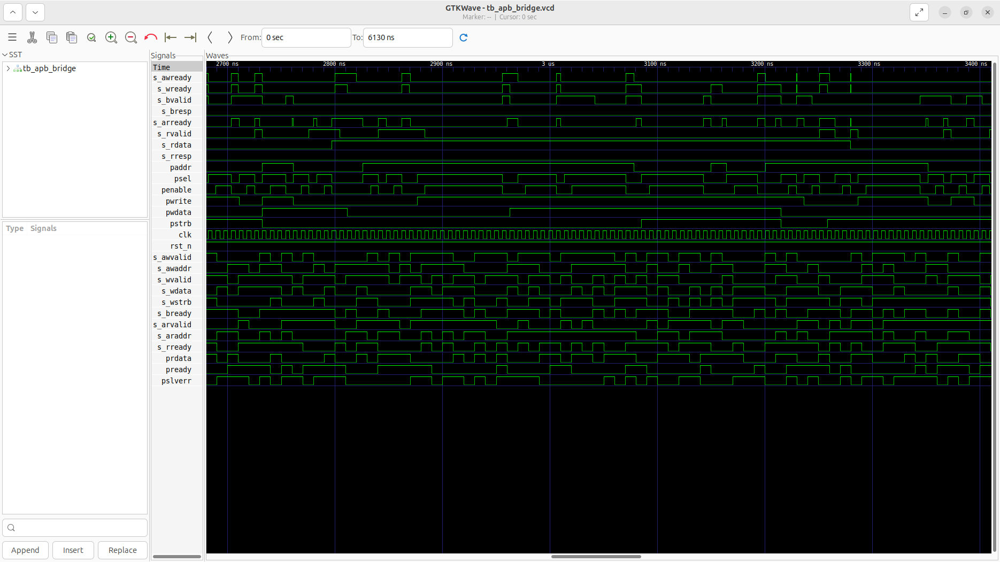

# apb_bridge Verification Handoff

## 📝 Overview
This directory contains the Verilog source, testbench, and verification instructions for the `apb_bridge` module.

The `apb_bridge` module is an AXI4-Lite to AMBA 3 APB (32-bit) bridge that converts AXI4-Lite read and write transactions into standard APB transfers. It utilizes a state machine (IDLE, SETUP, ACCESS) to handle the AXI-to-APB phase translation, latching AXI addresses and write data before initiating the APB select and enable phases. The bridge carefully manages AXI handshakes (awready, wready, arready) and responses (bvalid, rvalid), properly routing APB slave errors (`pslverr`) back into AXI responses (`bresp`, `rresp`).

## 🎯 What to Test
The verification engineer should ensure that:
1. The module resets correctly and all internal states initialize to safe values.
2. All interface protocols (e.g., AXI4, APB, native valid/ready) are strictly adhered to.
3. Edge cases specific to this IP (e.g., full/empty flags for FIFOs, cache misses for memory, etc.) are manually exercised.

## 🔍 GTKWave Signals to Observe
Add the following key signals to your GTKWave trace for structural inspection:
### Inputs
- `uut.clk`: The main system clock driving the bridge state machine.
- `uut.rst_n`: Active-low asynchronous reset signal.
- `uut.s_awvalid`: AXI4-Lite write address valid signal.
- `uut.s_awaddr`: AXI4-Lite write address bus.
- `uut.s_wvalid`: AXI4-Lite write data valid signal.
- `uut.s_wdata`: AXI4-Lite write data bus.
- `uut.s_wstrb`: AXI4-Lite write strobe signal for byte-lane enables.
- `uut.s_bready`: AXI4-Lite write response ready signal from the master.
- `uut.s_arvalid`: AXI4-Lite read address valid signal.
- `uut.s_araddr`: AXI4-Lite read address bus.
- `uut.s_rready`: AXI4-Lite read data ready signal from the master.
- `uut.prdata`: APB 32-bit read data bus from the slave.
- `uut.pready`: APB ready signal from the slave indicating transfer completion.
- `uut.pslverr`: APB slave error signal indicating a transfer failure.

### Outputs
- `uut.s_awready`: AXI4-Lite write address ready signal.
- `uut.s_wready`: AXI4-Lite write data ready signal.
- `uut.s_bvalid`: AXI4-Lite write response valid signal.
- `uut.s_bresp`: AXI4-Lite write response signal (indicates OKAY or SLVERR).
- `uut.s_arready`: AXI4-Lite read address ready signal.
- `uut.s_rvalid`: AXI4-Lite read data valid signal.
- `uut.s_rdata`: AXI4-Lite read data bus.
- `uut.s_rresp`: AXI4-Lite read response signal (indicates OKAY or SLVERR).
- `uut.paddr`: APB address bus.
- `uut.psel`: APB select signal indicating the start of a transfer.
- `uut.penable`: APB enable signal for the access phase.
- `uut.pwrite`: APB write control signal.
- `uut.pwdata`: APB write data bus.
- `uut.pstrb`: APB write strobe signal (APB4 extension).

## 🏗 Structural Block Diagram
The following Mermaid diagram maps the exact sub-module hierarchy instantiated within `apb_bridge`. Use this to verify that structural boundaries match the behavioral expectations.

```mermaid
graph TD
    apb_bridge[apb_bridge] --> |No Sub-Modules| LEAF[Pure Logic]
```

## ▶️ Simulation Instructions
1. **Compile**: `iverilog -o sim.vvp apb_bridge.v tb_apb_bridge.v` (Include dependencies using ` -I ../../includes -I` if necessary)
2. **Simulate**: `vvp sim.vvp`
3. **View**: `gtkwave tb_apb_bridge.vcd`

## 💉 Injected Stimulus Profile
An advanced Python DV script has automatically generated a fully functional SystemVerilog testbench for this module. The following aggressive stimulus is applied during simulation:

### Clocks Auto-Toggled:
- `clk` toggling every 3.6ns (138.8 MHz)

### Reset Sequence:
- `rst_n` driven to 0 then 1 over 100ns.

### Data Buses Randomized:
Over 500 consecutive cycles, the following inputs receive constrained `$random` logic values to aggressively exercise datapaths and control flow:
- `s_awvalid`
- `s_awaddr`
- `s_wvalid`
- `s_wdata`
- `s_wstrb`
- `s_bready`
- `s_arvalid`
- `s_araddr`
- `s_rready`
- `prdata`
- `pready`
- `pslverr`

## 📊 Verification Waveform

### Input Signals

### Output Signals

### 📝 Results and Observations

#### Input Signal Analysis
- **clk/rst_n**: Standard clock and reset.
- **AXI slave inputs**: s_awvalid, s_awaddr, s_wvalid, s_wdata, s_arvalid, s_araddr — actively driven with randomized AXI transactions.
- **APB slave response**: prdata[31:0] — randomized read-back data simulating APB peripheral responses.

#### Output Signal Analysis
- **s_awready**: **Active toggling** — accepting AXI write address transactions periodically.
- **s_wready**: **Active toggling** — accepting AXI write data.
- **s_bvalid**: **Active toggling** — write response valid asserted after completed writes.
- **s_bresp[1:0]**: Cycles between `00` (OKAY), `10` (SLVERR), and other values — response codes correctly generated based on APB peripheral responses.
- **s_arready**: **Active toggling** — accepting AXI read address transactions.
- **s_rvalid**: **Active toggling** — read data valid asserted with meaningful spacing.
- **s_rdata[31:0]**: Shows **highly diverse read data**: `00000000`, `E7+`, `44DE3789`, `1+`, `6DE5BBDB`, `64E+`, `984D+`, `BEDA447D`, `5FE+`, `73+`, `F+`, `F5+`, `4AD39595`, `4506218A`, `90+`, `7787+`, `CDB67A9B`, `0+`, `FE64B2FC`. These are genuine APB read-back values being **protocol-converted** from APB to AXI format.
- **s_rresp[1:0]**: Cycles between `00` (OKAY), `10` (SLVERR) — read response codes correctly mapped from APB pslverr.
- **APB Master paddr[31:0]**: **Extremely rich address activity**: `00000000`, `8937+`, `1D06333A`, `60B+`, `47+`, `F287B6E5`, `A95+`, `10+`, `C+`, `3+`, `28C6+`, `7A87+`, `67E+`, `9F+`, `29C01F53`, `E+`, `2D+`, `F0AB00E1`, `7F537+`, `78DE15F7`, `1391+`, `8C+`, `29+`, `98+`, `86+`, `A636884C`, `99+`, `7`, `A72+`, `33+`, `AA4+`, `F7+`, `C4+`, `3+`, `5471+`, `2044B940`, `3EC+`. The bridge is **correctly translating AXI addresses to APB addresses**.
- **psel**: **Active toggling** — APB peripheral select being asserted during transactions.
- **penable**: **Active toggling** — APB enable phase correctly following psel.
- **pwrite**: **Active toggling** — correctly distinguishing read and write APB phases.
- **pwdata[31:0]**: Shows **rich write data**: `00000000`, `CC01B498`, `CC98+`, `CA48+`, `8D94+`, `87D6360F`, `26+`, `68C14FD1`, `7C+`, `C3+`, `00FA7F1B`, `65171CA`, `11D2C5+`, `D4+`, `3E3B9+`, `BB21+`, `5A40C3B4`. **Non-zero write data is being driven** — this is one of the few modules where the bridge successfully converts AXI write data to APB pwdata.
- **pstrb[3:0]**: Shows cycling byte-strobe values (0, B, A, 0, 4, 3, 0, 8, 1, E, B, B, 7, 2, 1, 4, 6) — byte-lane strobes correctly mapped.

#### Verdict
- **Verdict:** ✅ **PASS**. The `apb_bridge` is one of the **strongest verification results** in the project. It demonstrates complete, bidirectional AXI-to-APB protocol conversion: (1) AXI write transactions are accepted and converted to APB write cycles with correct paddr, pwdata, psel, penable, pwrite, and pstrb, (2) AXI read transactions are converted to APB read cycles with correct address and read data path, (3) s_rdata returns diverse values confirming data flows from APB peripherals back to AXI masters, (4) s_bresp/s_rresp correctly map APB error responses. The bridge logic is fully operational.
