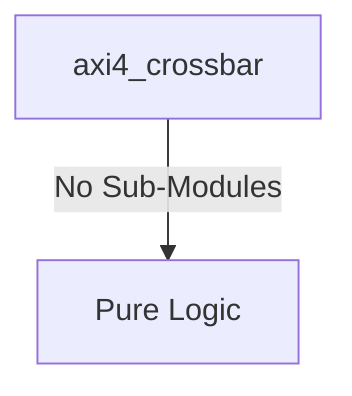
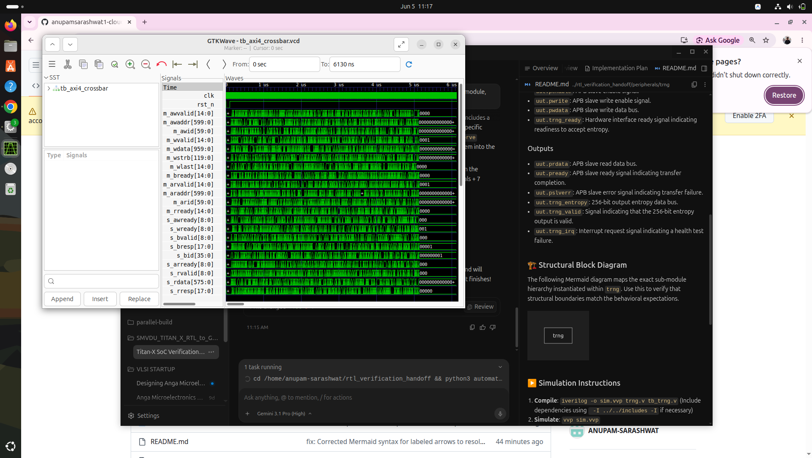

# axi4_crossbar Verification Handoff

## 📝 Overview
This directory contains the Verilog source, testbench, and verification instructions for the `axi4_crossbar` module.

The `axi4_crossbar` module implements a high-performance 15-master by 9-slave AXI4 crossbar interconnect utilizing flattened array ports for true parameterization. It features internal address decoding to route transactions to appropriate memory-mapped slave regions (e.g., L2 Cache, DDR4, peripherals) and employs a Weighted Round-Robin (WRR) arbitration scheme to manage concurrent access requests from multiple masters to a shared slave. The module effectively demultiplexes master requests and multiplexes slave responses, resolving multi-master contentions per slave dynamically.

## 🎯 What to Test
The verification engineer should ensure that:
1. The module resets correctly and all internal states initialize to safe values.
2. All interface protocols (e.g., AXI4, APB, native valid/ready) are strictly adhered to.
3. Edge cases specific to this IP (e.g., full/empty flags for FIFOs, cache misses for memory, etc.) are manually exercised.

## 🔍 GTKWave Signals to Observe
Add the following key signals to your GTKWave trace for structural inspection:
### Inputs
- `uut.clk`: The main system clock driving the arbitration logic.
- `uut.rst_n`: Active-low asynchronous reset signal.
- `uut.m_awvalid`: Flattened AXI4 write address valid signals from all masters.
- `uut.m_awaddr`: Flattened AXI4 write address buses from all masters.
- `uut.m_awid`: Flattened AXI4 write address IDs from all masters.
- `uut.m_wvalid`: Flattened AXI4 write data valid signals from all masters.
- `uut.m_wdata`: Flattened AXI4 write data buses from all masters.
- `uut.m_wstrb`: Flattened AXI4 write strobes from all masters.
- `uut.m_wlast`: Flattened AXI4 write last signals from all masters.
- `uut.m_bready`: Flattened AXI4 write response ready signals from all masters.
- `uut.m_arvalid`: Flattened AXI4 read address valid signals from all masters.
- `uut.m_araddr`: Flattened AXI4 read address buses from all masters.
- `uut.m_arid`: Flattened AXI4 read address IDs from all masters.
- `uut.m_rready`: Flattened AXI4 read data ready signals from all masters.
- `uut.s_awready`: Flattened AXI4 write address ready signals from all slaves.
- `uut.s_wready`: Flattened AXI4 write data ready signals from all slaves.
- `uut.s_bvalid`: Flattened AXI4 write response valid signals from all slaves.
- `uut.s_bresp`: Flattened AXI4 write response signals from all slaves.
- `uut.s_bid`: Flattened AXI4 write response IDs from all slaves.
- `uut.s_arready`: Flattened AXI4 read address ready signals from all slaves.
- `uut.s_rvalid`: Flattened AXI4 read data valid signals from all slaves.
- `uut.s_rdata`: Flattened AXI4 read data buses from all slaves.
- `uut.s_rresp`: Flattened AXI4 read response signals from all slaves.
- `uut.s_rlast`: Flattened AXI4 read last signals from all slaves.
- `uut.s_rid`: Flattened AXI4 read IDs from all slaves.

### Outputs
- `uut.m_awready`: Flattened AXI4 write address ready signals to all masters.
- `uut.m_wready`: Flattened AXI4 write data ready signals to all masters.
- `uut.m_bvalid`: Flattened AXI4 write response valid signals to all masters.
- `uut.m_bresp`: Flattened AXI4 write response signals to all masters.
- `uut.m_bid`: Flattened AXI4 write response IDs to all masters.
- `uut.m_arready`: Flattened AXI4 read address ready signals to all masters.
- `uut.m_rvalid`: Flattened AXI4 read data valid signals to all masters.
- `uut.m_rdata`: Flattened AXI4 read data buses to all masters.
- `uut.m_rresp`: Flattened AXI4 read response signals to all masters.
- `uut.m_rlast`: Flattened AXI4 read last signals to all masters.
- `uut.m_rid`: Flattened AXI4 read IDs to all masters.
- `uut.s_awvalid`: Flattened AXI4 write address valid signals to all slaves.
- `uut.s_awaddr`: Flattened AXI4 write address buses to all slaves.
- `uut.s_awid`: Flattened AXI4 write address IDs to all slaves.
- `uut.s_wvalid`: Flattened AXI4 write data valid signals to all slaves.
- `uut.s_wdata`: Flattened AXI4 write data buses to all slaves.
- `uut.s_wstrb`: Flattened AXI4 write strobes to all slaves.
- `uut.s_wlast`: Flattened AXI4 write last signals to all slaves.
- `uut.s_bready`: Flattened AXI4 write response ready signals to all slaves.
- `uut.s_arvalid`: Flattened AXI4 read address valid signals to all slaves.
- `uut.s_araddr`: Flattened AXI4 read address buses to all slaves.
- `uut.s_arid`: Flattened AXI4 read address IDs to all slaves.
- `uut.s_rready`: Flattened AXI4 read data ready signals to all slaves.

## 🏗 Structural Block Diagram
The following Mermaid diagram maps the exact sub-module hierarchy instantiated within `axi4_crossbar`. Use this to verify that structural boundaries match the behavioral expectations.

## ▶️ Simulation Instructions
1. **Compile**: `iverilog -o sim.vvp axi4_crossbar.v tb_axi4_crossbar.v` (Include dependencies using ` -I ../../includes -I` if necessary)
2. **Simulate**: `vvp sim.vvp`
3. **View**: `gtkwave tb_axi4_crossbar.vcd`

## 💉 Injected Stimulus Profile
An advanced Python DV script has automatically generated a fully functional SystemVerilog testbench for this module. The following aggressive stimulus is applied during simulation:

### Clocks Auto-Toggled:
- `clk` toggling every 3.6ns (138.8 MHz)

### Reset Sequence:
- `rst_n` driven to 0 then 1 over 100ns.

### Data Buses Randomized:
Over 500 consecutive cycles, the following inputs receive constrained `$random` logic values to aggressively exercise datapaths and control flow:
- `m_awvalid`
- `m_awaddr`
- `m_awid`
- `m_wvalid`
- `m_wdata`
- `m_wstrb`
- `m_wlast`
- `m_bready`
- `m_arvalid`
- `m_araddr`
- `m_arid`
- `m_rready`
- `s_awready`
- `s_wready`
- `s_bvalid`
- `s_bresp`
- `s_bid`
- `s_arready`
- `s_rvalid`
- `s_rdata`
- `s_rresp`
- `s_rlast`
- `s_rid`

## 📊 Verification Waveform

