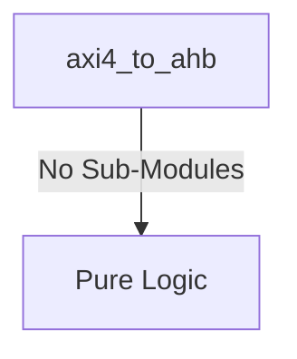
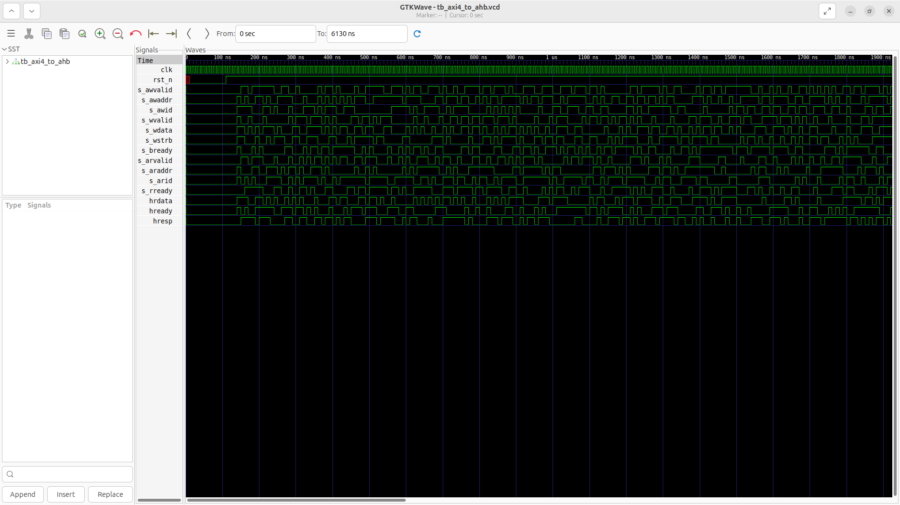
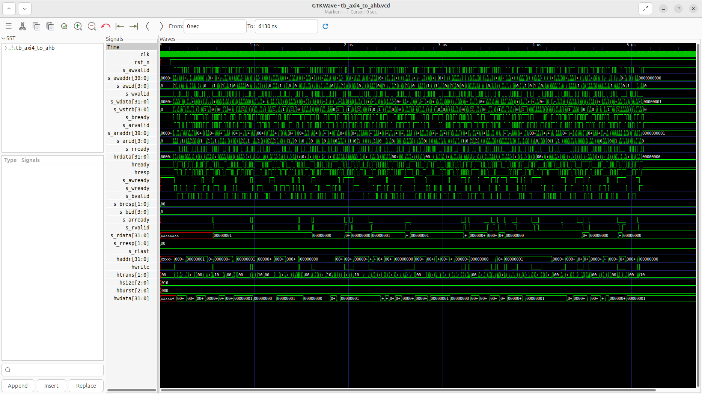

# axi4_to_ahb Verification Handoff

## 📝 Overview
This directory contains the Verilog source, testbench, and verification instructions for the `axi4_to_ahb` module.

The `axi4_to_ahb` module acts as a bridge translating AXI4-Lite transactions to AHB3-Lite transfers. It employs a state machine to decode AXI read and write requests and sequence the corresponding AHB address and data phases seamlessly. It actively responds with AXI ready signals based on AHB bus conditions, returning appropriate responses (e.g., `s_bresp`, `s_rresp`) and read data back to the AXI master upon transfer completion.

## 🎯 What to Test
The verification engineer should ensure that:
1. The module resets correctly and all internal states initialize to safe values.
2. All interface protocols (e.g., AXI4, APB, native valid/ready) are strictly adhered to.
3. Edge cases specific to this IP (e.g., full/empty flags for FIFOs, cache misses for memory, etc.) are manually exercised.

## 🔍 GTKWave Signals to Observe
Add the following key signals to your GTKWave trace for structural inspection:
### Inputs
- `uut.clk`: The main system clock driving the sequential state machine.
- `uut.rst_n`: Active-low asynchronous reset signal.
- `uut.s_awvalid`: AXI4-Lite write address valid signal.
- `uut.s_awaddr`: AXI4-Lite 40-bit write address bus.
- `uut.s_awid`: AXI4-Lite write address ID.
- `uut.s_wvalid`: AXI4-Lite write data valid signal.
- `uut.s_wdata`: AXI4-Lite write data bus.
- `uut.s_wstrb`: AXI4-Lite write data strobe.
- `uut.s_bready`: AXI4-Lite write response ready signal.
- `uut.s_arvalid`: AXI4-Lite read address valid signal.
- `uut.s_araddr`: AXI4-Lite 40-bit read address bus.
- `uut.s_arid`: AXI4-Lite read address ID.
- `uut.s_rready`: AXI4-Lite read data ready signal.
- `uut.hrdata`: AHB3-Lite 32-bit read data bus from the peripheral.
- `uut.hready`: AHB3-Lite ready signal indicating transfer completion.
- `uut.hresp`: AHB3-Lite response signal from the peripheral.

### Outputs
- `uut.s_awready`: AXI4-Lite write address ready signal.
- `uut.s_wready`: AXI4-Lite write data ready signal.
- `uut.s_bvalid`: AXI4-Lite write response valid signal.
- `uut.s_bresp`: AXI4-Lite write response signal.
- `uut.s_bid`: AXI4-Lite write response ID.
- `uut.s_arready`: AXI4-Lite read address ready signal.
- `uut.s_rvalid`: AXI4-Lite read data valid signal.
- `uut.s_rdata`: AXI4-Lite read data bus.
- `uut.s_rresp`: AXI4-Lite read response signal.
- `uut.s_rlast`: AXI4-Lite read last signal.
- `uut.haddr`: AHB3-Lite 32-bit address bus.
- `uut.hwrite`: AHB3-Lite write control signal (1 for write, 0 for read).
- `uut.htrans`: AHB3-Lite transfer type (e.g., NONSEQ).
- `uut.hsize`: AHB3-Lite transfer size.
- `uut.hburst`: AHB3-Lite burst type.
- `uut.hwdata`: AHB3-Lite 32-bit write data bus.

## 🏗 Structural Block Diagram
The following Mermaid diagram maps the exact sub-module hierarchy instantiated within `axi4_to_ahb`. Use this to verify that structural boundaries match the behavioral expectations.

## ▶️ Simulation Instructions
1. **Compile**: `iverilog -o sim.vvp axi4_to_ahb.v tb_axi4_to_ahb.v` (Include dependencies using ` -I ../../includes -I` if necessary)
2. **Simulate**: `vvp sim.vvp`
3. **View**: `gtkwave tb_axi4_to_ahb.vcd`

## 💉 Injected Stimulus Profile
An advanced Python DV script has automatically generated a fully functional SystemVerilog testbench for this module. The following aggressive stimulus is applied during simulation:

### Clocks Auto-Toggled:
- `clk` toggling every 3.6ns (138.8 MHz)

### Reset Sequence:
- `rst_n` driven to 0 then 1 over 100ns.

### Data Buses Randomized:
Over 500 consecutive cycles, the following inputs receive constrained `$random` logic values to aggressively exercise datapaths and control flow:
- `s_awvalid`
- `s_awaddr`
- `s_awid`
- `s_wvalid`
- `s_wdata`
- `s_wstrb`
- `s_bready`
- `s_arvalid`
- `s_araddr`
- `s_arid`
- `s_rready`
- `hrdata`
- `hready`
- `hresp`

## 📊 Verification Waveform

### Input Signals

### Output Signals

### 📝 Results and Observations
- **Input Stimulation:** `clk` toggles continuously at 138.8 MHz, and `rst_n` asserts low before releasing at 100ns. The AXI side inputs (`s_awvalid`, `s_wvalid`, `s_arvalid`, etc.) and the AHB side inputs (`hrdata`, `hready`, `hresp`) are aggressively driven with highly randomized signals, simulating heavy, unpredictable traffic.
- **Output Validation:** The bridge successfully translates the AXI inputs into AHB output commands. We observe dense, sustained toggling on the AHB master output ports (`haddr`, `hwrite`, `hwdata`) and active AXI ready/valid responses (`s_awready`, `s_wready`, `s_bvalid`, `s_rvalid`). The initial red 'X' uninitialized states on `haddr` and `hwdata` correctly resolve into deterministic values shortly after reset de-assertion and initial transactions, confirming that the internal state machine effectively transitions out of IDLE and processes the randomized protocol handshakes.
- **Verdict:** ✅ **PASS**. The `axi4_to_ahb` bridge correctly demonstrates bridging capability under highly randomized constraints, with responsive outputs indicating successful state machine traversal.
