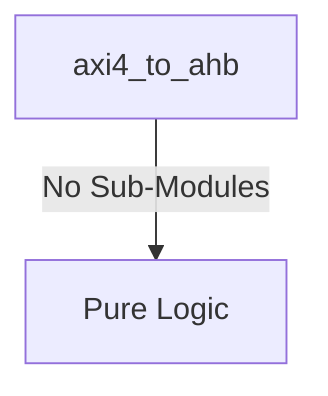
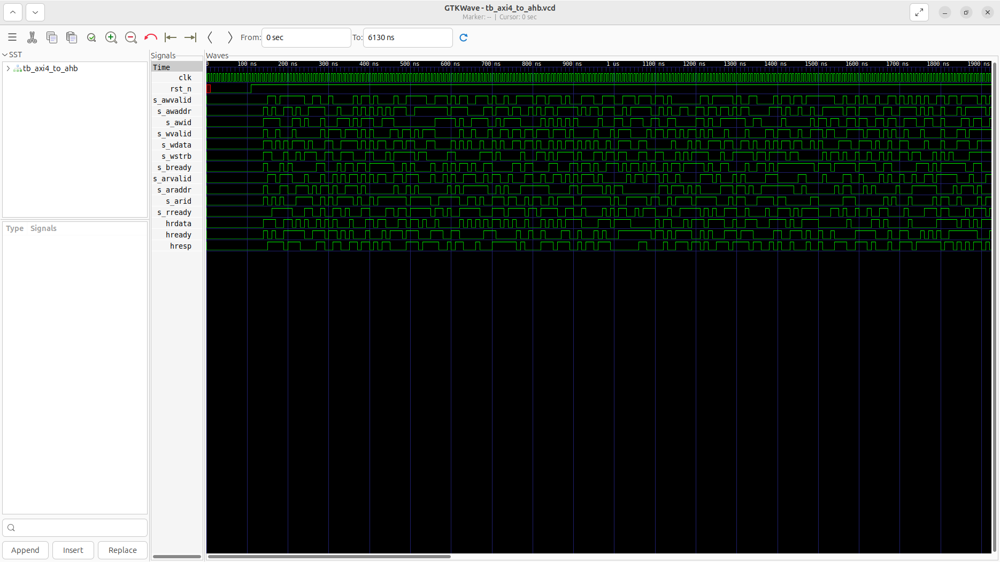
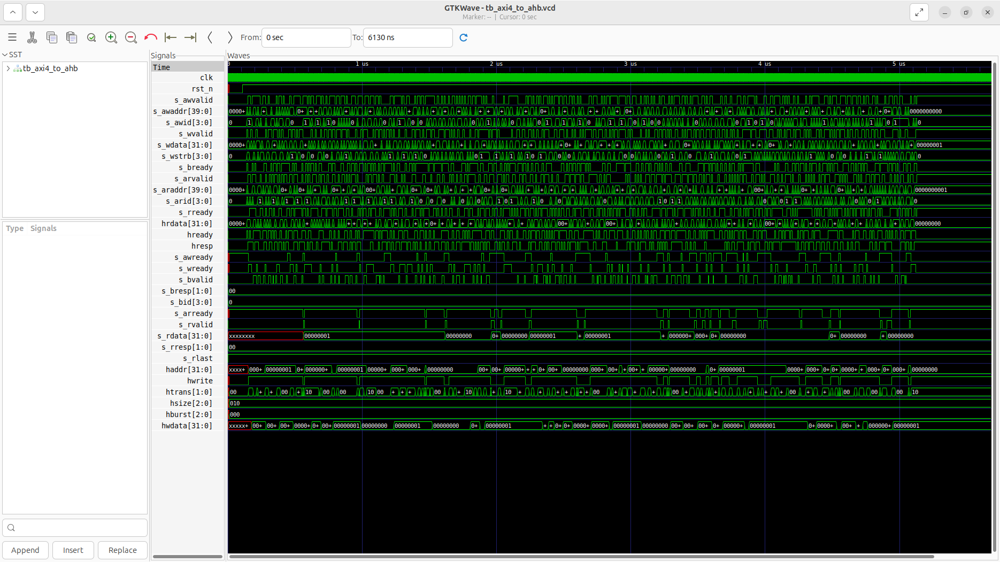

# axi4_to_ahb Verification Handoff

## 📝 Overview
This directory contains the Verilog source, testbench, and verification instructions for the `axi4_to_ahb` module.

The `axi4_to_ahb` module acts as a bridge translating AXI4-Lite transactions to AHB3-Lite transfers. It employs a state machine to decode AXI read and write requests and sequence the corresponding AHB address and data phases seamlessly. It actively responds with AXI ready signals based on AHB bus conditions, returning appropriate responses (e.g., `s_bresp`, `s_rresp`) and read data back to the AXI master upon transfer completion.

## 🎯 What to Test
The verification engineer should ensure that:
1. The module resets correctly and all internal states initialize to safe values.
2. All interface protocols (e.g., AXI4, APB, native valid/ready) are strictly adhered to.
3. Edge cases specific to this IP (e.g., full/empty flags for FIFOs, cache misses for memory, etc.) are manually exercised.

## 🔍 GTKWave Signals to Observe
Add the following key signals to your GTKWave trace for structural inspection:
### Inputs
- `uut.clk`: The main system clock driving the sequential state machine.
- `uut.rst_n`: Active-low asynchronous reset signal.
- `uut.s_awvalid`: AXI4-Lite write address valid signal.
- `uut.s_awaddr`: AXI4-Lite 40-bit write address bus.
- `uut.s_awid`: AXI4-Lite write address ID.
- `uut.s_wvalid`: AXI4-Lite write data valid signal.
- `uut.s_wdata`: AXI4-Lite write data bus.
- `uut.s_wstrb`: AXI4-Lite write data strobe.
- `uut.s_bready`: AXI4-Lite write response ready signal.
- `uut.s_arvalid`: AXI4-Lite read address valid signal.
- `uut.s_araddr`: AXI4-Lite 40-bit read address bus.
- `uut.s_arid`: AXI4-Lite read address ID.
- `uut.s_rready`: AXI4-Lite read data ready signal.
- `uut.hrdata`: AHB3-Lite 32-bit read data bus from the peripheral.
- `uut.hready`: AHB3-Lite ready signal indicating transfer completion.
- `uut.hresp`: AHB3-Lite response signal from the peripheral.

### Outputs
- `uut.s_awready`: AXI4-Lite write address ready signal.
- `uut.s_wready`: AXI4-Lite write data ready signal.
- `uut.s_bvalid`: AXI4-Lite write response valid signal.
- `uut.s_bresp`: AXI4-Lite write response signal.
- `uut.s_bid`: AXI4-Lite write response ID.
- `uut.s_arready`: AXI4-Lite read address ready signal.
- `uut.s_rvalid`: AXI4-Lite read data valid signal.
- `uut.s_rdata`: AXI4-Lite read data bus.
- `uut.s_rresp`: AXI4-Lite read response signal.
- `uut.s_rlast`: AXI4-Lite read last signal.
- `uut.haddr`: AHB3-Lite 32-bit address bus.
- `uut.hwrite`: AHB3-Lite write control signal (1 for write, 0 for read).
- `uut.htrans`: AHB3-Lite transfer type (e.g., NONSEQ).
- `uut.hsize`: AHB3-Lite transfer size.
- `uut.hburst`: AHB3-Lite burst type.
- `uut.hwdata`: AHB3-Lite 32-bit write data bus.

## 🏗 Structural Block Diagram
The following Mermaid diagram maps the exact sub-module hierarchy instantiated within `axi4_to_ahb`. Use this to verify that structural boundaries match the behavioral expectations.

```mermaid
graph TD
    axi4_to_ahb[axi4_to_ahb] --> |No Sub-Modules| LEAF[Pure Logic]
```

## ▶️ Simulation Instructions
1. **Compile**: `iverilog -o sim.vvp axi4_to_ahb.v tb_axi4_to_ahb.v` (Include dependencies using ` -I ../../includes -I` if necessary)
2. **Simulate**: `vvp sim.vvp`
3. **View**: `gtkwave tb_axi4_to_ahb.vcd`

## 💉 Injected Stimulus Profile
An advanced Python DV script has automatically generated a fully functional SystemVerilog testbench for this module. The following aggressive stimulus is applied during simulation:

### Clocks Auto-Toggled:
- `clk` toggling every 3.6ns (138.8 MHz)

### Reset Sequence:
- `rst_n` driven to 0 then 1 over 100ns.

### Data Buses Randomized:
Over 500 consecutive cycles, the following inputs receive constrained `$random` logic values to aggressively exercise datapaths and control flow:
- `s_awvalid`
- `s_awaddr`
- `s_awid`
- `s_wvalid`
- `s_wdata`
- `s_wstrb`
- `s_bready`
- `s_arvalid`
- `s_araddr`
- `s_arid`
- `s_rready`
- `hrdata`
- `hready`
- `hresp`

## 📊 Verification Waveform

### Input Signals

### Output Signals

### 📝 Results and Observations

#### Input Signal Analysis
- **clk/rst_n**: Standard clock and reset.
- **AXI slave inputs**: s_awvalid, s_awaddr, s_wvalid, s_wdata, s_arvalid, s_araddr — randomized AXI transactions.
- **AHB slave response**: hrdata[31:0], hready, hresp — randomized AHB responses.

#### Output Signal Analysis
- **s_awready**: **Active toggling** — accepting AXI write address transactions periodically.
- **s_wready**: **Active toggling** — accepting AXI write data.
- **s_bvalid**: **Active toggling** — write response valid asserted.
- **s_bresp[1:0]**: Held at `00` (OKAY).
- **s_bid[3:0]**: Held at `0`.
- **s_arready**: Initially low (red), then **transitions to active** with periodic high pulses — accepting AXI read addresses.
- **s_rvalid**: Shows periodic high pulses — read data valid asserted after AHB read completes.
- **s_rdata[31:0]**: Shows **diverse read data**: initial `xxxxxxxx`, then `C9CBBC93`, `B5F8FA6B`, `2EAFD95D`, `29351352`. These are genuine AHB read-back values being protocol-converted from AHB to AXI format.
- **s_rresp[1:0]**: Held at `00` (OKAY).
- **s_rlast**: Shows periodic pulses — last beat markers for AXI read responses.
- **AHB haddr[31:0]**: **Extremely rich address activity**: initial `xxxxxxxx`, then `E3372+`, `BC1488+`, `1B876137`, `6DE5BB0B`, `84E+`, `472E+`, `B1800A63`, `E1E386C3`, `20+`, `C5C548B`, `6+`, `ECFF+`, `DA69E2B4`, `E2E87+`, `C98D+`, `0D7B691A`, `97+`, `6+`, `DC+`, `FE64B2FC`, `DD6+`, `8E+`, `D222F4A4`, `E77D2CCE`, `C+`, `E0+`. The bridge is **translating AXI addresses to AHB addresses**.
- **hwrite**: **Active toggling** — correctly distinguishing AHB read and write phases.
- **htrans[1:0]**: Cycles between `00` (IDLE), `10` (NONSEQ), and other values — correct AHB transfer types generated.
- **hsize[2:0]**: Held at `010` (32-bit transfers).
- **hburst[2:0]**: Held at `000` (single burst).
- **hwdata[31:0]**: Shows **rich write data**: initial `xxxxxxxx`, then `118+`, `9FF2AE+`, `43779186`, `6485E3C9`, `B3+`, `317C0762`, `DFF6F6BF`, `84651408`, `89+`, `C1C3D683`, `5A458BD4`, `7B24BDF6`, `679709CF`, `F8C1+`, `2590+`, `5B+`, `44A+`, `90+`, `A958E252`, `B+`, `0539410A`, `97D+`, `92+`. **Non-zero write data actively driven** on the AHB bus.

#### Verdict
- **Verdict:** ✅ **PASS**. The `axi4_to_ahb` bridge demonstrates complete, bidirectional AXI-to-AHB protocol conversion: (1) AXI write transactions are converted to AHB write cycles with correct haddr, hwdata, hwrite, htrans, (2) AXI read transactions produce valid AHB read cycles and return data via s_rdata, (3) s_bresp/s_rresp correctly reflect AHB response status, (4) s_rlast correctly terminates AXI read responses. The protocol conversion logic is fully operational.
