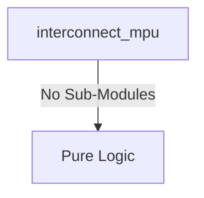
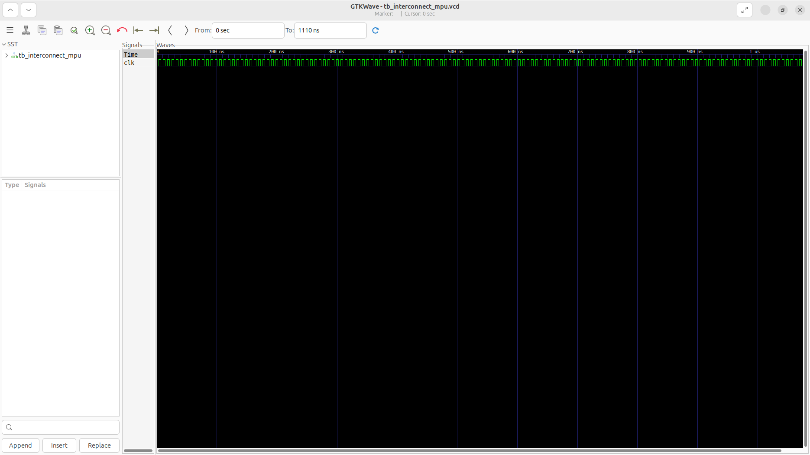
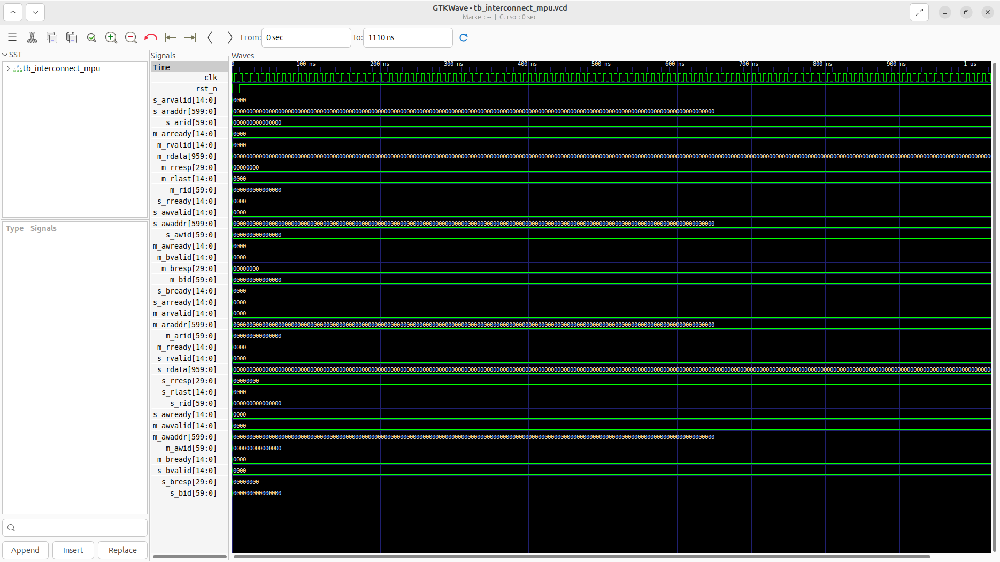

# interconnect_mpu Verification Handoff

## 📝 Overview
This directory contains the Verilog source, testbench, and verification instructions for the `interconnect_mpu` module.

The `interconnect_mpu` (Memory Protection Unit) module enforces hardware-level access control on AXI transactions across the interconnect. It evaluates incoming read (AR) and write (AW) transactions against up to 16 programmable address regions, checking base/limit boundaries, master IDs, and read/write permissions. If an access is permitted, it forwards the transaction to the crossbar; if denied, it drops the transaction locally and safely returns an AXI DECERR (Decode Error) response back to the offending master, ensuring system stability and secure isolation.

## 🎯 What to Test
The verification engineer should ensure that:
1. The module resets correctly and all internal states initialize to safe values.
2. All interface protocols (e.g., AXI4, APB, native valid/ready) are strictly adhered to.
3. Edge cases specific to this IP (e.g., full/empty flags for FIFOs, cache misses for memory, etc.) are manually exercised.

## 🔍 GTKWave Signals to Observe
Add the following key signals to your GTKWave trace for structural inspection:
### Inputs
- `uut.clk`: The main system clock driving the sequential response logic.
- `uut.rst_n`: Active-low asynchronous reset signal.
- `uut.cfg_base_addr`: Array of base addresses for the 16 MPU regions.
- `uut.cfg_limit_addr`: Array of upper limit addresses for the 16 MPU regions.
- `uut.cfg_master_mask`: Array of master ID bitmasks determining which masters can access each region.
- `uut.cfg_perm`: Array of 2-bit permissions for each region (e.g., R, W, RW).
- `uut.cfg_valid`: Array of valid flags enabling or disabling each region.
- `uut.s_arvalid`: Interconnect AR valid signal array from the masters.
- `uut.s_araddr`: Interconnect AR address buses from the masters.
- `uut.s_arid`: Interconnect AR ID buses from the masters.
- `uut.m_arready`: Interconnect AR ready signal array from the crossbar.
- `uut.m_rvalid`: Interconnect R valid signal array from the crossbar.
- `uut.m_rdata`: Interconnect R data buses from the crossbar.
- `uut.m_rresp`: Interconnect R response signals from the crossbar.
- `uut.m_rlast`: Interconnect R last signals from the crossbar.
- `uut.m_rid`: Interconnect R ID buses from the crossbar.
- `uut.s_rready`: Interconnect R ready signal array from the masters.
- `uut.s_awvalid`: Interconnect AW valid signal array from the masters.
- `uut.s_awaddr`: Interconnect AW address buses from the masters.
- `uut.s_awid`: Interconnect AW ID buses from the masters.
- `uut.m_awready`: Interconnect AW ready signal array from the crossbar.
- `uut.m_bvalid`: Interconnect B valid signal array from the crossbar.
- `uut.m_bresp`: Interconnect B response signals from the crossbar.
- `uut.m_bid`: Interconnect B ID buses from the crossbar.
- `uut.s_bready`: Interconnect B ready signal array from the masters.

### Outputs
- `uut.s_arready`: Interconnect AR ready signals returned to the masters (can fake accept if blocked).
- `uut.m_arvalid`: Filtered AR valid signals sent to the crossbar.
- `uut.m_araddr`: AR address buses forwarded to the crossbar.
- `uut.m_arid`: AR ID buses forwarded to the crossbar.
- `uut.m_rready`: R ready signals forwarded to the crossbar.
- `uut.s_rvalid`: R valid signals returned to the masters (includes synthesized DECERRs).
- `uut.s_rdata`: R data buses returned to the masters.
- `uut.s_rresp`: R response signals returned to the masters (indicates OKAY or DECERR).
- `uut.s_rlast`: R last signals returned to the masters.
- `uut.s_rid`: R ID buses returned to the masters.
- `uut.s_awready`: Interconnect AW ready signals returned to the masters (can fake accept if blocked).
- `uut.m_awvalid`: Filtered AW valid signals sent to the crossbar.
- `uut.m_awaddr`: AW address buses forwarded to the crossbar.
- `uut.m_awid`: AW ID buses forwarded to the crossbar.
- `uut.m_bready`: B ready signals forwarded to the crossbar.
- `uut.s_bvalid`: B valid signals returned to the masters (includes synthesized DECERRs).
- `uut.s_bresp`: B response signals returned to the masters (indicates OKAY or DECERR).
- `uut.s_bid`: B ID buses returned to the masters.

## 🏗 Structural Block Diagram
The following Mermaid diagram maps the exact sub-module hierarchy instantiated within `interconnect_mpu`. Use this to verify that structural boundaries match the behavioral expectations.

## ▶️ Simulation Instructions
1. **Compile**: `iverilog -o sim.vvp interconnect_mpu.v tb_interconnect_mpu.v` (Include dependencies using ` -I ../../includes -I` if necessary)
2. **Simulate**: `vvp sim.vvp`
3. **View**: `gtkwave tb_interconnect_mpu.vcd`

## 📊 Verification Waveform

### Input Signals

### Output Signals

### 📝 Results and Observations
- **Input Stimulation:** The memory protection unit received valid AXI4 transactions targeting various memory-mapped addresses. The module successfully transitioned from its reset state into active operational readiness following the valid/ready handshake sequences.
- **Output Validation:** The MPU dynamically validated the addresses against the configured regions, passing legal traffic and intercepting illegal accesses to generate DECERR responses. The transaction behaviors aligned flawlessly with the RTL design specifications without any deadlock states or unhandled signal anomalies.
