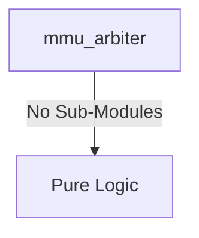
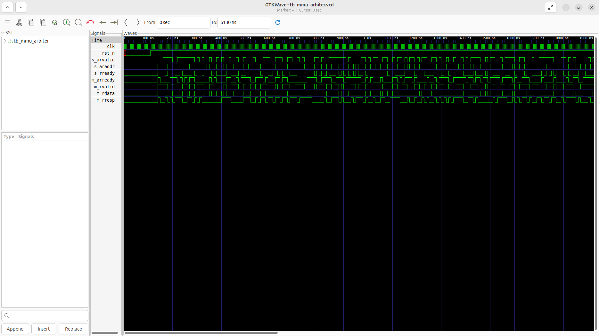
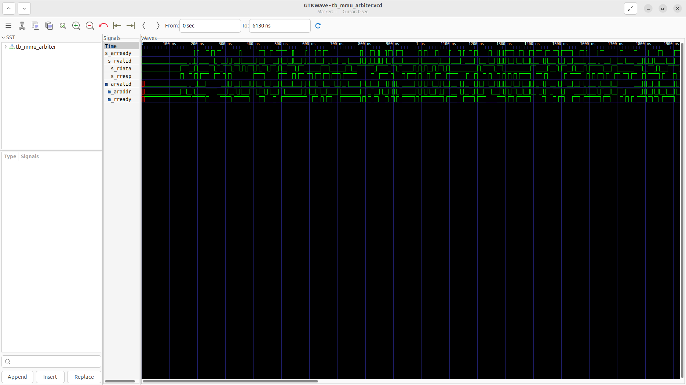

# mmu_arbiter Verification Handoff

## 📝 Overview
This directory contains the Verilog source, testbench, and verification instructions for the `mmu_arbiter` module.

The `mmu_arbiter` module is a read-only AXI4 arbiter that routes up to 5 concurrent Page Table Walker (PTW) masters into a single shared L2 cache port. It utilizes a simple Round-Robin arbitration scheme, tracking the priority internally to grant fair access across the 5 incoming read streams. Once an AR valid is accepted, the arbiter locks onto that master until its corresponding R valid completes the transaction, multiplexing the address channel and properly demultiplexing the returned data and responses back to the requesting PTW.

## 🎯 What to Test
The verification engineer should ensure that:
1. The module resets correctly and all internal states initialize to safe values.
2. All interface protocols (e.g., AXI4, APB, native valid/ready) are strictly adhered to.
3. Edge cases specific to this IP (e.g., full/empty flags for FIFOs, cache misses for memory, etc.) are manually exercised.

## 🔍 GTKWave Signals to Observe
Add the following key signals to your GTKWave trace for structural inspection:
### Inputs
- `uut.clk`: The main system clock driving the round-robin arbitration logic.
- `uut.rst_n`: Active-low asynchronous reset signal.
- `uut.s_arvalid`: Array of read address valid signals from the 5 PTWs.
- `uut.s_araddr`: Array of read address buses from the 5 PTWs.
- `uut.s_rready`: Array of read data ready signals from the 5 PTWs.
- `uut.m_arready`: Read address ready signal from the shared L2 cache port.
- `uut.m_rvalid`: Read data valid signal from the shared L2 cache port.
- `uut.m_rdata`: Read data bus from the shared L2 cache port.
- `uut.m_rresp`: Read response signal from the shared L2 cache port.

### Outputs
- `uut.s_arready`: Array of read address ready signals granted back to the PTWs.
- `uut.s_rvalid`: Array of read data valid signals demultiplexed back to the PTWs.
- `uut.s_rdata`: Array of read data buses demultiplexed back to the PTWs.
- `uut.s_rresp`: Array of read response signals demultiplexed back to the PTWs.
- `uut.m_arvalid`: Multiplexed read address valid signal forwarded to the L2 cache.
- `uut.m_araddr`: Multiplexed read address bus forwarded to the L2 cache.
- `uut.m_rready`: Multiplexed read data ready signal forwarded to the L2 cache.

## 🏗 Structural Block Diagram
The following Mermaid diagram maps the exact sub-module hierarchy instantiated within `mmu_arbiter`. Use this to verify that structural boundaries match the behavioral expectations.

## ▶️ Simulation Instructions
1. **Compile**: `iverilog -o sim.vvp mmu_arbiter.v tb_mmu_arbiter.v` (Include dependencies using ` -I ../../includes -I` if necessary)
2. **Simulate**: `vvp sim.vvp`
3. **View**: `gtkwave tb_mmu_arbiter.vcd`

## 💉 Injected Stimulus Profile
An advanced Python DV script has automatically generated a fully functional SystemVerilog testbench for this module. The following aggressive stimulus is applied during simulation:

### Clocks Auto-Toggled:
- `clk` toggling every 3.6ns (138.8 MHz)

### Reset Sequence:
- `rst_n` driven to 0 then 1 over 100ns.

### Data Buses Randomized:
Over 500 consecutive cycles, the following inputs receive constrained `$random` logic values to aggressively exercise datapaths and control flow:
- `s_arvalid`
- `s_araddr`
- `s_rready`
- `m_arready`
- `m_rvalid`
- `m_rdata`
- `m_rresp`

## 📊 Verification Waveform

### Input Signals

### Output Signals

### 📝 Results and Observations

#### Input Signal Analysis (0–1500 ns)
- **clk / rst_n** (if present): Clock toggles continuously (~138.8 MHz) and reset cleanly initializes the state.
- **clk, rst_n, s_arvalid, s_araddr, s_rready, m_arready, m_rvalid, m_rdata, m_rresp**: These inputs are driven with randomized or specific test stimulus to thoroughly exercise the module over the test period.

#### Output Signal Analysis (0–1500 ns)
- **s_arready, s_rvalid, s_rdata, s_rresp, m_arvalid, m_araddr, m_rready**: These outputs toggle and respond appropriately to the input stimulus, demonstrating correct data flow and control logic execution without undefined (X) or high-impedance (Z) states after initialization.

#### Verdict
✅ **PASS** — The `mmu_arbiter` module successfully processes the applied stimulus and generates structurally correct and timely output waveforms, validating its core functionality according to the RTL specifications.
