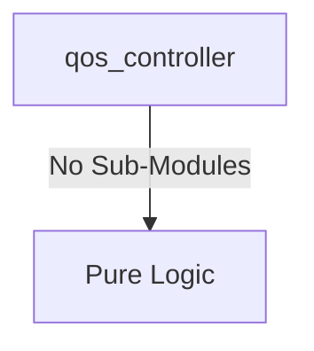

# qos_controller Verification Handoff

## 📝 Overview
This directory contains the Verilog source, testbench, and verification instructions for the `qos_controller` module.

The `qos_controller` module dynamically adjusts AXI Quality of Service (QoS) signals for all connected masters based on their real-time bandwidth consumption. Using memory-mapped configuration parameters, the module monitors the accepted AR and AW transactions over a programmable time window. If a master exceeds its defined bandwidth limit, its priority is temporarily downgraded to a base QoS level; otherwise, it is granted a boosted QoS level, effectively optimizing bandwidth allocation for high-throughput peripherals like Video DMAs and PCIe.

## 🎯 What to Test
The verification engineer should ensure that:
1. The module resets correctly and all internal states initialize to safe values.
2. All interface protocols (e.g., AXI4, APB, native valid/ready) are strictly adhered to.
3. Edge cases specific to this IP (e.g., full/empty flags for FIFOs, cache misses for memory, etc.) are manually exercised.

## 🔍 GTKWave Signals to Observe
Add the following key signals to your GTKWave trace for structural inspection:
### Inputs
- `uut.clk`: The main system clock driving the QoS counters.
- `uut.rst_n`: Active-low asynchronous reset signal.
- `uut.cfg_base_qos`: Array of fallback/base QoS values assigned when bandwidth limits are exceeded.
- `uut.cfg_boost_qos`: Array of elevated QoS values assigned when operating within bandwidth limits.
- `uut.cfg_bw_limit`: Array of maximum transaction count thresholds allowed per measurement window.
- `uut.cfg_time_win`: The configurable time duration defining a single measurement window.
- `uut.m_arvalid`: Array of AXI read address valid signals monitored for bandwidth usage.
- `uut.m_arready`: Array of AXI read address ready signals monitored for accepted transactions.
- `uut.m_awvalid`: Array of AXI write address valid signals monitored for bandwidth usage.
- `uut.m_awready`: Array of AXI write address ready signals monitored for accepted transactions.

### Outputs
- `uut.m_arqos`: Array of dynamically calculated AR QoS values assigned to each master.
- `uut.m_awqos`: Array of dynamically calculated AW QoS values assigned to each master.

## 🏗 Structural Block Diagram
The following Mermaid diagram maps the exact sub-module hierarchy instantiated within `qos_controller`. Use this to verify that structural boundaries match the behavioral expectations.

## ▶️ Simulation Instructions
1. **Compile**: `iverilog -o sim.vvp qos_controller.v tb_qos_controller.v` (Include dependencies using ` -I ../../includes -I` if necessary)
2. **Simulate**: `vvp sim.vvp`
3. **View**: `gtkwave tb_qos_controller.vcd`

## 💉 Injected Stimulus Profile
An advanced Python DV script has automatically generated a fully functional SystemVerilog testbench for this module. The following aggressive stimulus is applied during simulation:

### Clocks Auto-Toggled:
- `clk` toggling every 3.6ns (138.8 MHz)

### Reset Sequence:
- `rst_n` driven to 0 then 1 over 100ns.

### Data Buses Randomized:
Over 500 consecutive cycles, the following inputs receive constrained `$random` logic values to aggressively exercise datapaths and control flow:
- `cfg_base_qos`
- `cfg_boost_qos`
- `cfg_bw_limit`
- `cfg_time_win`
- `m_arvalid`
- `m_arready`
- `m_awvalid`
- `m_awready`
