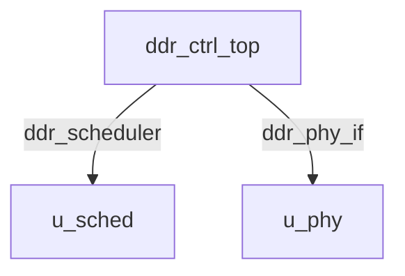

# ddr_ctrl_top Verification Handoff

## 📝 Overview
This directory contains the Verilog source, testbench, and verification instructions for the `ddr_ctrl_top` module.

## 🎯 What to Test
The verification engineer should ensure that:
1. The module resets correctly and all internal states initialize to safe values.
2. All interface protocols (e.g., AXI4, APB, native valid/ready) are strictly adhered to.
3. Edge cases specific to this IP (e.g., full/empty flags for FIFOs, cache misses for memory, etc.) are manually exercised.

## 🔍 GTKWave Signals to Observe
Add the following key signals to your GTKWave trace for structural inspection:
### Inputs
- `uut.clk`
- `uut.rst_n`
- `uut.s_awvalid`
- `uut.s_awaddr`
- `uut.s_awid`
- `uut.s_awlen`
- `uut.s_awsize`
- `uut.s_wvalid`
- `uut.s_wdata`
- `uut.s_wstrb`
- `uut.s_wlast`
- `uut.s_bready`
- `uut.s_arvalid`
- `uut.s_araddr`
- `uut.s_arid`
- `uut.s_arlen`
- `uut.s_rready`

### Outputs
- `uut.s_awready`
- `uut.s_wready`
- `uut.s_bvalid`
- `uut.s_bresp`
- `uut.s_bid`
- `uut.s_arready`
- `uut.s_rvalid`
- `uut.s_rdata`
- `uut.s_rresp`
- `uut.s_rlast`
- `uut.s_rid`
- `uut.ddr_ck_p`
- `uut.ddr_ck_n`
- `uut.ddr_cke`
- `uut.ddr_cs_n`
- `uut.ddr_ras_n`
- `uut.ddr_cas_n`
- `uut.ddr_we_n`
- `uut.ddr_ba`
- `uut.ddr_bg`
- `uut.ddr_addr`
- `uut.ddr_dm`

## 🏗 Structural Block Diagram
The following Mermaid diagram maps the exact sub-module hierarchy instantiated within `ddr_ctrl_top`. Use this to verify that structural boundaries match the behavioral expectations.

## ▶️ Simulation Instructions
1. **Compile**: `iverilog -o sim.vvp ddr_ctrl_top.v tb_ddr_ctrl_top.v` (Include dependencies using ` -I ../../includes -I` if necessary)
2. **Simulate**: `vvp sim.vvp`
3. **View**: `gtkwave tb_ddr_ctrl_top.vcd`
