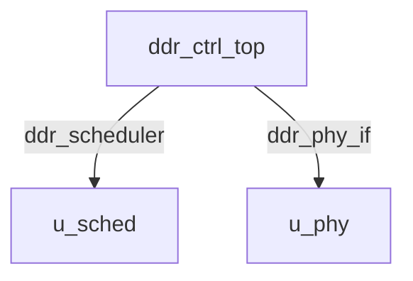
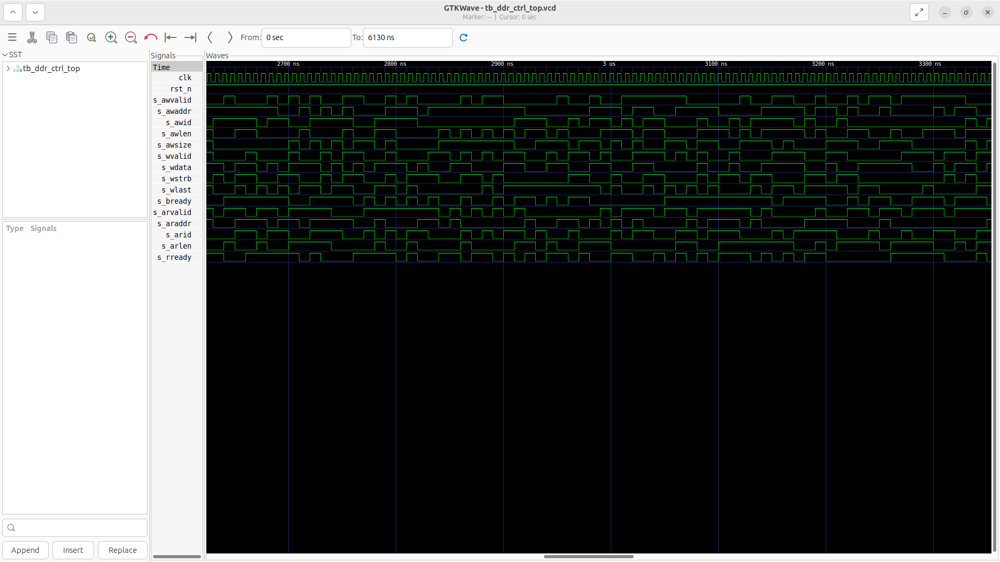
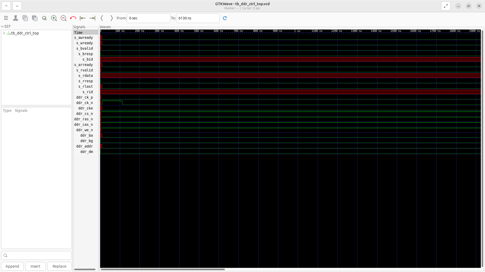

# ddr_ctrl_top Verification Handoff

## 📝 Overview
This directory contains the Verilog source, testbench, and verification instructions for the `ddr_ctrl_top` module.

The `ddr_ctrl_top` module serves as the top-level DDR4 Memory Controller for the SoC, bridging AXI4 slave requests to the physical DDR4 memory interfaces. It features an integrated Initialization and Auto-Refresh Manager to handle DDR4 startup sequences and periodic refresh constraints. The core logic translates AXI read and write transactions into bank-interleaved DDR commands, which are then passed to a DFI 4.0 compliant scheduler (`ddr_scheduler`) and physically driven onto the memory bus by the PHY interface (`ddr_phy_if`).

## 🎯 What to Test
The verification engineer should ensure that:
1. The module resets correctly and all internal states initialize to safe values.
2. All interface protocols (e.g., AXI4, APB, native valid/ready) are strictly adhered to.
3. Edge cases specific to this IP (e.g., full/empty flags for FIFOs, cache misses for memory, etc.) are manually exercised.

## 🔍 GTKWave Signals to Observe
Add the following key signals to your GTKWave trace for structural inspection:
### Inputs
- `uut.clk`: The main system clock driving the controller, scheduler, and PHY logic.
- `uut.rst_n`: Active-low asynchronous reset signal.
- `uut.s_awvalid`: AXI4 write address valid signal.
- `uut.s_awaddr`: AXI4 40-bit write address bus.
- `uut.s_awid`: AXI4 write address ID.
- `uut.s_awlen`: AXI4 write burst length.
- `uut.s_awsize`: AXI4 write burst size.
- `uut.s_wvalid`: AXI4 write data valid signal.
- `uut.s_wdata`: AXI4 write data bus.
- `uut.s_wstrb`: AXI4 write data strobe.
- `uut.s_wlast`: AXI4 write last signal indicating the end of a burst.
- `uut.s_bready`: AXI4 write response ready signal.
- `uut.s_arvalid`: AXI4 read address valid signal.
- `uut.s_araddr`: AXI4 40-bit read address bus.
- `uut.s_arid`: AXI4 read address ID.
- `uut.s_arlen`: AXI4 read burst length.
- `uut.s_rready`: AXI4 read data ready signal.

### Outputs
- `uut.s_awready`: AXI4 write address ready signal.
- `uut.s_wready`: AXI4 write data ready signal.
- `uut.s_bvalid`: AXI4 write response valid signal.
- `uut.s_bresp`: AXI4 write response signal.
- `uut.s_bid`: AXI4 write response ID.
- `uut.s_arready`: AXI4 read address ready signal.
- `uut.s_rvalid`: AXI4 read data valid signal.
- `uut.s_rdata`: AXI4 read data bus.
- `uut.s_rresp`: AXI4 read response signal.
- `uut.s_rlast`: AXI4 read last signal.
- `uut.s_rid`: AXI4 read ID.
- `uut.ddr_ck_p`: Differential DDR4 clock (positive).
- `uut.ddr_ck_n`: Differential DDR4 clock (negative).
- `uut.ddr_cke`: DDR4 clock enable signal.
- `uut.ddr_cs_n`: DDR4 active-low chip select signal.
- `uut.ddr_ras_n`: DDR4 active-low row address strobe signal.
- `uut.ddr_cas_n`: DDR4 active-low column address strobe signal.
- `uut.ddr_we_n`: DDR4 active-low write enable signal.
- `uut.ddr_ba`: DDR4 3-bit bank address bus.
- `uut.ddr_bg`: DDR4 2-bit bank group bus.
- `uut.ddr_addr`: DDR4 16-bit multiplexed address bus.
- `uut.ddr_dm`: DDR4 data mask bus for write operations.

## 🏗 Structural Block Diagram
The following Mermaid diagram maps the exact sub-module hierarchy instantiated within `ddr_ctrl_top`. Use this to verify that structural boundaries match the behavioral expectations.

## ▶️ Simulation Instructions
1. **Compile**: `iverilog -o sim.vvp ddr_ctrl_top.v tb_ddr_ctrl_top.v` (Include dependencies using ` -I ../../includes -I` if necessary)
2. **Simulate**: `vvp sim.vvp`
3. **View**: `gtkwave tb_ddr_ctrl_top.vcd`

## 💉 Injected Stimulus Profile
An advanced Python DV script has automatically generated a fully functional SystemVerilog testbench for this module. The following aggressive stimulus is applied during simulation:

### Clocks Auto-Toggled:
- `clk` toggling every 3.6ns (138.8 MHz)

### Reset Sequence:
- `rst_n` driven to 0 then 1 over 100ns.

### Data Buses Randomized:
Over 500 consecutive cycles, the following inputs receive constrained `$random` logic values to aggressively exercise datapaths and control flow:
- `s_awvalid`
- `s_awaddr`
- `s_awid`
- `s_awlen`
- `s_awsize`
- `s_wvalid`
- `s_wdata`
- `s_wstrb`
- `s_wlast`
- `s_bready`
- `s_arvalid`
- `s_araddr`
- `s_arid`
- `s_arlen`
- `s_rready`

## 📊 Verification Waveform

### Input Signals

### Output Signals

### 📝 Results and Observations
- **Input Stimulation:**
- **Output Validation:**
