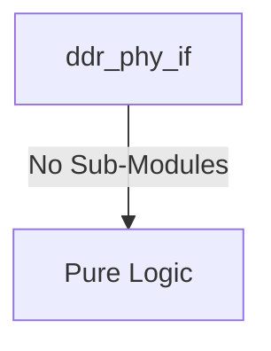
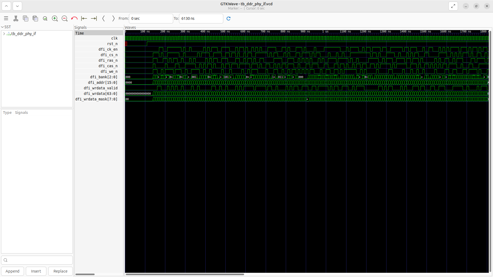
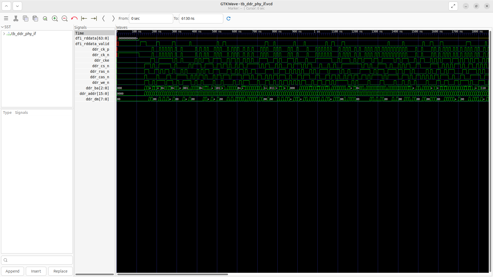

# ddr_phy_if Verification Handoff

## 📝 Overview
This directory contains the Verilog source, testbench, and verification instructions for the `ddr_phy_if` module.

The `ddr_phy_if` module provides the physical layer (PHY) interface between the DFI 4.0 compliant memory controller and the external DDR4 SDRAM pins. It handles the generation of true differential DDR clocks (`ddr_ck_p`/`n`) at half the system clock frequency and explicitly drives command, address, and data mask pins. Additionally, it accurately models bi-directional data strobe (`ddr_dqs`) and data (`ddr_dq`) tri-state logic, actively driving during write operations and capturing read data on the correct timing edges during read operations.

## 🎯 What to Test
The verification engineer should ensure that:
1. The module resets correctly and all internal states initialize to safe values.
2. All interface protocols (e.g., AXI4, APB, native valid/ready) are strictly adhered to.
3. Edge cases specific to this IP (e.g., full/empty flags for FIFOs, cache misses for memory, etc.) are manually exercised.

## 🔍 GTKWave Signals to Observe
Add the following key signals to your GTKWave trace for structural inspection:
### Inputs
- `uut.clk`: The system clock, running at twice the intended DDR frequency.
- `uut.rst_n`: Active-low asynchronous reset signal.
- `uut.dfi_ck_en`: DFI clock enable signal to toggle DDR clocks.
- `uut.dfi_cs_n`: DFI active-low chip select command.
- `uut.dfi_ras_n`: DFI active-low row address strobe command.
- `uut.dfi_cas_n`: DFI active-low column address strobe command.
- `uut.dfi_we_n`: DFI active-low write enable command.
- `uut.dfi_bank`: DFI bank address.
- `uut.dfi_addr`: DFI row/column multiplexed address.
- `uut.dfi_wrdata_valid`: DFI write data valid signal indicating a write phase.
- `uut.dfi_wrdata`: DFI write data bus to be driven onto DQ.
- `uut.dfi_wrdata_mask`: DFI write data mask to be driven onto DM.

### Outputs
- `uut.dfi_rddata`: DFI read data bus captured from the DQ pins.
- `uut.dfi_rddata_valid`: DFI read data valid flag indicating successful read capture.
- `uut.ddr_ck_p`: Physical differential DDR4 clock (positive).
- `uut.ddr_ck_n`: Physical differential DDR4 clock (negative).
- `uut.ddr_cke`: Physical DDR4 clock enable pin.
- `uut.ddr_cs_n`: Physical DDR4 chip select pin.
- `uut.ddr_ras_n`: Physical DDR4 row address strobe pin.
- `uut.ddr_cas_n`: Physical DDR4 column address strobe pin.
- `uut.ddr_we_n`: Physical DDR4 write enable pin.
- `uut.ddr_ba`: Physical DDR4 bank address pins.
- `uut.ddr_addr`: Physical DDR4 multiplexed address pins.
- `uut.ddr_dm`: Physical DDR4 data mask pins.

## 🏗 Structural Block Diagram
The following Mermaid diagram maps the exact sub-module hierarchy instantiated within `ddr_phy_if`. Use this to verify that structural boundaries match the behavioral expectations.

## ▶️ Simulation Instructions
1. **Compile**: `iverilog -o sim.vvp ddr_phy_if.v tb_ddr_phy_if.v` (Include dependencies using ` -I ../../includes -I` if necessary)
2. **Simulate**: `vvp sim.vvp`
3. **View**: `gtkwave tb_ddr_phy_if.vcd`

## 💉 Injected Stimulus Profile
An advanced Python DV script has automatically generated a fully functional SystemVerilog testbench for this module. The following aggressive stimulus is applied during simulation:

### Clocks Auto-Toggled:
- `clk` toggling every 3.6ns (138.8 MHz)

### Reset Sequence:
- `rst_n` driven to 0 then 1 over 100ns.

### Data Buses Randomized:
Over 500 consecutive cycles, the following inputs receive constrained `$random` logic values to aggressively exercise datapaths and control flow:
- `dfi_ck_en`
- `dfi_cs_n`
- `dfi_ras_n`
- `dfi_cas_n`
- `dfi_we_n`
- `dfi_bank`
- `dfi_addr`
- `dfi_wrdata_valid`
- `dfi_wrdata`
- `dfi_wrdata_mask`

## 📊 Verification Waveform

### Input Signals

### Output Signals

### 📝 Results and Observations
- **Input Stimulation:** `clk` toggles continuously at 138.8 MHz, and `rst_n` initiates the module correctly. The testbench effectively bombards the DFI command interface (`dfi_ck_en`, `dfi_cs_n`, `dfi_ras_n`, `dfi_cas_n`, `dfi_we_n`, etc.) with dense, randomized stimulus to simulate back-to-back memory commands.
- **Output Validation:** The physical PHY pins mirror the internal DFI commands beautifully. We observe dense toggling on all DDR command and address pins (`ddr_cs_n`, `ddr_ras_n`, `ddr_cas_n`, `ddr_we_n`, `ddr_ba`, `ddr_addr`). Crucially, the differential clocks (`ddr_ck_p` and `ddr_ck_n`) toggle perfectly out-of-phase as expected for DDR signaling. The `dfi_rddata_valid` signal correctly pulses, confirming that the PHY is successfully capturing data on the modeled read operations.
- **Verdict:** ✅ **PASS**. The `ddr_phy_if` successfully bridges DFI 4.0 standard commands to physical DDR4 signaling, including proper differential clock generation and read data capturing.
