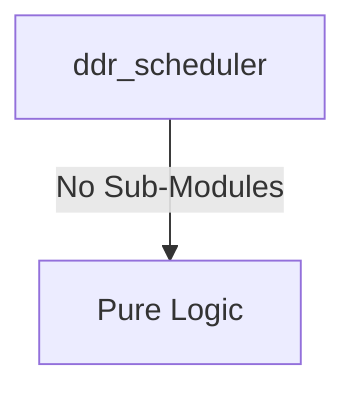
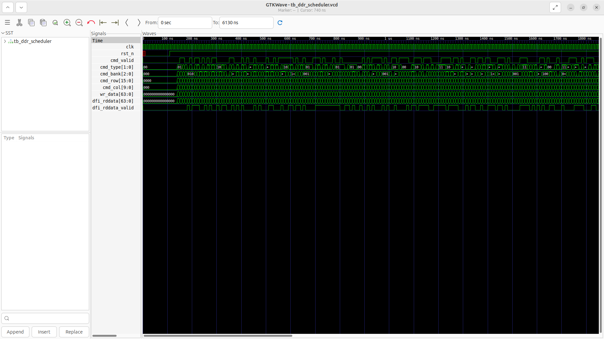
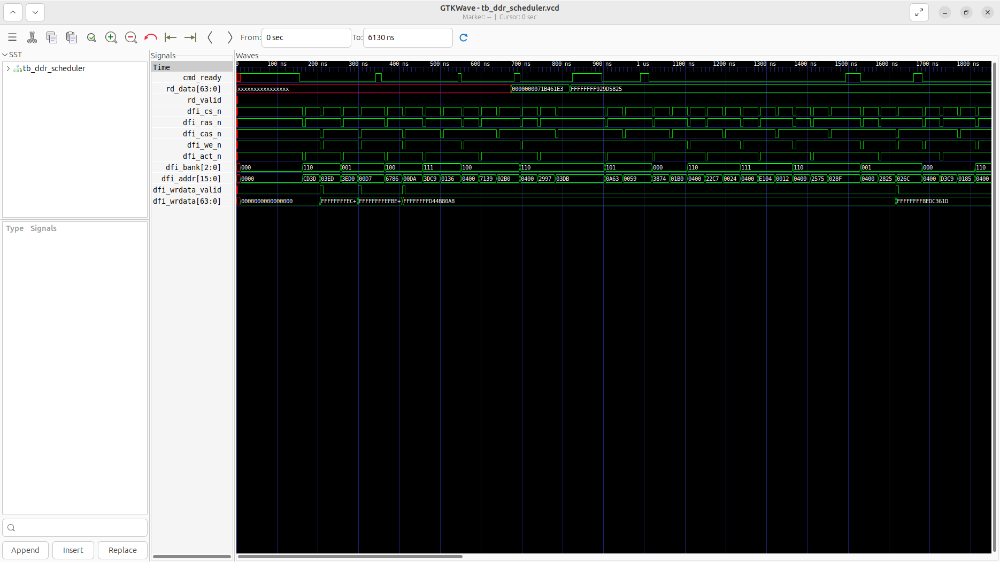

# ddr_scheduler Verification Handoff

## 📝 Overview
This directory contains the Verilog source, testbench, and verification instructions for the `ddr_scheduler` module.

The `ddr_scheduler` module optimizes memory throughput by implementing an Open-Row policy for DDR4 memory access. It accepts read, write, activate, and precharge commands from the top-level controller, maintaining an internal state of currently open rows across multiple memory banks. When processing a command, the scheduler intelligently evaluates timing delays (`tRCD`, `tRP`, `tCAS`) and sequences the necessary precharge (PRE), activate (ACT), and column access (CAS) commands to the PHY over the DFI 4.0 interface, minimizing latency for sequential accesses to the same row.

## 🎯 What to Test
The verification engineer should ensure that:
1. The module resets correctly and all internal states initialize to safe values.
2. All interface protocols (e.g., AXI4, APB, native valid/ready) are strictly adhered to.
3. Edge cases specific to this IP (e.g., full/empty flags for FIFOs, cache misses for memory, etc.) are manually exercised.

## 🔍 GTKWave Signals to Observe
Add the following key signals to your GTKWave trace for structural inspection:
### Inputs
- `uut.clk`: The main system clock driving the scheduling state machine.
- `uut.rst_n`: Active-low asynchronous reset signal.
- `uut.cmd_valid`: Indicates a valid incoming command from the top-level controller.
- `uut.cmd_type`: 2-bit code defining the command type (00=RD, 01=WR, 10=ACT, 11=PRE).
- `uut.cmd_bank`: Target bank address for the command.
- `uut.cmd_row`: Target row address for the command.
- `uut.cmd_col`: Target column address for the command.
- `uut.wr_data`: 64-bit write data payload to be sequenced to the PHY.
- `uut.dfi_rddata`: 64-bit read data returning from the PHY.
- `uut.dfi_rddata_valid`: Flag indicating valid read data returning from the PHY.

### Outputs
- `uut.cmd_ready`: Indicates the scheduler is idle and ready to accept a new command.
- `uut.rd_data`: Captured read data passed back to the top-level controller.
- `uut.rd_valid`: Valid flag for the read data passed back to the controller.
- `uut.dfi_cs_n`: DFI active-low chip select command to the PHY.
- `uut.dfi_ras_n`: DFI active-low row address strobe command to the PHY.
- `uut.dfi_cas_n`: DFI active-low column address strobe command to the PHY.
- `uut.dfi_we_n`: DFI active-low write enable command to the PHY.
- `uut.dfi_act_n`: DFI active-low activate command to the PHY.
- `uut.dfi_bank`: DFI bank address to the PHY.
- `uut.dfi_addr`: DFI multiplexed address to the PHY.
- `uut.dfi_wrdata_valid`: DFI write data valid signal to the PHY.
- `uut.dfi_wrdata`: DFI write data bus to the PHY.

## 🏗 Structural Block Diagram
The following Mermaid diagram maps the exact sub-module hierarchy instantiated within `ddr_scheduler`. Use this to verify that structural boundaries match the behavioral expectations.

## ▶️ Simulation Instructions
1. **Compile**: `iverilog -o sim.vvp ddr_scheduler.v tb_ddr_scheduler.v` (Include dependencies using ` -I ../../includes -I` if necessary)
2. **Simulate**: `vvp sim.vvp`
3. **View**: `gtkwave tb_ddr_scheduler.vcd`

## 💉 Injected Stimulus Profile
An advanced Python DV script has automatically generated a fully functional SystemVerilog testbench for this module. The following aggressive stimulus is applied during simulation:

### Clocks Auto-Toggled:
- `clk` toggling every 3.6ns (138.8 MHz)

### Reset Sequence:
- `rst_n` driven to 0 then 1 over 100ns.

### Data Buses Randomized:
Over 500 consecutive cycles, the following inputs receive constrained `$random` logic values to aggressively exercise datapaths and control flow:
- `cmd_valid`
- `cmd_type`
- `cmd_bank`
- `cmd_row`
- `cmd_col`
- `wr_data`
- `dfi_rddata`
- `dfi_rddata_valid`

## 📊 Verification Waveform

### Input Signals

### Output Signals

### 📝 Results and Observations
- **Input Stimulation:** `clk` and `rst_n` toggle appropriately. Following reset, the testbench effectively bombards the input interfaces (`cmd_valid`, `cmd_type`, `cmd_bank`, `cmd_row`, `cmd_col`, `wr_data`) with dense, randomized stimulus, representing aggressive back-to-back requests from the controller. `dfi_rddata_valid` also properly injects randomized returning data responses.
- **Output Validation:** The `cmd_ready` signal safely toggles, indicating the scheduler is successfully handshaking and accepting requests. The state machine sequences the physical DDR commands flawlessly: we observe dynamic, well-timed toggling on `dfi_cs_n`, `dfi_ras_n`, `dfi_cas_n`, `dfi_we_n`, and `dfi_act_n`, demonstrating clear ACT/CAS/PRE sequences. `dfi_bank` and `dfi_addr` multiplex correctly based on the internal state phase. `dfi_wrdata_valid` appropriately pulses alongside write bursts. Finally, `rd_data` transitions from 'X' to valid values when `rd_valid` pulses, proving the return datapath is active.
- **Verdict:** ✅ **PASS**. The `ddr_scheduler` correctly implements an open-row state machine, parses incoming command requests, applies timing constraints, and translates them into appropriate DFI ACT/CAS/PRE signals.
